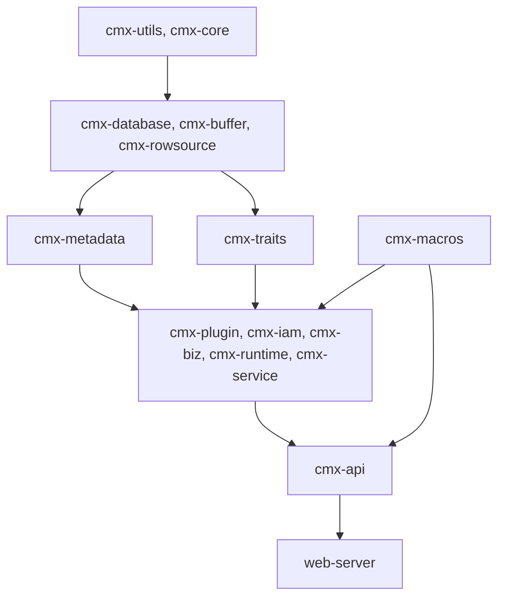

# 审查报告输出模板（Report Template）

> 适用范围：rust-arch-review 技能生成的最终审查报告。
> 报告路径：`cmx-container/documents/rust-arch-review-YYYY-MM-DD.md`
> 使用方法：将本模板复制为报告骨架，按审查结果逐节填充。

---

# Rust 架构与代码质量审查报告

**审查日期**：YYYY-MM-DD
**审查范围**：{scope_description，如 `cmx-iam` 整个 crate / `cmx-biz/src/form` 单模块 / 全 workspace}
**审查者**：rust-arch-review 技能（MiniMax-M3）
**审查依据**：[cmx-container/AGENTS.md](../../../AGENTS.md) 18 章 + [references/checklist.md](./checklist.md) + [references/reuse-catalog.md](./reuse-catalog.md)

---

## 一、审查总览

### 1.1 总体评分

| 大类 | 子维度 | 评分 | 状态 |
|------|--------|------|------|
| **A. 宏观架构** | A1 Crate 划分 | X/10 | 🟡/🔴/✅ |
| | A2 目录结构 | X/10 | |
| **B. 模块设计** | B1 Trait 解耦 | X/10 | |
| | **B2 代码复用** | X/10 | ⭐核心新增 |
| **C. 实现质量** | C1 错误处理 | X/10 | |
| | C2 异步模式 | X/10 | |
| | **C3 Rust 最佳实践** | X/10 | ⭐核心新增 |
| **D. 工程规范** | D1 依赖管理 | X/10 | |
| | D2 命名规范 | X/10 | |
| | D3 注释规范 | X/10 | |
| | D4 测试 | X/10 | |
| **加权总分** | — | **X/10** | |

### 1.2 问题统计

| 严重级别 | 数量 | 占比 |
|---------|------|------|
| 🔴 严重（P0 立即修复） | N | X% |
| 🟡 警告（P1 短期优化） | M | X% |
| 🔵 建议（P2 长期改进） | K | X% |
| **总计** | **N+M+K** | 100% |

### 1.3 复用偏离度速览

> 完整数据见 §三、复用偏离度表。

| 资产 | 偏离率 | 严重级别 |
|------|--------|----------|
| `GenericCrudService` | X% | 🟡/🟠/🔴 |
| `dv!` 宏 | X% | |
| `ParamsBuilder` | X% | |
| `declare_crud_handlers!` 宏 | X% | |
| `cmx-traits::*` 抽象层 | X% | |
| ... | | |

### 1.4 规范符合度速览

> 完整矩阵见 §四、规范符合度矩阵。

| 规范条目 | 涉及 | 合规 | 合规率 |
|---------|------|------|--------|
| §1.1 thiserror 必用 | N | M | X% |
| §1.4 禁裸 unwrap | N | M | X% |
| §3.1 workspace=true | N | N | 100% |
| §3.4 禁 log crate | N | M | X% |
| §9 Entity #[derive(Fields)] | N | M | X% |
| §11 plugin_id 下划线 | N | M | X% |
| ... | | | |

---

## 二、宏观架构（A）

### A1. Crate 划分

#### 总体评估

{评估文字}

#### 🔴/🟡/🔵 {问题标题}

- **文件位置**：`path/to/file:COL`
- **问题描述**：{具体描述}
- **当前代码**：

```rust
// 当前代码片段
```

- **建议修改**：

```rust
// 修改后的代码
```

- **修改理由**：{详细解释}
- **影响范围**：{影响}
- **修复工作量**：{估算}

#### A1.{n} {...}

{同上格式}

---

### A2. 目录结构

{同上格式}

---

## 三、模块设计（B）

### B1. Trait 解耦

{同上格式}

---

### B2. 代码复用 ⭐

#### 3.1 复用偏离度表

> 详细资产清单见 [references/reuse-catalog.md](./reuse-catalog.md)。扫描方法：Grep 按锚点关键词对比。

| 复用资产 | 应复用次数 | 实际复用次数 | 偏离率 | 涉及文件 | 严重级别 |
|----------|-----------|------------|--------|----------|----------|
| `cmx-core::dv!` 宏 | 12 | 4 | 66% | `cmx-biz/src/foo.rs:45` 等 | 🟠 |
| `cmx-core::ParamsBuilder` | 8 | 2 | 75% | `cmx-biz/src/bar.rs:120` | 🟠 |
| `cmx-database::GenericCrudService` | 8 | 2 | 75% | `cmx-biz/src/application/service.rs:33` 等 | 🟠 |
| `cmx-api::declare_crud_handlers!` 宏 | 5 | 0 | 100% | `cmx-api/src/handlers/iam/` 全部 | 🔴 |
| `modql::field::Fields` derive | 12 | 12 | 0% | — | ✅ |
| `modql::filter::FilterNodes` derive | 12 | 12 | 0% | — | ✅ |
| `DbBmc` trait impl | 12 | 12 | 0% | — | ✅ |
| `cmx-traits::PluginQuery` 等 | 6 | 1 | 83% | `cmx-service/src/foo.rs:78` | 🟠 |
| `cmx-utils::ConfigManager` | 31 | 28 | 10% | `cmx-biz/src/baz.rs:10` 等 | 🟡 |
| `cmx-utils::UuidGenerator` | 24 | 0 | 100% | `cmx-iam/src/foo.rs:30` 等 | 🔴 |
| `cmx-utils::ZipCompressor` | 5 | 5 | 0% | — | ✅ |
| `cmx-macros::#[has_permission]` | 15 | 0 | 100% | `cmx-api/src/handlers/iam/` 全部 | 🔴 |

**总体复用偏离度**：X%（{偏离严重}）

#### 3.2 未复用资产详细分析

##### 🔴 {复用资产名称}（偏离率 X%）

- **典型反例**：`crates/libs/<crate>/src/<file>:<line>`

```rust
// ❌ 当前代码：手写 XXX
{full code snippet}
```

- **应替换为**：

```rust
// ✅ 正确：用 {资产}
{correct code snippet}
```

- **根因分析**：{为什么开发时未复用此资产？}
- **修复工作量**：{估算}

---

## 四、实现质量（C）

### C1. 错误处理

{问题列表，格式同 §二}

#### 错误处理特殊项

| # | 反模式 | 命中次数 | 涉及文件 |
|---|--------|---------|----------|
| 1 | `impl Error for` / `impl Display for` | N | `<files>` |
| 2 | `derive_more::From` | N | `<files>` |
| 3 | 裸 `unwrap()` | N | `<files>` |
| 4 | `init` 函数 panic | N | `<files>` |
| 5 | 跨模块错误直接暴露 | N | `<files>` |

---

### C2. 异步编程模式

{问题列表}

---

### C3. Rust 最佳实践 ⭐

#### 命名规范

| # | 违例 | 位置 |
|---|------|------|
| 1 | `pub fn XxxYyy` (PascalCase) | `crates/libs/cmx-biz/src/foo.rs:30` |
| 2 | `pub struct xxx` (lowercase) | `crates/libs/cmx-iam/src/bar.rs:50` |
| ... | | |

#### 文档注释覆盖率

| 范围 | `pub fn` 总数 | 含 `///` 注释 | 覆盖率 |
|------|--------------|---------------|--------|
| `cmx-biz` | 120 | 100 | 83% |
| `cmx-iam` | 80 | 40 | 50% |
| **总计** | **200** | **140** | **70%** |

#### 注释规范反模式

| # | 反模式 | 命中次数 |
|---|--------|---------|
| 1 | `///.*TODO\|FIXME\|HACK` | N |
| 2 | `////` 注释 | N |
| 3 | 块注释 `/* */` | N |
| 4 | 文档摘要不以句号结尾 | N |
| 5 | `pub fn` 缺 `# Arguments` / `# Returns` | N |

#### 集合与字符串

| # | 反模式 | 命中次数 |
|---|--------|---------|
| 1 | `&String` 而非 `&str` | N |
| 2 | `for i in 0..vec.len()` 而非 `iter()` | N |
| 3 | 热路径 `.clone()` 不必要 | N |

---

## 五、工程规范（D）

### D1. 依赖管理

| # | 反模式 | 命中次数 | 涉及文件 |
|---|--------|---------|----------|
| 1 | 子 crate 硬编码版本 | N | `<files>` |
| 2 | 用 `log` crate | N | `<files>` |
| 3 | `workspace = true` 缺失 | N | `<files>` |
| 4 | 依赖无注释 / 分组注释 | N | `<files>` |
| 5 | 未用依赖未注释保留 | N | `<files>` |

---

### D2. 命名规范

{问题列表}

---

### D3. 注释规范

{问题列表，参考 §C3 注释规范}

---

### D4. 测试

| 范围 | `pub fn` 总数 | 单元测试覆盖 | 覆盖率 |
|------|--------------|--------------|--------|
| `cmx-biz` | 120 | 30 | 25% |
| `cmx-iam` | 80 | 15 | 19% |
| **总计** | **200** | **45** | **22%** |

#### 关键 Service 缺失测试清单

| Service | 文件 | 是否测试 | 严重级别 |
|---------|------|----------|----------|
| `FormService` | `cmx-biz/src/form/service.rs` | ❌ 无 | 🔴 |
| `PermissionService::import_permissions` | `cmx-iam/src/permission/service/import.rs` | ❌ 无 | 🔴 |
| `ModuleInstallService` | `cmx-plugin/src/service/module_install.rs` | ❌ 无 | 🔴 |
| ... | | | |

---

## 六、跨维度硬约束

> 来源：[cmx-container/AGENTS.md](../../../AGENTS.md) 18 章 + [references/checklist.md §E](./checklist.md#e-跨维度的硬约束项目特定)。

| 规范条目 | 涉及 | 合规 | 违规示例 | 严重级别 |
|---------|------|------|----------|----------|
| §6.1 禁止硬编码 `"default"` 作 app_id | N | M | `cmx-plugin/src/foo.rs:45` | 🔴 |
| §7 Service list/page 必用 filters+list_options | N | M | `<files>` | 🟠 |
| §8.3 Handler 除 get_by_id 外全 POST | N | M | `<files>` | 🟠 |
| §9 Entity 必 derive(Fields) | N | M | `<files>` | 🔴 |
| §9 Filter 必 derive(FilterNodes) | N | M | `<files>` | 🔴 |
| §10 必用 execute_sql_with_datavalues | N | M | `<files>` | 🔴 |
| §10 动态 UPDATE 必用 ParamsBuilder | N | M | `<files>` | 🟠 |
| §11 plugin_id 只能用下划线 | N | M | `<files>` | 🟠 |
| §14 cmx-core 不引入业务依赖 | N | M | `<files>` | 🔴 |
| §18 旧接口不参考 | N | M | `<files>` | 🔴 |

---

## 七、Crate 依赖拓扑图



> 说明：实际拓扑应无循环依赖；如有，标红。

---

## 八、问题汇总清单

| # | 严重级别 | 类别 | 文件:行 | 简述 |
|---|---------|------|---------|------|
| 1 | 🔴 | B2 | `cmx-biz/src/foo.rs:30` | 手写 CRUD 而未复用 GenericCrudService |
| 2 | 🟡 | C1 | `cmx-iam/src/bar.rs:45` | 裸 `unwrap()` |
| 3 | 🔵 | D3 | `cmx-biz/src/baz.rs:10` | 文档摘要缺句号 |
| ... | | | | |

---

## 九、优化路线图

### P0 - 立即修复（🔴 严重问题，建议本周内）

1. **问题 N：{问题标题}**
   - **影响范围**：{影响}
   - **修改方案**：{方案}
   - **涉及文件**：`{files}`
   - **工作量**：{估算}
   - **风险**：{是否破坏性变更}

2. **{问题 N+1}**：{同上格式}

### P1 - 短期优化（🟡 警告，建议 2-4 周内）

{同上格式}

### P2 - 长期改进（🔵 建议，列入 backlog）

{同上格式}

---

## 十、复用偏离度详细表

> 对应 §3.1 的展开。

### 10.1 严重偏离（🔴 偏离率 > 60%）

| 资产 | 涉及文件 | 偏离次数 | 示例 |
|------|---------|---------|------|
| `cmx-macros::#[has_permission]` | `<files>` | 15 | `cmx-api/src/handlers/iam/...` |
| `cmx-utils::UuidGenerator` | `<files>` | 24 | `cmx-iam/src/foo.rs:30` |
| `cmx-api::declare_crud_handlers!` 宏 | `<files>` | 5 | `cmx-api/src/handlers/...` |

### 10.2 中等偏离（🟠 偏离率 30%-60%）

| 资产 | 涉及文件 | 偏离次数 | 示例 |
|------|---------|---------|------|
| `cmx-core::ParamsBuilder` | `<files>` | 6 | `<files>` |
| `GenericCrudService` | `<files>` | 6 | `<files>` |

### 10.3 轻微偏离（🟡 偏离率 10%-30%）

| 资产 | 涉及文件 | 偏离次数 | 示例 |
|------|---------|---------|------|
| `ConfigManager` | `<files>` | 3 | `<files>` |

### 10.4 复用充分（✅ 偏离率 < 10%）

| 资产 | 备注 |
|------|------|
| `modql::field::Fields` | 全员 derive |
| `modql::filter::FilterNodes` | 全员 derive |
| `DbBmc` | 全员实现 |

---

## 十一、规范符合度详细矩阵

> 对应 §1.4 的展开。

| 规范条目 | 来源 | 涉及文件 | 合规 | 违规示例（file:line） |
|---------|------|----------|------|---------------------|
| §1.1 thiserror 必用 | AGENTS.md | N | M | `cmx-iam/src/foo.rs:45` |
| §1.2 禁手写 impl Error | AGENTS.md | N | M | `<files>` |
| §1.3 crate 独立 error 模块 | AGENTS.md | N | M | `<files>` |
| §1.4 禁裸 unwrap | AGENTS.md | N | M | `<files>` |
| §3.1 workspace 集中管理 | AGENTS.md | N | M | `<files>` |
| §3.3 依赖必注释 | AGENTS.md | N | M | `<files>` |
| §3.4 禁 log crate | AGENTS.md | N | M | `<files>` |
| §3.5 新增依赖流程 | AGENTS.md | N | M | `<files>` |
| §5.4 表名 cmx_ 前缀 | AGENTS.md | N | M | `<files>` |
| §5.4 禁外键 | AGENTS.md | N | M | `<files>` |
| §5.5 迁移文件命名 | AGENTS.md | N | M | `<files>` |
| §6.1 禁硬编码 app_id | AGENTS.md | N | M | `<files>` |
| §7 Service list/page 必用结构化参数 | AGENTS.md | N | M | `<files>` |
| §8.3 Handler 除 get_by_id 外全 POST | AGENTS.md | N | M | `<files>` |
| §8.3 ForCreate 不含 id/create_time/update_time | AGENTS.md | N | M | `<files>` |
| §8.3 ForUpdate 字段全 Option | AGENTS.md | N | M | `<files>` |
| §9 Entity 必 derive(Fields) | AGENTS.md | N | M | `<files>` |
| §9 Filter 必 derive(FilterNodes) | AGENTS.md | N | M | `<files>` |
| §9 BMC 必实现 DbBmc | AGENTS.md | N | M | `<files>` |
| §10 必用 execute_sql_with_datavalues | AGENTS.md | N | M | `<files>` |
| §10 动态 UPDATE 必用 ParamsBuilder | AGENTS.md | N | M | `<files>` |
| §10 事务内必传 txn_id | AGENTS.md | N | M | `<files>` |
| §11 plugin_id 只能用下划线 | AGENTS.md | N | M | `<files>` |
| §12 metadata ordinal 连续不跳跃 | AGENTS.md | N | M | `<files>` |
| §13 pub fn 必含 # Arguments + # Returns | AGENTS.md | N | M | `<files>` |
| §14 cmx-core 不引入业务依赖 | AGENTS.md | N | M | `<files>` |
| §17 init() 返回 Result | AGENTS.md | N | M | `<files>` |
| §18 旧接口不参考 | AGENTS.md | N | M | `<files>` |

---

## 十二、修改任务清单

- [ ] **任务 1**：{具体修改内容} → `file_path:COL`
- [ ] **任务 2**：{具体修改内容} → `file_path:COL`
- [ ] **任务 3**：{具体修改内容} → `file_path:COL`
- ...

---

## 十三、附录

### 13.1 关联文件

- 计划文档：[20260715_rust-arch-review_技能完善方案.md](../../../documents/20260715_rust-arch-review_技能完善方案.md)
- 项目规范：[AGENTS.md](../../../AGENTS.md)
- 复用资产清单：[references/reuse-catalog.md](./reuse-catalog.md)
- 检查清单：[references/checklist.md](./checklist.md)
- 反模式目录：[references/anti-patterns.md](./anti-patterns.md)

### 13.2 审查方法论

1. 复用偏离度扫描：Grep 锚点关键词，对照 [reuse-catalog.md](./reuse-catalog.md)
2. 规范符合度扫描：Read 项目源文件，对照 [AGENTS.md](../../../AGENTS.md) 18 章
3. 11 子维度深度审查：Read + Grep，对照 [checklist.md](./checklist.md) 11 张表
4. 反模式识别：Read 疑似症状，对照 [anti-patterns.md](./anti-patterns.md)
5. 根因聚类：识别"同一根本原因触发的多个问题"，合并报告

### 13.3 重要免责声明

- 本报告基于 AI 静态分析，可能存在误判。涉及具体修改前应人工确认。
- 评分仅为相对值，**不作为绝对质量指标**。
- 修复优先级 P0/P1/P2 为建议顺序，团队可根据业务压力调整。
