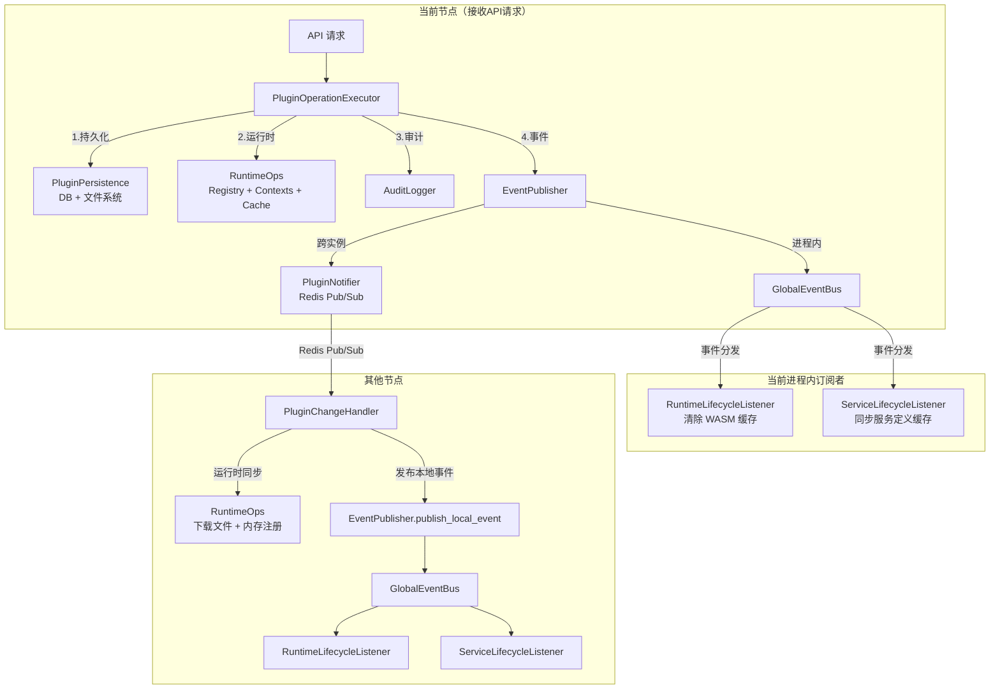
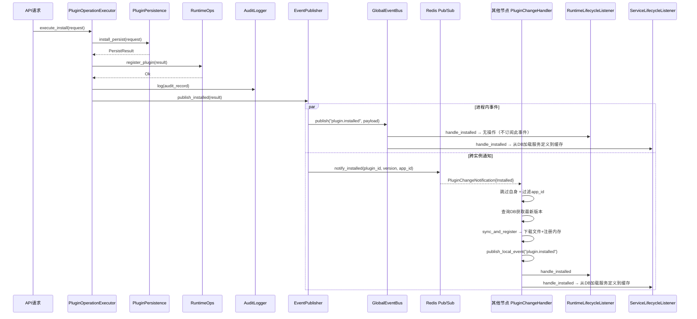
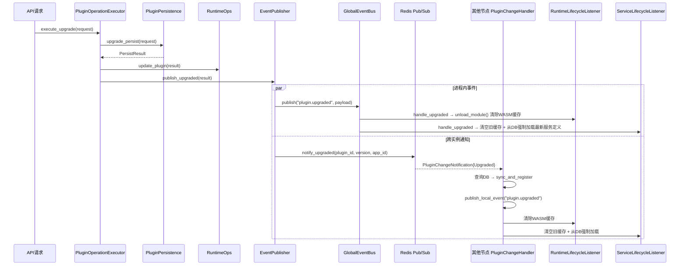
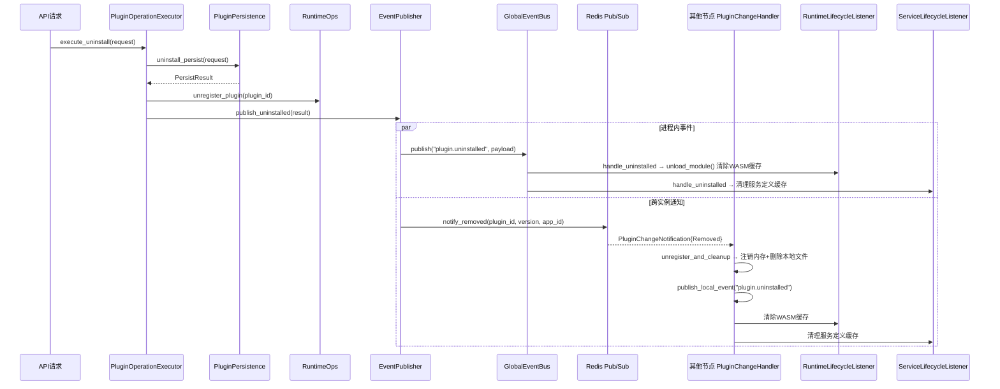
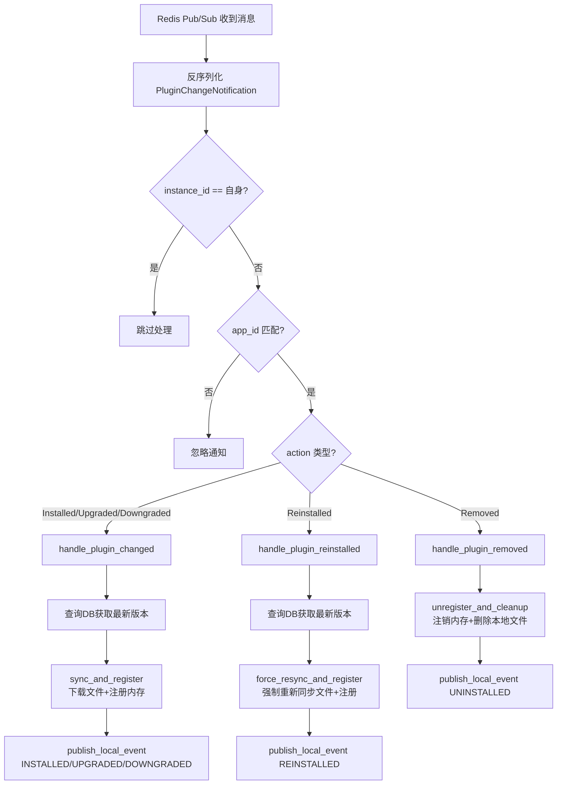
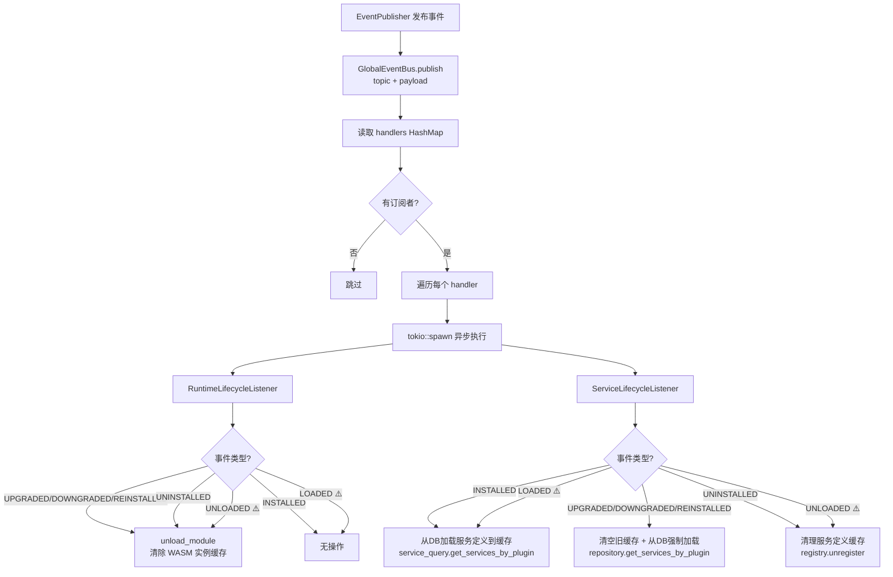
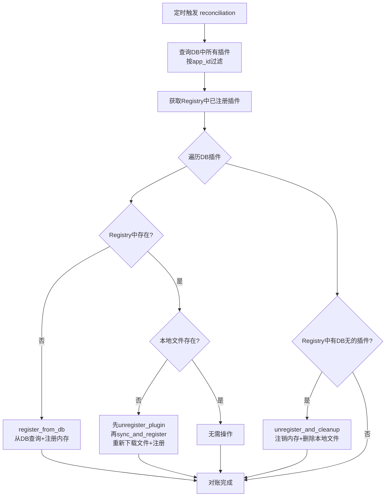
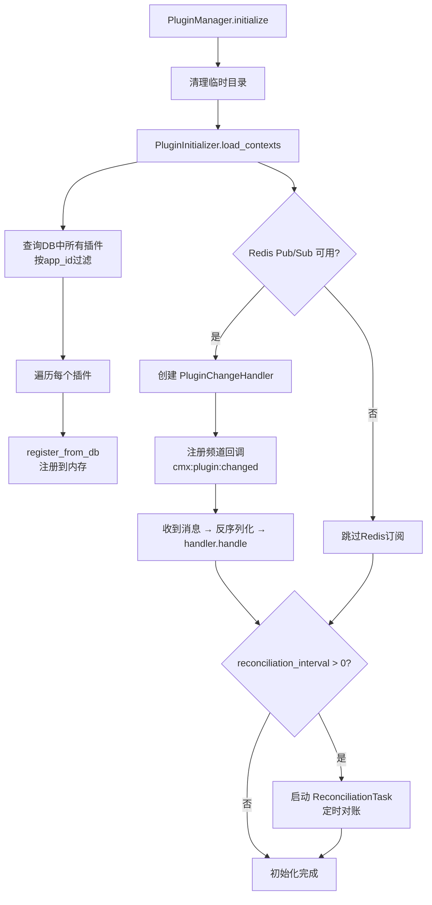

# 2026-05-24 cmx-plugin跨实例通知机制分析文档

## 计划概述

阅读 cmx-plugin 模块所有源码，梳理 Notifier（Redis 跨实例通知）和 GlobalEventBus（进程内事件总线）两种通知方式的完整机制，生成详细分析文档。

## 当前状态分析

已阅读以下核心源码文件：

| 文件                                                      | 职责                                                                 |
| ------------------------------------------------------- | ------------------------------------------------------------------ |
| `crates/libs/cmx-traits/src/event_bus/bus.rs`           | EventBus 核心实现（发布-订阅）                                               |
| `crates/libs/cmx-traits/src/event_bus/global.rs`        | GlobalEventBus 单例管理（OnceLock）                                      |
| `crates/libs/cmx-traits/src/event_bus/types.rs`         | 类型定义：EventTopic、EventPayload、EventHandler                          |
| `crates/libs/cmx-traits/src/lifecycle.rs`               | 事件主题常量、PluginLifecyclePayload、PluginLifecycleListener trait        |
| `crates/libs/cmx-plugin/src/cluster/notification.rs`    | PluginNotifier 实现（RuntimeLoad/RuntimeUnload 已注释）                   |
| `crates/libs/cmx-plugin/src/service/event_publisher.rs` | EventPublisher 统一封装（notify\_runtime\_load/unload 已注释）              |
| `crates/libs/cmx-plugin/src/service/plugin_sync.rs`     | PluginChangeHandler — Redis 通知处理器（RuntimeLoad/RuntimeUnload 处理已注释） |
| `crates/libs/cmx-plugin/src/service/executor.rs`        | PluginOperationExecutor — 统一编排（管控操作已注释）                            |
| `crates/libs/cmx-plugin/src/service/runtime_ops.rs`     | RuntimeOps — 运行时操作层                                                |
| `crates/libs/cmx-plugin/src/service/reconciliation.rs`  | ReconciliationTask — 定时对账                                          |
| `crates/libs/cmx-plugin/src/service/initializer.rs`     | PluginInitializer — 启动初始化                                          |
| `crates/libs/cmx-plugin/src/core/manager.rs`            | PluginManager — 核心协调器                                              |
| `crates/libs/cmx-runtime/src/lifecycle_listener.rs`     | RuntimeLifecycleListener                                           |
| `crates/libs/cmx-service/src/lifecycle_listener.rs`     | ServiceLifecycleListener                                           |

## 输出产物

在 `/media/yqs/工作/rustspace/cmx/cmx-container/.trae/documents/` 下创建文档：

**文件名**: `2026-05-24-cmx-plugin跨实例通知机制分析.md`

## 文档内容规划

### 1. 架构概览

* 两套通知机制的整体关系图

* EventPublisher 统一封装层

### 2. GlobalEventBus 详解

* 实现原理（OnceLock 单例、HashMap\<topic, handlers>、tokio::spawn 异步分发）

* 事件主题常量（7 个：INSTALLED/UPGRADED/UNINSTALLED/DOWNGRADED/REINSTALLED/LOADED/UNLOADED）

* 事件载荷 PluginLifecyclePayload 结构

* 两个订阅者及其处理逻辑：

  * RuntimeLifecycleListener：订阅 5 个事件，调用 unload\_module 清除 WASM 缓存

  * ServiceLifecycleListener：订阅 7 个事件，同步服务定义缓存

### 3. PluginNotifier 详解

* 实现原理（Redis Pub/Sub、频道 cmx:plugin:changed）

* 通知动作 PluginChangeAction（5 个：Installed/Upgraded/Downgraded/Reinstalled/Removed）

* RuntimeLoad/RuntimeUnload 已随管控模式一起禁用（注释状态）

* 通知消息 PluginChangeNotification 结构

* instance\_id 隔离机制

### 4. 两种通知方式的核心区别

* 通信范围：进程内 vs 跨实例

* 载荷丰富度：完整业务数据 vs 最小通知

* 数据来源：直接使用载荷 vs 从数据库查询

* 操作范围：仅内存缓存 vs 文件同步+内存注册

* 触发链路：直接触发 vs 间接触发（Redis 通知 → 本地处理 → 再发 GlobalEventBus）

### 5. 事件接收后的后续操作详解

* GlobalEventBus 两个订阅者的每个事件处理逻辑

* PluginChangeHandler 的每个动作处理逻辑

* RuntimeOps 各方法详解

### 6. 事件发布策略

* 本地操作（API 请求）：GlobalEventBus 进程内事件 + Redis 跨实例变更通知

* 管控操作（ControlService）已禁用，相关代码已注释

### 7. 完整数据流图

#### 7.1 整体架构关系图

#### 7.2 本地操作数据流（安装为例）

#### 7.3 本地操作数据流（升级为例）

#### 7.4 本地操作数据流（卸载为例）

#### 7.5 Redis 通知接收处理流程

#### 7.6 GlobalEventBus 事件分发流程

> ⚠️ 标注说明：LOADED/UNLOADED 事件主题常量和订阅者代码仍保留，但因管控模式已禁用，当前无实际触发源。这些事件仅在管控模式下的 RuntimeLoad/RuntimeUnload Redis 通知被处理时通过 `publish_local_event` 触发。

#### 7.7 对账任务流程

#### 7.8 启动初始化流程

### 8. 辅助机制

* 对账任务（ReconciliationTask）

* 启动初始化（PluginInitializer）

## 验证步骤

1. 文档内容与源码逐一对照确认准确性
2. 事件主题、动作枚举值与源码一致
3. 数据流图覆盖所有关键路径

