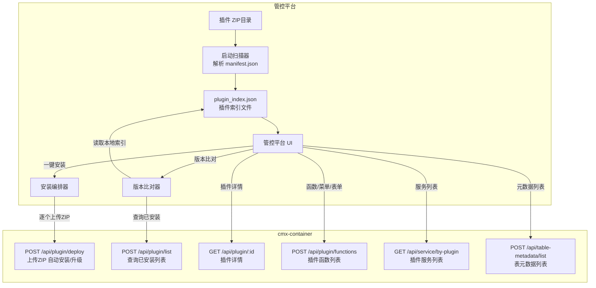
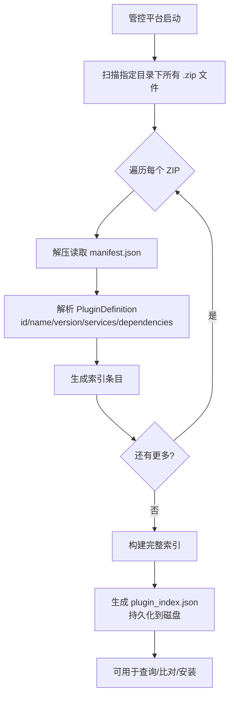
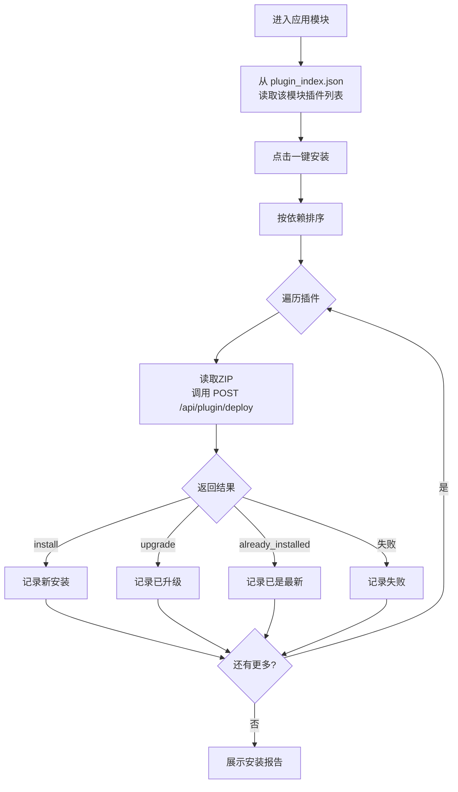
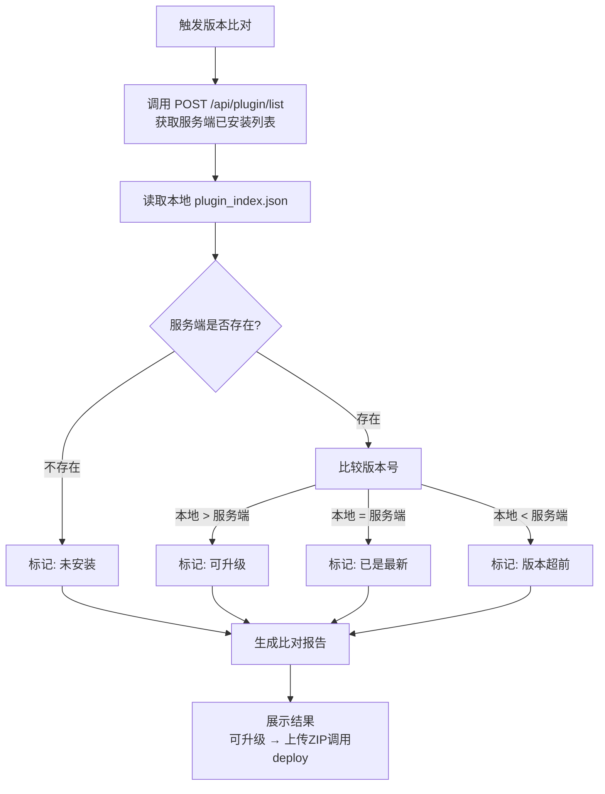
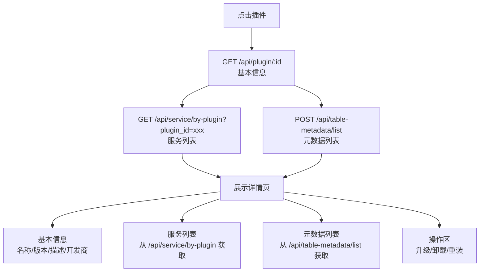
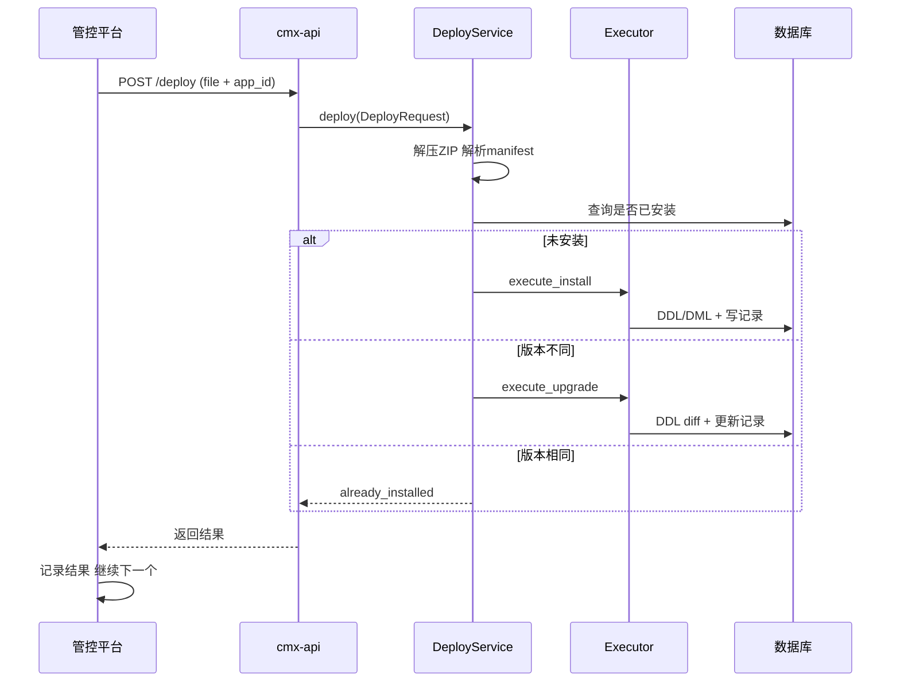
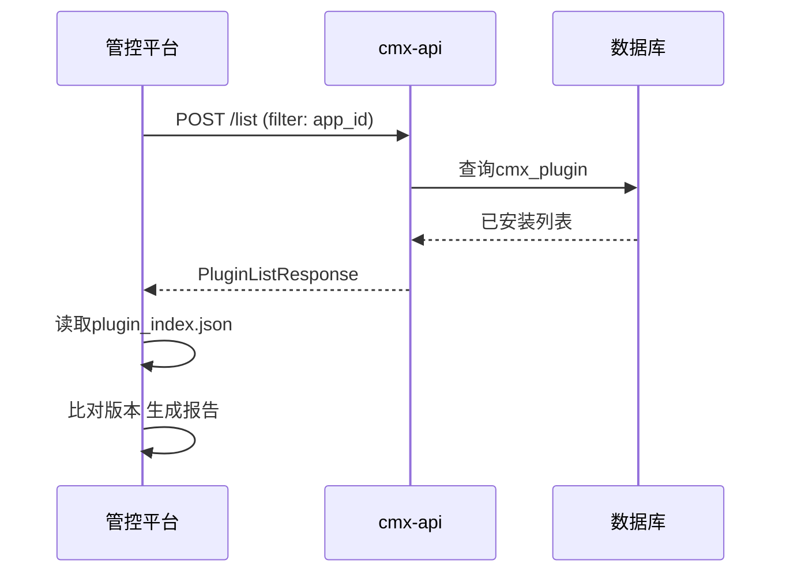

# 管控平台插件管理集成方案

> 管控平台（外部系统）与 cmx-container 服务端的插件管理集成方案。
> 管控平台负责插件包管理、索引构建、一键安装编排；cmx-container 作为服务端提供插件安装/查询/升级等 API。
> **cmx-container 侧无需任何代码改动**，现有接口已完全满足需求。

***

## 一、整体架构

### 1.1 系统角色

| 角色                | 说明                                                                                 |
| ----------------- | ---------------------------------------------------------------------------------- |
| **管控平台**          | 外部服务部署平台，可视化选择镜像/数据库/Redis/部署服务器等，以 Docker Compose 启动服务。负责插件 ZIP 包管理、插件索引构建、一键安装编排 |
| **cmx-container** | 当前项目，作为服务端提供插件安装、元数据初始化（菜单/权限/表单/DDL）、插件列表查询、版本比对等 REST API                        |
| **插件 ZIP 包**      | 包含 manifest.json 清单文件的 ZIP 包，存放于管控平台指定目录                                           |

### 1.2 系统交互总览图



***

## 二、核心流程

### 2.1 流程一：启动扫描与插件索引构建

管控平台启动时，扫描指定目录下的所有 ZIP 插件包，解析每个包内的 manifest.json，生成 plugin\_index.json 文件。



**plugin\_index.json 结构：**

```json
{
  "generated_at": "2026-05-27T10:00:00Z",
  "total_plugins": 15,
  "plugins": {
    "gl_account": {
      "plugin_id": "gl_account",
      "name": "总账插件",
      "version": "1.2.0",
      "domain_code": "FIN",
      "application_code": "GL_ACCT",
      "module_code": "GL",
      "zip_file_path": "/data/plugins/gl_account-1.2.0.zip",
      "dependencies": [],
      "services": []
    }
  },
  "modules": {
    "FIN": {
      "GL_ACCT": {
        "GL": ["gl_account", "gl_report"]
      }
    }
  }
}
```

> 索引文件每次启动重新生成覆盖，确保与ZIP目录同步。

### 2.2 流程二：一键安装模块所有插件

统一使用 `POST /api/plugin/deploy` 上传 ZIP，接口内部自动判断安装/升级/覆盖。



### 2.3 流程三：版本比对与升级检测

对比本地 plugin\_index.json 与服务端已安装列表，判断是否需要升级。



### 2.4 流程四：插件详情查看



***

## 三、cmx-container 现有接口说明

> cmx-container 侧无需任何代码改动。

| 接口                         | 方法   | 用途                                     |
| -------------------------- | ---- | -------------------------------------- |
| `/api/plugin/deploy`       | POST | 上传ZIP，自动判断安装/升级/覆盖                     |
| `/api/plugin/list`         | POST | 查询已安装列表，支持按domain/application/module过滤 |
| `/api/plugin/page`         | POST | 分页查询                                   |
| `/api/plugin/{plugin_id}`  | GET  | 插件详情                                   |
| `/api/plugin/functions`    | POST | 批量获取插件函数列表                             |
| `/api/plugin/exists`       | GET  | 检查插件是否已安装                              |
| `/api/plugin/uninstall`    | POST | 卸载插件                                   |
| `/api/plugin/downgrade`    | POST | 降级插件                                   |
| `/api/service/by-plugin`   | GET  | 获取插件关联的服务列表                            |
| `/api/table-metadata/list` | POST | 查询表元数据列表                               |

### deploy 接口参数

请求（multipart/form-data）：

* `file`: ZIP包（必填）

* `target_db_id`: 目标数据库ID（可选）

* `force_reinstall`: 是否覆盖安装（可选）

* `build_type`: debug/release（可选）

响应 action 字段：

* `install`: 全新安装

* `upgrade`: 版本升级

* `reinstall`: 覆盖安装

* `already_installed`: 已安装相同版本

***

## 四、数据流图

### 4.1 安装数据流



### 4.2 版本比对数据流



***

## 五、管控平台侧实现要点

> 以下为管控平台侧实现，不在cmx-container范围内。

1. **ZIP扫描与索引构建**：扫描目录 -> 解析manifest.json -> 生成plugin\_index.json
2. **一键安装编排器**：读取索引 -> 依赖排序 -> 逐个调用deploy -> 生成报告
3. **版本比对模块**：调用list获取服务端列表 -> 与plugin\_index.json比对 -> 标记状态
4. **插件详情页**：调用get详情 + `/api/service/by-plugin` 服务列表 + `/api/table-metadata/list` 元数据列表

***

## 六、关键设计决策

1. **统一使用deploy**：自动判断安装/升级/覆盖，管控平台逻辑极简
2. **管控平台侧比对**：读取索引JSON与服务端list比对，减少服务端压力
3. **依赖顺序安装**：按dependencies拓扑排序
4. **错误处理**：单个失败不阻塞，可配置关键插件失败时中止

***

## 七、服务间调用关系分析

### 7.1 调用方向

本方案采用**单向调用**架构：

```
管控平台 ──────调用──────> cmx-container
   │
   │   不存在反向调用
   └───────────────────────┘
```

**仅允许管控平台调用 cmx-container 服务，不允许 cmx-container 反向调用管控平台。**

### 7.2 为什么不应双向调用

| 问题       | 说明                                       |
| -------- | ---------------------------------------- |
| **服务耦合** | 双向调用形成循环依赖，部署、扩缩容、升级都必须协调进行              |
| **边界模糊** | 管控平台是编排层，cmx-container 是执行层，角色不清         |
| **部署独立** | 管控平台可能管理多个 cmx-container 实例，双向调用导致网络拓扑复杂 |
| **故障传播** | cmx-container 故障不应影响管控平台本身的功能            |

### 7.3 cmx-container 不应具备的能力

以下能力不应存在于 cmx-container 中，也不应反向调用管控平台：

| 能力                    | 原因                                  | 正确做法                                                                  |
| --------------------- | ----------------------------------- | --------------------------------------------------------------------- |
| 监听管控平台 ZIP 目录变化       | cmx-container 不应感知管控平台的存储结构         | 管控平台主动推送 ZIP 到 cmx-container 的 deploy 接口                              |
| 回调通知管控平台安装结果          | cmx-container 只负责执行，执行结果由管控平台轮询获取   | 部署完成后，管控平台主动查询 `/api/plugin/list` 获取结果                                |
| 查询 plugin\_index.json | 索引属于管控平台，cmx-container 不应访问管控平台文件系统 | 管控平台本地持有索引，比对时调用 cmx-container 的 list 接口                              |
| 主动推送插件更新事件            | cmx-container 是被动服务，不应主动触发管控平台操作    | cmx-container 通过 Redis PubSub 通知其他 cmx-container 节点（集群内），管控平台通过轮询检测变更 |
| 调用管控平台 REST API       | cmx-container 不应依赖管控平台的接口存在         | 管控平台作为客户端，单方面依赖 cmx-container                                         |

### 7.4 正确的服务边界

| 角色                | 职责                                     | 调用谁                      |
| ----------------- | -------------------------------------- | ------------------------ |
| **管控平台**          | ZIP 管理、索引构建、一键安装编排、UI 展示、版本比对          | 主动调用 cmx-container 的 API |
| **cmx-container** | 插件安装/升级/卸载执行、DDL/DML 初始化、元数据管理、集群内插件同步 | 不调用管控平台，仅提供被动 API        |

### 7.5 部署架构示意

```
┌─────────────────────────────────────────────┐
│              管控平台（独立部署）              │
│                                             │
│  ┌─────────┐  ┌─────────┐  ┌─────────────┐  │
│  │ZIP目录   │  │索引构建  │  │ 一键安装编排 │  │
│  │扫描器    │  │器       │  │ 器          │  │
│  └────┬────┘  └────┬────┘  └──────┬──────┘  │
│       │            │             │         │
│       └────────────┴──────┬───────┘         │
│                           │ 调用 API        │
└───────────────────────────┼─────────────────┘
                            ▼
┌─────────────────────────────────────────────┐
│           cmx-container 集群                 │
│                                             │
│  ┌────────────┐    ┌────────────┐          │
│  │ cmx-node-1 │◄──►│ cmx-node-2 │          │
│  │  (API+运行时)│    │  (API+运行时)│          │
│  └────────────┘    └────────────┘          │
│         ▲                                   │
│         │ Redis PubSub（集群内部同步）        │
└─────────┼───────────────────────────────────┘
          ▲ 集群内通知
          │
    ┌─────┴─────┐
    │ Redis     │
    └───────────┘
```

> **核心原则**：管控平台始终是主动方，cmx-container 始终是被动方。两者通过 HTTP API 解耦，不存在反向依赖。

***

## 八、注意事项

1. **control模块已注释**：如需集中式管控（不触发运行时加载），需恢复该模块
2. **app\_id隔离**：所有操作带app\_id参数，确保多应用隔离
3. **ZIP格式**：根目录必须包含manifest.json
4. **自动初始化**：安装时自动执行DDL/DML/菜单/权限/表单初始化
5. **单向调用原则**：仅允许管控平台调用 cmx-container，禁止反向调用

