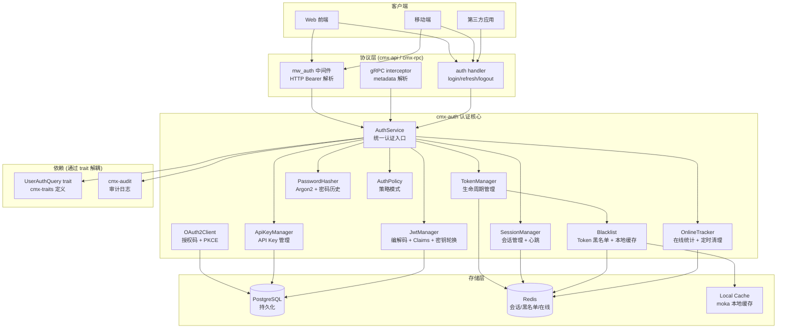
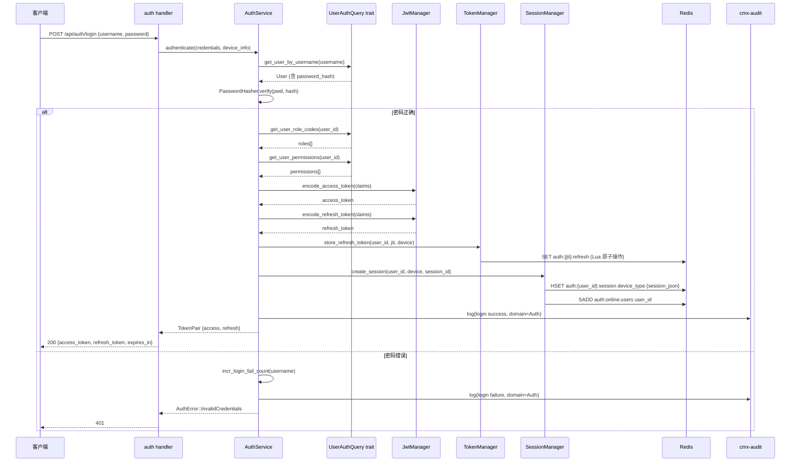
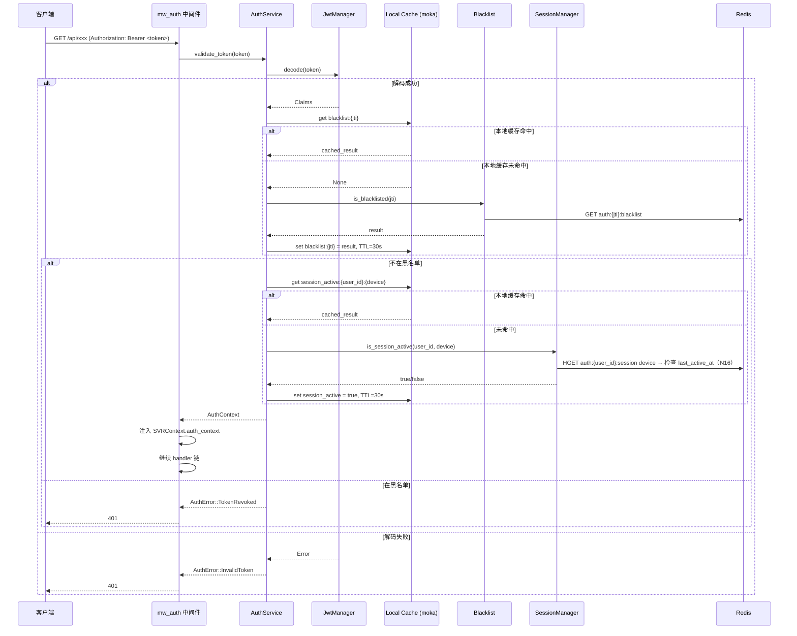
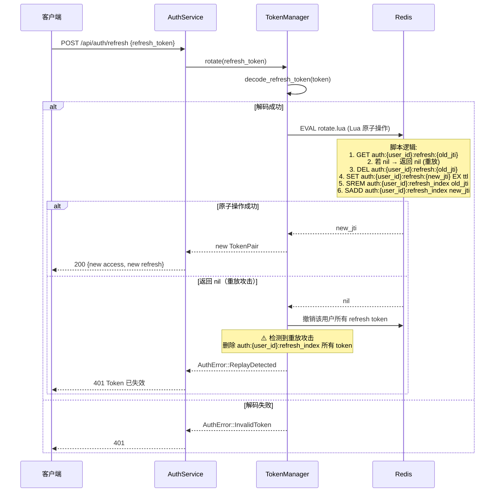
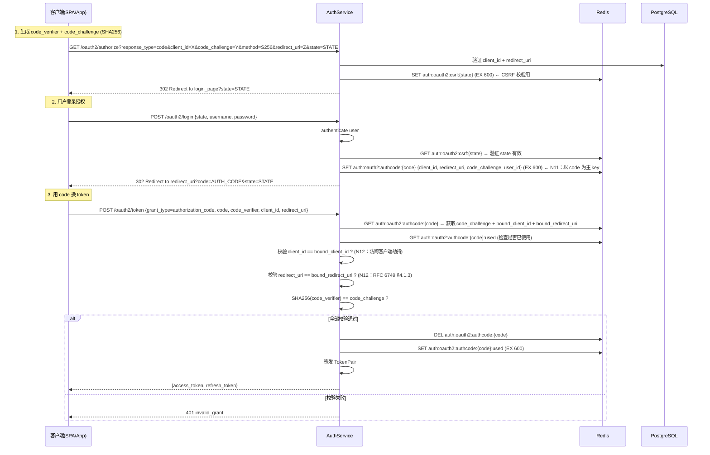
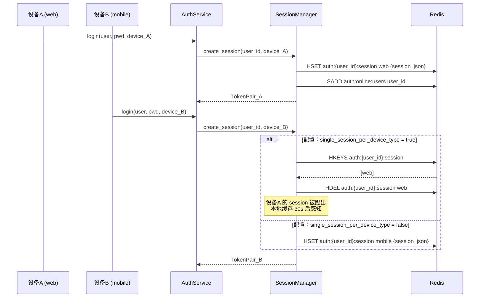
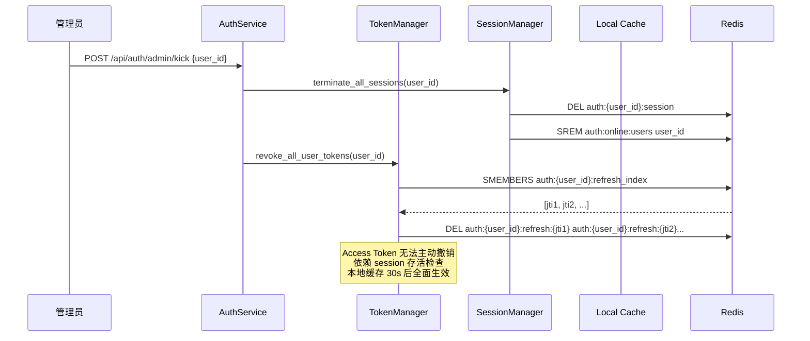

# Rust 企业级统一认证模块架构方案（cmx-auth）

> 日期：2026-06-15 | 模块：cmx-auth | 状态：方案设计 v6（整合 v8 评审报告 N21~N22 修正）
>
> 依赖文档：
>
> * `20260612_平台级基础设施与双协议架构重构方案.md`（Phase 4：认证系统）
>
> * `20260615_cmx-iam_用户权限角色管理方案.md`（RBAC 数据模型）
>
> * `20260615_cmx-auth_架构方案评审报告.md`（评审意见整合）
>
> 上游基础：`cmx-core::AuthContext` 定义在 `crates/libs/cmx-core/src/model/service/context.rs`，需扩展（见 §4.1.6）。

***

## 一、概述与目标

### 1.1 定位

cmx-auth 是平台的**认证基础设施 crate**，位于 `crates/libs/cmx-infra/cmx-auth/`，提供：

* JWT 双令牌（Access Token + Refresh Token）签发与校验

* Token 生命周期管理（刷新轮换、撤销、黑名单）

* Argon2 密码哈希

* OAuth2 授权码模式 + PKCE

* 无状态 + 有状态结合的会话管理（SSO、多设备互踢）

* 认证策略模式（Strategy Pattern）

* 实时在线用户统计与强制下线

* API Key 认证（服务间调用）

* JWT 密钥轮换（Key Rotation）

### 1.2 设计原则

| 原则       | 说明                                                         |
| -------- | ---------------------------------------------------------- |
| 协议无关     | Service 层不依赖 axum/volo，供 HTTP 中间件和 gRPC interceptor 共同调用   |
| Trait 抽象 | 认证策略、用户数据查询、Token 存储、密码哈希均通过 trait 抽象                      |
| 零成本抽象    | 优先泛型静态分发，仅跨 crate 边界使用 `dyn Trait`                         |
| 所有权安全    | 充分利用 Rust 所有权机制避免 Token 泄露、并发数据竞争                          |
| 解耦设计     | cmx-auth 通过 `UserAuthQuery` trait 获取用户数据，**不直接依赖 cmx-iam** |

### 1.3 Web 框架：Axum（已确定）

项目已使用 Axum，cmx-auth **不直接依赖 axum**，仅提供 `validate_token()` 等协议无关函数。

### 1.4 Token 传递方式：Authorization Header（CSRF 免疫）

**决策**：Access Token 通过 `Authorization: Bearer <token>` 传递，**不使用 Cookie**。

理由：

* Authorization Header 不受浏览器自动发送机制影响，天然免疫 CSRF 攻击

* 前端（SPA/移动端）可方便地在请求头中携带 Token

* 若后续需支持 Cookie 方案（如服务端渲染），需额外增加 Double Submit Cookie 或 SameSite=Strict 防护

***

## 二、架构设计

### 2.1 整体架构图



### 2.2 核心交互时序：登录 + Token 签发

> **评审 P0-4 修正**：通过 `UserAuthQuery` trait 获取用户数据，不直接调用 cmx-iam



### 2.3 核心交互时序：Token 校验（中间件 + 本地缓存）

> **评审 P1-9 修正**：增加本地缓存层减少 Redis 往返



**本地缓存策略**（评审 P1-9 决策：启用，N10 修正：补充 Pub/Sub 主动失效）：

* 缓存层：`moka` crate（高性能并发缓存）

* 缓存内容：黑名单查询结果 + Session 存活状态

* 默认 TTL：30 秒（可配置，`AuthConfig.cache.local_ttl_secs`，安全敏感场景建议 ≤5s）

* **主动失效通道**（N10 修正）：撤销/强制下线时通过 Redis Pub/Sub 广播 `invalidate` 事件，各实例收到后主动 `local_cache.invalidate()`，将延迟从 30s 降到**秒级**

* 权衡说明：最坏情况（Pub/Sub 消息丢失）下仍依赖 TTL 自然过期；正常情况下秒级生效

### 2.4 Crate 内部模块结构

```
crates/libs/cmx-infra/cmx-auth/
  ├── Cargo.toml
  ├── src/
  │   ├── lib.rs                    # 模块声明 + re-exports
  │   ├── error.rs                  # AuthError
  │   ├── config.rs                 # AuthConfig (JWT 密钥、过期、Argon2 参数、缓存配置)
  │   │
  │   ├── jwt/                      # JWT 编解码
  │   │   ├── mod.rs
  │   │   ├── claims.rs             # AccessClaims, RefreshClaims, TokenPair
  │   │   ├── encoder.rs            # JwtManager (encode/decode, RS256/HS256)
  │   │   └── key_store.rs          # 🆕 密钥管理 + 轮换 (kid + 多密钥)
  │   │
  │   ├── token/                    # Token 生命周期管理
  │   │   ├── mod.rs
  │   │   ├── manager.rs            # TokenManager (签发/刷新/撤销)
  │   │   ├── blacklist.rs          # Redis 黑名单 + moka 本地缓存
  │   │   └── refresh_rotation.rs   # Refresh Token 轮换 (Lua 原子操作)
  │   │
  │   ├── password/                 # 密码处理
  │   │   ├── mod.rs
  │   │   ├── hasher.rs             # Argon2Hasher (hash/verify)
  │   │   ├── policy.rs             # 密码策略校验 (强度)
  │   │   └── history.rs            # 🆕 密码历史校验
  │   │
  │   ├── policy/                   # 认证策略抽象 (Strategy Pattern)
  │   │   ├── mod.rs                # AuthPolicy trait
  │   │   ├── jwt_policy.rs         # JWT Bearer 策略
  │   │   ├── api_key.rs            # API Key 策略
  │   │   └── oauth2_policy.rs      # OAuth2 策略
  │   │
  │   ├── oauth2/                   # OAuth2 客户端
  │   │   ├── mod.rs
  │   │   ├── flows.rs              # Authorization Code Flow
  │   │   ├── pkce.rs               # PKCE 扩展
  │   │   └── store.rs              # 客户端/授权码持久化
  │   │
  │   ├── api_key/                  # 🆕 API Key 管理
  │   │   ├── mod.rs
  │   │   ├── manager.rs            # ApiKeyManager (generate/validate/revoke)
  │   │   └── entity.rs             # ApiKey 结构
  │   │
  │   ├── session/                  # 会话管理
  │   │   ├── mod.rs
  │   │   ├── manager.rs            # SessionManager (创建/查询/销毁/互踢)
  │   │   ├── heartbeat.rs          # 🆕 心跳续期
  │   │   └── online.rs             # OnlineTracker (在线统计 + 定时清理)
  │   │
  │   ├── metrics.rs                # 🆕 Prometheus 指标定义
  │   └── auth_service_impl.rs      # AuthService trait 实现
```

### 2.5 cmx-traits 新增 Trait

> **评审 P0-4 + 5.1 修正**：遵循 cmx-traits 扁平结构，新增独立文件

```
crates/libs/cmx-traits/src/
  ├── auth_service.rs        # AuthService trait + Credentials + TokenPair + DeviceInfo
  ├── auth_policy.rs         # AuthPolicy trait
  └── user_auth_query.rs     # 🆕 用户认证数据查询抽象（解耦 cmx-auth 与 cmx-iam）
```

#### 2.5.1 UserAuthQuery Trait（P0-4 新增）

> cmx-auth 不直接依赖 cmx-iam，通过此 trait 获取用户/角色/权限数据。cmx-iam 负责实现。

```rust
// crates/libs/cmx-traits/src/user_auth_query.rs
use async_trait::async_trait;
use serde::{Deserialize, Serialize};

/// 用户认证数据（含密码哈希，仅认证服务可见）
#[derive(Debug, Clone, Serialize, Deserialize)]
pub struct UserAuthData {
    pub user_id: String,
    pub username: String,
    pub password_hash: Option<String>,
    pub status: i64,        // 0-禁用 1-启用
    pub nickname: Option<String>,
}

/// 用户认证数据查询抽象
///
/// cmx-auth 依赖此 trait 获取用户数据，cmx-iam 实现此 trait。
/// N5 修正：去掉 db_id 参数（认证固定使用 default_db_id，与架构方案 §5.5 一致）
/// 实现 crates/libs/cmx-iam/src/auth_query_impl.rs
#[async_trait]
pub trait UserAuthQuery: Send + Sync {
    /// 根据用户名查询用户认证数据（含密码哈希）
    async fn get_user_by_username(
        &self,
        username: &str,
    ) -> Result<Option<UserAuthData>, crate::error::TraitError>;

    /// 获取用户角色编码列表
    async fn get_user_role_codes(
        &self,
        user_id: &str,
    ) -> Result<Vec<String>, crate::error::TraitError>;

    /// 获取用户权限编码列表
    async fn get_user_permissions(
        &self,
        user_id: &str,
    ) -> Result<Vec<String>, crate::error::TraitError>;
}
```

#### 2.5.2 AuthError 定义（v2 评审 N1 修正：定义在 cmx-traits）

> **评审 N1 决策**：`AuthError` 定义在 cmx-traits 中（而非 cmx-auth），使 `AuthService` trait 可返回强类型错误，避免 `Box<dyn Error>` 导致类型擦除和错误映射失效。cmx-traits 已依赖 thiserror。

```rust
// crates/libs/cmx-traits/src/auth_error.rs
use thiserror::Error;

/// 认证领域错误（仅保留领域语义，不含基础设施错误链）
///
/// N8+N13 修正：cmx-traits 不依赖 cmx-buffer/jsonwebtoken 等具体实现库，
/// 底层错误链由 cmx-auth 的 AuthInfraError 保留。
/// AuthService trait 返回 AuthError，消费方只需关心领域语义。
#[derive(Debug, Error)]
pub enum AuthError {
    #[error("用户名或密码错误")]
    InvalidCredentials,

    #[error("Token 无效: {0}")]
    InvalidToken(String),

    #[error("Token 已过期")]
    TokenExpired,

    #[error("Token 已被撤销")]
    TokenRevoked,

    #[error("Refresh Token 已失效，检测到重放攻击")]
    ReplayDetected,

    #[error("会话不存在或已过期")]
    SessionNotFound,

    #[error("密码哈希失败: {0}")]
    PasswordHashError(String),

    #[error("密码校验失败")]
    PasswordVerifyFailed,

    #[error("密码不符合策略要求: {0}")]
    PasswordPolicyViolated(String),

    #[error("密码与历史密码重复")]
    PasswordReused,

    #[error("OAuth2 错误: {0}")]
    OAuth2(String),

    #[error("OAuth2 客户端不存在: {0}")]
    ClientNotFound(String),

    #[error("授权码无效或已过期")]
    InvalidAuthCode,

    #[error("PKCE 校验失败")]
    PkceVerificationFailed,

    #[error("权限不足")]
    Forbidden,

    #[error("用户已被禁用")]
    UserDisabled,

    #[error("API Key 无效")]
    InvalidApiKey,

    #[error("API Key 已过期")]
    ApiKeyExpired,

    #[error("登录失败次数过多，账号已锁定 {secs} 秒")]
    TooManyAttempts { secs: u64, limit: u32, window: u64 },

    #[error("序列化错误: {0}")]
    SerdeJson(#[from] serde_json::Error),

    #[error("内部错误: {0}")]
    Internal(String),
}
```

**cmx-auth 基础设施错误扩展**：

```rust
// crates/libs/cmx-infra/cmx-auth/src/error.rs
use thiserror::Error;
use cmx_traits::AuthError;

/// 认证基础设施错误（保留完整错误链）
///
/// N8+N13 修正：Redis/JWT/Database 错误可安全使用 #[from] 保留错误链，
/// 不影响 cmx-traits 的依赖方向。cmx-auth 内部实现使用此类型，
/// 在返回 AuthService trait 接口时 .map_err() 转换为 AuthError。
#[derive(Debug, Error)]
pub enum AuthInfraError {
    #[error("Redis 操作错误")]
    Redis(#[from] cmx_buffer::error::CacheError),

    #[error("JWT 错误")]
    Jwt(#[from] jsonwebtoken::errors::Error),

    #[error("数据库操作错误")]
    Database(#[from] cmx_database::Error),  // N19 修正：不直接依赖 sqlx，复用 cmx-database 的错误类型

    #[error(transparent)]
    Auth(#[from] AuthError),
}

impl From<AuthInfraError> for AuthError {
    fn from(e: AuthInfraError) -> Self {
        match e {
            AuthInfraError::Auth(auth_err) => auth_err,
            AuthInfraError::Redis(err) => AuthError::Internal(err.to_string()),
            AuthInfraError::Jwt(err) => AuthError::InvalidToken(err.to_string()),
            AuthInfraError::Database(err) => AuthError::Internal(err.to_string()),
        }
    }
}
```

#### 2.5.3 AuthService Trait

```rust
// crates/libs/cmx-traits/src/auth_service.rs
use async_trait::async_trait;
use cmx_core::AuthContext;
use serde::{Deserialize, Serialize};
use crate::auth_error::AuthError;

/// 认证凭证（策略模式入口）
#[derive(Debug, Clone, Serialize, Deserialize)]
#[serde(tag = "type", content = "value")]
pub enum Credentials {
    Password { username: String, password: String },
    RefreshToken { refresh_token: String },
    AuthorizationCode { code: String, code_verifier: String, client_id: String },
    ApiKey { key: String },
}

#[derive(Debug, Clone, Serialize, Deserialize)]
pub struct TokenPair {
    pub access_token: String,
    pub refresh_token: String,
    pub access_expires_at: i64,
    pub refresh_expires_at: i64,
    pub token_type: String,
}

#[derive(Debug, Clone, Serialize, Deserialize, Default)]
pub struct DeviceInfo {
    pub device_type: String,
    pub device_id: String,
    pub ip: Option<String>,
    pub user_agent: Option<String>,
}

/// 认证服务统一接口
/// 返回强类型 AuthError，消费方可直接 match 错误变体做 HTTP 映射
#[async_trait]
pub trait AuthService: Send + Sync {
    async fn authenticate(&self, credentials: Credentials, device_info: Option<DeviceInfo>) -> Result<TokenPair, AuthError>;
    async fn validate_token(&self, token: &str) -> Result<AuthContext, AuthError>;
    async fn refresh_token(&self, refresh_token: &str) -> Result<TokenPair, AuthError>;
    async fn revoke_token(&self, token: &str) -> Result<(), AuthError>;
    async fn revoke_all_tokens(&self, user_id: &str) -> Result<(), AuthError>;
    async fn hash_password(&self, plain: &str) -> Result<String, AuthError>;
    async fn verify_password(&self, plain: &str, hash: &str) -> Result<bool, AuthError>;
}
```

***

## 三、核心流程设计

### 3.1 JWT 双令牌刷新流程（Refresh Token Rotation）

**双令牌设计**：

| 令牌            | 用途               | 有效期         | 存储位置        | 可撤销      |
| ------------- | ---------------- | ----------- | ----------- | -------- |
| Access Token  | API 访问凭证，自包含     | 短（15-30 分钟） | 客户端内存       | 黑名单检查    |
| Refresh Token | 换取新 Access Token | 长（7-30 天）   | Redis + 客户端 | Redis 删除 |

**Refresh Token Rotation 流程**（防重放，Lua 原子操作）：

> **评审 P0-2 修正**：使用 cmx-buffer 的 Lua 公共 API 保证原子性



**Lua 脚本（rotate.lua）**：

```lua
-- N4 修正：所有 KEYS 以 {user_id} 为 Hash Tag，保证 Cluster 同 slot
-- KEYS[1] = auth:{user_id}:refresh:{old_jti}
-- KEYS[2] = auth:{user_id}:refresh:{new_jti}
-- KEYS[3] = auth:{user_id}:refresh_index
-- ARGV[1] = user_id (存入 refresh value)
-- ARGV[2] = ttl (秒)
-- ARGV[3] = old_jti
-- ARGV[4] = new_jti

local old = redis.call('GET', KEYS[1])
if not old then
    return nil  -- 已被使用或已撤销 → 重放攻击
end
redis.call('DEL', KEYS[1])
redis.call('SREM', KEYS[3], ARGV[3])
redis.call('SET', KEYS[2], ARGV[1], 'EX', ARGV[2])
redis.call('SADD', KEYS[3], ARGV[4])
return ARGV[4]
```

### 3.2 OAuth2 授权码流程 + PKCE

> **N11+N12 修正**：授权码主 key 改为 `auth:oauth2:authcode:{code}`（而非 `{state}`），换 token 时用 code 反查；补充 client_id + redirect_uri 一致性校验



### 3.3 多端会话互踢流程

> **评审 P0-5 修正**：Key 使用 Hash Tag 格式 `auth:{user_id}:session`



### 3.4 强制下线流程



***

## 四、数据结构与缓存设计

### 4.1 核心 Rust Struct 设计

#### 4.1.1 JWT Claims

```rust
// crates/libs/cmx-infra/cmx-auth/src/jwt/claims.rs
use serde::{Deserialize, Serialize};

/// Access Token Claims
#[derive(Debug, Clone, Serialize, Deserialize)]
pub struct AccessClaims {
    pub sub: String,         // subject (用户 ID)
    pub exp: i64,            // expiration time
    pub iat: i64,            // issued at
    pub jti: String,         // JWT ID (用于黑名单)
    pub iss: String,         // issuer
    pub aud: String,         // audience
    pub username: String,
    #[serde(default)]
    pub roles: Vec<String>,
    #[serde(default)]
    pub permissions: Vec<String>,
    #[serde(default)]
    pub org_id: Option<String>,
    pub sid: String,         // 会话 ID（关联 Redis session）
    pub device: String,      // 设备类型
    pub typ: String,         // "access"
    #[serde(default)]
    pub kid: Option<String>, // 🆕 密钥 ID（用于密钥轮换）
}

/// Refresh Token Claims（精简）
#[derive(Debug, Clone, Serialize, Deserialize)]
pub struct RefreshClaims {
    pub sub: String,
    pub exp: i64,
    pub iat: i64,
    pub jti: String,
    pub iss: String,
    pub typ: String,         // "refresh"
    pub sid: String,
    pub device: String,
}
```

#### 4.1.2 UserSession

```rust
// crates/libs/cmx-infra/cmx-auth/src/session/manager.rs
use serde::{Deserialize, Serialize};
use chrono::{DateTime, Utc};

/// 用户会话（存储在 Redis Hash 中）
#[derive(Debug, Clone, Serialize, Deserialize)]
pub struct UserSession {
    pub session_id: String,
    pub user_id: String,
    pub device_type: String,
    pub device_id: String,
    pub login_at: DateTime<Utc>,
    pub last_active_at: DateTime<Utc>,
    pub ip: Option<String>,
    pub user_agent: Option<String>,
    pub current_jti: String,
}
```

#### 4.1.3 OAuth2 客户端与授权码

```rust
// crates/libs/cmx-infra/cmx-auth/src/oauth2/store.rs
use serde::{Deserialize, Serialize};

#[derive(Debug, Clone, Serialize, Deserialize)]
pub struct OAuth2Client {
    pub client_id: String,
    pub client_name: String,
    pub client_secret: Option<String>,
    pub redirect_uris: Vec<String>,
    pub grant_types: Vec<String>,
    pub client_type: String,     // public / confidential
    pub pkce_required: bool,
    pub allowed_scopes: Vec<String>,
    pub status: i64,
}

#[derive(Debug, Clone, Serialize, Deserialize)]
pub struct AuthorizationCode {
    pub code: String,
    pub client_id: String,
    pub user_id: Option<String>,
    pub redirect_uri: String,
    pub code_challenge: Option<String>,
    pub code_challenge_method: Option<String>,
    pub scope: Vec<String>,
    pub state: String,
    pub approved: bool,
    pub created_at: i64,
}
```

#### 4.1.4 API Key

```rust
// crates/libs/cmx-infra/cmx-auth/src/api_key/entity.rs
use serde::{Deserialize, Serialize};

/// API Key（服务间调用认证）
#[derive(Debug, Clone, Serialize, Deserialize)]
pub struct ApiKey {
    pub id: String,
    /// API Key 前缀（用于展示识别，如 "cmx-xxxx"）
    pub key_prefix: String,
    /// SHA256 哈希（存储用，明文仅在生成时返回一次）
    pub key_hash: String,
    /// 关联用户 ID（可选，服务级 Key 可能无对应用户）
    pub user_id: Option<String>,
    /// 关联服务名称
    pub service_name: Option<String>,
    /// 允许的 scope（限定可访问的服务/接口）
    pub scopes: Vec<String>,
    /// 速率限制（请求/秒）
    pub rate_limit: Option<u32>,
    /// 过期时间（None = 永不过期）
    pub expires_at: Option<chrono::DateTime<chrono::Utc>>,
    pub status: i64,
}

/// API Key 生成结果（明文仅返回一次）
#[derive(Debug, Clone, Serialize, Deserialize)]
pub struct ApiKeyGenerated {
    pub key: String,          // 完整明文 key（仅此一次）
    pub key_prefix: String,
    pub id: String,
}
```

#### 4.1.5 AuthConfig

```rust
// crates/libs/cmx-infra/cmx-auth/src/config.rs
use serde::{Deserialize, Serialize};

#[derive(Debug, Clone, Serialize, Deserialize)]
pub struct AuthConfig {
    pub jwt: JwtConfig,
    pub token: TokenExpiryConfig,
    pub argon2: Argon2Config,
    pub session: SessionConfig,
    pub cache: CacheConfig,
    pub oauth2: Option<OAuth2Config>,
    /// 🆕 静态 API Key 列表（从配置文件加载，启动时自动导入）
    pub static_api_keys: Vec<StaticApiKeyConfig>,
    /// 🆕 超级管理员配置（启动时自动创建/更新）
    pub super_admin: Option<SuperAdminConfig>,
}

/// 🆕 静态 API Key 配置（从配置文件加载）
///
/// 应用启动时自动导入到 cmx_auth_api_key 表（如不存在则创建）。
/// 用于确保系统启动前有固定的服务间调用 API Key。
#[derive(Debug, Clone, Serialize, Deserialize)]
pub struct StaticApiKeyConfig {
    /// API Key 前缀（唯一标识）
    pub key_prefix: String,
    /// 明文 Key（配置文件中填写，启动时自动 SHA256 哈希后存储）
    pub key: String,
    /// 关联用户 ID
    pub user_id: Option<String>,
    /// 关联服务名称
    pub service_name: Option<String>,
    /// 允许的 scope
    #[serde(default)]
    pub scopes: Vec<String>,
    /// 描述
    pub description: Option<String>,
}

/// 🆕 超级管理员配置（启动时自动创建/更新）
#[derive(Debug, Clone, Serialize, Deserialize)]
pub struct SuperAdminConfig {
    pub username: String,
    /// 明文密码（启动时自动 Argon2 哈希后存储）
    pub password: String,
    pub nickname: Option<String>,
    pub email: Option<String>,
}

#[derive(Debug, Clone, Serialize, Deserialize)]
pub struct JwtConfig {
    pub algorithm: String,        // RS256 / HS256
    /// N15 修正：支持文件路径或 PEM 内容，生产环境建议使用文件路径 + chmod 600
    /// 启动时根据是否以 "-----BEGIN" 开头判断是 PEM 内容还是文件路径
    pub private_key: Option<String>,
    /// 同 private_key，支持文件路径或 PEM 内容
    pub public_key: Option<String>,
    pub secret: Option<String>,
    pub issuer: String,
    pub audience: String,
    /// 🆕 密钥轮换：当前签发使用的 kid
    pub current_kid: Option<String>,
    /// 🆕 历史公钥列表（验签用，宽限期内的旧密钥）
    pub legacy_public_keys: Vec<(String, String)>, // (kid, PEM)
}

#[derive(Debug, Clone, Serialize, Deserialize)]
pub struct TokenExpiryConfig {
    pub access_ttl_secs: u64,     // 默认 1800 (30 分钟)
    pub refresh_ttl_secs: u64,    // 默认 604800 (7 天)
}

#[derive(Debug, Clone, Serialize, Deserialize)]
pub struct Argon2Config {
    pub memory_cost: u32,         // 默认 65536 (64MB)
    pub time_cost: u32,           // 默认 3
    pub parallelism: u32,         // 默认 4
}

#[derive(Debug, Clone, Serialize, Deserialize)]
pub struct SessionConfig {
    pub single_session_per_device_type: bool,
    pub max_sessions: usize,
    pub idle_timeout_secs: u64,   // 默认 86400 (24h)
    /// 🆕 心跳间隔（秒），客户端需定时调用 /api/auth/heartbeat
    pub heartbeat_interval_secs: u64, // 默认 300 (5 分钟)
}

/// 🆕 本地缓存配置（评审 P1-9）
#[derive(Debug, Clone, Serialize, Deserialize)]
pub struct CacheConfig {
    /// 是否启用本地缓存
    pub enable_local_cache: bool,      // 默认 true
    /// 本地缓存 TTL（秒）
    pub local_ttl_secs: u64,           // 默认 30
    /// 本地缓存最大容量
    pub local_cache_max_entries: u64,  // 默认 10000
    /// 登录失败锁定阈值
    pub max_login_attempts: u32,       // 默认 5
    /// 锁定时长（秒）
    pub lock_duration_secs: u64,       // 默认 900 (15 分钟)
}

impl Default for AuthConfig {
    fn default() -> Self {
        Self {
            jwt: JwtConfig {
                algorithm: "HS256".into(),
                private_key: None,
                public_key: None,
                secret: Some("a7k9m2p4x8q1w5e3r6t0y7u2i9o4p1".into()),
                issuer: "cmx-auth".into(),
                audience: "cmx-platform".into(),
                current_kid: None,
                legacy_public_keys: vec![],
            },
            token: TokenExpiryConfig {
                access_ttl_secs: 1800,
                refresh_ttl_secs: 604800,
            },
            argon2: Argon2Config {
                memory_cost: 65536,
                time_cost: 3,
                parallelism: 4,
            },
            session: SessionConfig {
                single_session_per_device_type: false,
                max_sessions: 0,
                idle_timeout_secs: 86400,
                heartbeat_interval_secs: 300,
            },
            cache: CacheConfig {
                enable_local_cache: true,
                local_ttl_secs: 30,
                local_cache_max_entries: 10000,
                max_login_attempts: 5,
                lock_duration_secs: 900,
            },
            oauth2: None,
            static_api_keys: vec![],
            super_admin: None,
        }
    }
}
```

#### 4.1.6 AuthContext 扩展（P0-3 修正）

> **评审 P0-3**：cmx-core 的 AuthContext 需新增 session\_id / device\_type / auth\_method 字段

```rust
// crates/libs/cmx-core/src/model/service/context.rs
// 修改现有 AuthContext：

#[derive(Debug, Clone, Serialize, Deserialize)]
pub struct AuthContext {
    pub user_id: String,
    pub username: String,
    #[serde(default)]
    pub roles: Vec<String>,
    #[serde(default)]
    pub permissions: Vec<String>,
    pub org_id: Option<String>,
    // 🆕 P0-3 新增字段
    #[serde(default)]
    pub session_id: Option<String>,     // 关联 Redis session
    #[serde(default)]
    pub device_type: Option<String>,    // 设备类型
    #[serde(default)]
    pub auth_method: Option<String>,    // 认证方式: password/oauth2/api_key
}
```

> **WASM 兼容性**：新增字段使用 `#[serde(default)]`，旧插件反序列化时缺失字段默认为 `None`，向前兼容 ✅

#### 4.1.7 AuthError（已移至 cmx-traits）

> AuthError 定义已移至 `crates/libs/cmx-traits/src/auth_error.rs`（见 §2.5.2），cmx-auth re-export 使用。

### 4.2 错误映射（v2 评审 N2+N3 修正）

> **评审 N2**：`rate_limit_exceeded` 实际签名为 `(retry_after: u64, limit: u64, window: u64)`
>
> **评审 N3**：`From<AuthError>` 实现放在 **cmx-api** crate（infra 不应依赖 API 层）

```rust
// 此实现位于 cmx-api crate
// 文件：crates/libs/cmx-api/src/middleware/mw_auth.rs

impl From<cmx_traits::AuthError> for cmx_api_types::Error {
    fn from(e: cmx_traits::AuthError) -> Self {
        use cmx_traits::AuthError;
        match &e {
            AuthError::InvalidCredentials | AuthError::InvalidToken(_)
            | AuthError::TokenExpired | AuthError::TokenRevoked
            | AuthError::ReplayDetected | AuthError::SessionNotFound
            | AuthError::InvalidAuthCode | AuthError::PkceVerificationFailed
            | AuthError::InvalidApiKey | AuthError::ApiKeyExpired => {
                Error::unauthorized(e.to_string())
            }
            AuthError::Forbidden | AuthError::UserDisabled => {
                Error::forbidden(e.to_string())
            }
            // N2 修正：3 个 u64 参数
            AuthError::TooManyAttempts { secs, limit, window } => {
                Error::rate_limit_exceeded(*secs, *limit as u64, *window)
            }
            AuthError::ClientNotFound | AuthError::PasswordPolicyViolated(_)
            | AuthError::PasswordReused => {
                Error::bad_request(e.to_string())
            }
            _ => Error::internal_error(e.to_string()),
        }
    }
}
```

| AuthError                                  | HTTP Status | 说明           |
| ------------------------------------------ | ----------- | ------------ |
| InvalidCredentials                         | 401         | 用户名密码错误      |
| InvalidToken / TokenExpired / TokenRevoked | 401         | Token 相关错误   |
| ReplayDetected                             | 401         | 重放攻击         |
| SessionNotFound                            | 401         | 会话失效         |
| Forbidden / UserDisabled                   | 403         | 权限不足/用户禁用    |
| TooManyAttempts                            | 429         | 登录次数超限       |
| ClientNotFound / PkceVerificationFailed    | 400         | OAuth2 客户端错误 |
| Internal                                 | 500         | 内部错误（含 Redis/Database/底层错误链） |

### 4.3 Redis Key 设计规范（P0-5 修正：统一 Hash Tag）

> **评审 P0-5**：所有同一 user\_id 的 Key 统一使用 Hash Tag `{user_id}`，保证 Redis Cluster 下同 slot

#### 4.3.1 完整 Key 清单

> **N2 修正**：cmx-buffer 的 `CacheManager` 默认自动添加 `cmx:` 前缀（`build_key` 方法），cmx-auth 内部 key 省略 `cmx:`，实际 Redis 中的 key 为 `cmx:auth:...`。下表列出的是 cmx-auth 代码中使用的 key（不含 `cmx:` 前缀）。

| Key 模式                            | 数据结构              | TTL                   | 用途                                           |
| --------------------------------- | ----------------- | --------------------- | -------------------------------------------- |
| `auth:{user_id}:refresh:{jti}`    | String (user\_id) | 7 天                   | Refresh Token 存活标记（N4：以 user\_id 为 hash tag） |
| `auth:{user_id}:refresh_index`    | Set (jti)         | 7 天                   | 用户所有 refresh token 索引                        |
| `auth:{user_id}:session`          | Hash              | 手动管理                  | 用户会话表，field=device\_type                     |
| `auth:{session_id}:session_detail`| String (JSON)     | idle\_timeout (24h)   | 会话详情                                         |
| `auth:{jti}:blacklist`            | String            | = access token 剩余 TTL | 被撤销的 access token                            |
| `auth:online:users`               | Set (user\_id)    | 无                     | **全局在线用户集合**                                 |
| `auth:oauth2:csrf:{state}`         | String            | 10 分钟                 | OAuth2 CSRF 校验（N11：仅 authorize 阶段） |
| `auth:oauth2:authcode:{code}`      | String (JSON)     | 10 分钟                 | OAuth2 授权码（N11：以 code 为主 key） |
| `auth:oauth2:authcode:{code}:used` | String            | 10 分钟                 | 已使用的授权码（防重放） |
| `auth:{username}:login_fail`      | String (count)    | 15 分钟                 | 登录失败次数                                       |
| `auth:{username}:locked`          | String            | lock\_duration        | 账号锁定标记                                       |

**Hash Tag 说明**：

* cmx-buffer 的 `CacheManager` 默认自动添加 `cmx:` 前缀（`build_key` 方法，默认 `key_prefix = "cmx:"`），cmx-auth 内部 key 省略 `cmx:`，实际 Redis 中的 key 为 `cmx:auth:...`

* `auth:{user_id}:session` 和 `auth:{user_id}:refresh_index` 的 `{user_id}` 保证同一用户的 Key 在同一 slot

* `auth:{user_id}:refresh:{jti}` 以 `{user_id}` 为 Hash Tag（而非 `{jti}`），保证同一用户的 refresh token 与 refresh_index 在同一 slot，Lua 原子操作可正常执行

* `auth:{jti}:blacklist` 的 jti 本身全局唯一，无需 Hash Tag

* `auth:online:users` 是全局集合，不绑定特定 user\_id

#### 4.3.2 在线用户统计设计

**操作映射**：

| 操作     | Redis 命令                               | 说明     |
| ------ | -------------------------------------- | ------ |
| 登录     | `SADD auth:online:users {user_id}`     | 加入在线集合 |
| 登出     | `SREM auth:online:users {user_id}`     | 移出在线集合 |
| 强制下线   | `SREM auth:online:users {user_id}`     | 管理员操作  |
| 在线总数   | `SCARD auth:online:users`              | O(1)   |
| 在线列表   | `SSCAN auth:online:users`              | 分页遍历   |
| 用户是否在线 | `SISMEMBER auth:online:users {user_id}` | <br /> |

#### 4.3.3 心跳与定时清理（P1-5 新增）

> **评审 P1-5**：online:users 无 TTL，需心跳机制 + 定时清理

**心跳机制**：

* 客户端每 `heartbeat_interval_secs`（默认 5 分钟）调用 `POST /api/auth/heartbeat`

* 服务端刷新 `auth:{user_id}:session` 中各 session 的 `last_active_at`

* 刷新 `auth:{session_id}:session_detail` 的 TTL

**定时清理任务**（在 web-server 中注册 tokio 定时任务）：

> **N16 修正**：Session 存活检查不能用 `HEXISTS`（只检查 field 是否存在，不检查 `last_active_at` 过期），需 `HGET` 取出 JSON 后检查 `last_active_at` 是否超过 `idle_timeout`。定时清理任务保证过期 session 会被删除，但清理间隔（5分钟）和本地缓存（30s）叠加仍有延迟窗口。

```rust
// 每 5 分钟执行一次
async fn cleanup_expired_sessions(cache: &CacheManager, config: &SessionConfig) {
    // 1. 扫描所有 session_detail Key（SCAN，非 KEYS）
    // 2. HGET 取出 session JSON，检查 last_active_at 是否超过 idle_timeout
    // 3. 超时的 session 从 online:users 和 session Hash 中移除
    // 注意：SCAN 是渐进式遍历，不影响生产性能
}
```

**`is_session_active` 实现说明**（N16）：

```rust
async fn is_session_active(&self, user_id: &str, device: &str) -> Result<bool> {
    let key = format!("auth:{{{}}}:session", user_id);
    let json: Option<String> = self.cache.hash().hget(&key, device).await?;
    match json {
        Some(json_str) => {
            let session: UserSession = serde_json::from_str(&json_str)?;
            let elapsed = Utc::now().timestamp() - session.last_active_at.timestamp();
            Ok(elapsed < self.config.session.idle_timeout_secs as i64)
        }
        None => Ok(false), // field 不存在 = session 已被销毁
    }
}
```

### 4.4 数据库表结构设计（PostgreSQL）

> schema: `public`，表前缀 `cmx_auth_`，遵循 pg-table-generator 规范

#### 4.4.1 OAuth2 客户端表

```sql
CREATE TABLE "public"."cmx_auth_client" (
    "id" varchar(64) NOT NULL,
    "client_id" varchar(100) NOT NULL,
    "client_name" varchar(200) NOT NULL,
    "client_secret" varchar(500),
    "client_type" varchar(20) NOT NULL,
    "redirect_uris" text NOT NULL,
    "grant_types" varchar(200) NOT NULL,
    "allowed_scopes" text,
    "pkce_required" bool DEFAULT true,
    "status" int4 DEFAULT 1,
    "description" varchar(500),
    "archived" int4 DEFAULT 0,
    "create_time" timestamp DEFAULT CURRENT_TIMESTAMP,
    "update_time" timestamp DEFAULT CURRENT_TIMESTAMP,
    "create_by" varchar(100),
    "create_name" varchar(100),
    "update_by" varchar(100),
    "update_name" varchar(100),
    CONSTRAINT "pk_cmx_auth_client" PRIMARY KEY ("id"),
    CONSTRAINT "uk_cmx_auth_client_client_id" UNIQUE ("client_id")
);

COMMENT ON TABLE "public"."cmx_auth_client" IS 'OAuth2 客户端表';
COMMENT ON COLUMN "public"."cmx_auth_client"."id" IS '主键ID';
COMMENT ON COLUMN "public"."cmx_auth_client"."client_id" IS '客户端标识';
COMMENT ON COLUMN "public"."cmx_auth_client"."client_name" IS '客户端名称';
COMMENT ON COLUMN "public"."cmx_auth_client"."client_secret" IS '客户端密钥（哈希存储）';
COMMENT ON COLUMN "public"."cmx_auth_client"."client_type" IS '客户端类型：public/confidential';
COMMENT ON COLUMN "public"."cmx_auth_client"."redirect_uris" IS '回调地址（JSON 数组）';
COMMENT ON COLUMN "public"."cmx_auth_client"."grant_types" IS '允许的授权类型（逗号分隔）';
COMMENT ON COLUMN "public"."cmx_auth_client"."allowed_scopes" IS '允许的 scope（逗号分隔）';
COMMENT ON COLUMN "public"."cmx_auth_client"."pkce_required" IS '是否强制 PKCE';
COMMENT ON COLUMN "public"."cmx_auth_client"."status" IS '状态：0-禁用，1-启用';
COMMENT ON COLUMN "public"."cmx_auth_client"."description" IS '描述';
COMMENT ON COLUMN "public"."cmx_auth_client"."archived" IS '是否归档：0-否，1-是';
COMMENT ON COLUMN "public"."cmx_auth_client"."create_time" IS '创建时间';
COMMENT ON COLUMN "public"."cmx_auth_client"."update_time" IS '更新时间';
COMMENT ON COLUMN "public"."cmx_auth_client"."create_by" IS '创建人ID';
COMMENT ON COLUMN "public"."cmx_auth_client"."create_name" IS '创建人姓名';
COMMENT ON COLUMN "public"."cmx_auth_client"."update_by" IS '更新人ID';
COMMENT ON COLUMN "public"."cmx_auth_client"."update_name" IS '更新人姓名';
```

#### 4.4.2 Token 记录表（保留 + 定期清理）

```sql
CREATE TABLE "public"."cmx_auth_token_record" (
    "id" varchar(64) NOT NULL,
    "jti" varchar(100) NOT NULL,
    "user_id" varchar(64) NOT NULL,
    "token_type" varchar(20) NOT NULL,
    "session_id" varchar(100),
    "device_type" varchar(50),
    "device_id" varchar(200),
    "ip_address" varchar(50),
    "issued_at" timestamp NOT NULL,
    "expires_at" timestamp NOT NULL,
    "revoked_at" timestamp,
    "revoke_reason" varchar(200),
    "archived" int4 DEFAULT 0,
    "create_time" timestamp DEFAULT CURRENT_TIMESTAMP,
    "update_time" timestamp DEFAULT CURRENT_TIMESTAMP,
    "create_by" varchar(100),
    "create_name" varchar(100),
    "update_by" varchar(100),
    "update_name" varchar(100),
    CONSTRAINT "pk_cmx_auth_token_record" PRIMARY KEY ("id"),
    CONSTRAINT "uk_cmx_auth_token_record_jti" UNIQUE ("jti")
);

CREATE INDEX "idx_cmx_auth_token_record_user" ON "public"."cmx_auth_token_record" ("user_id");
CREATE INDEX "idx_cmx_auth_token_record_expires" ON "public"."cmx_auth_token_record" ("expires_at");

COMMENT ON TABLE "public"."cmx_auth_token_record" IS 'Token 签发记录表（审计追踪）';
COMMENT ON COLUMN "public"."cmx_auth_token_record"."jti" IS 'JWT ID';
COMMENT ON COLUMN "public"."cmx_auth_token_record"."token_type" IS 'Token 类型：access/refresh';
COMMENT ON COLUMN "public"."cmx_auth_token_record"."session_id" IS '关联会话ID';
COMMENT ON COLUMN "public"."cmx_auth_token_record"."issued_at" IS '签发时间';
COMMENT ON COLUMN "public"."cmx_auth_token_record"."expires_at" IS '过期时间';
COMMENT ON COLUMN "public"."cmx_auth_token_record"."revoked_at" IS '撤销时间';
COMMENT ON COLUMN "public"."cmx_auth_token_record"."revoke_reason" IS '撤销原因';
```

**生命周期管理**（评审 P1-8 决策：保留独立表 + 定期清理）：

* 定时任务每天凌晨清理 30 天前的已过期/已撤销记录

* 保留 30 天用于安全审计和问题排查

* `UPDATE cmx_auth_token_record SET archived = 1 WHERE expires_at < NOW() - INTERVAL '30 days'`

#### 4.4.3 API Key 表（P1-3 新增）

```sql
CREATE TABLE "public"."cmx_auth_api_key" (
    "id" varchar(64) NOT NULL,
    "key_prefix" varchar(20) NOT NULL,
    "key_hash" varchar(255) NOT NULL,
    "user_id" varchar(64),
    "service_name" varchar(200),
    "scopes" text,
    "rate_limit" int4,
    "expires_at" timestamp,
    "status" int4 DEFAULT 1,
    "description" varchar(500),
    "archived" int4 DEFAULT 0,
    "create_time" timestamp DEFAULT CURRENT_TIMESTAMP,
    "update_time" timestamp DEFAULT CURRENT_TIMESTAMP,
    "create_by" varchar(100),
    "create_name" varchar(100),
    "update_by" varchar(100),
    "update_name" varchar(100),
    CONSTRAINT "pk_cmx_auth_api_key" PRIMARY KEY ("id"),
    CONSTRAINT "uk_cmx_auth_api_key_prefix" UNIQUE ("key_prefix")
);

CREATE INDEX "idx_cmx_auth_api_key_user" ON "public"."cmx_auth_api_key" ("user_id");

COMMENT ON TABLE "public"."cmx_auth_api_key" IS 'API Key 表（服务间调用认证）';
COMMENT ON COLUMN "public"."cmx_auth_api_key"."key_prefix" IS 'Key 前缀（展示识别用）';
COMMENT ON COLUMN "public"."cmx_auth_api_key"."key_hash" IS 'SHA256 哈希（明文仅生成时返回一次）';
COMMENT ON COLUMN "public"."cmx_auth_api_key"."user_id" IS '关联用户ID';
COMMENT ON COLUMN "public"."cmx_auth_api_key"."service_name" IS '关联服务名称';
COMMENT ON COLUMN "public"."cmx_auth_api_key"."scopes" IS '允许的 scope（逗号分隔）';
COMMENT ON COLUMN "public"."cmx_auth_api_key"."rate_limit" IS '速率限制（请求/秒）';
COMMENT ON COLUMN "public"."cmx_auth_api_key"."expires_at" IS '过期时间（NULL=永不过期）';
COMMENT ON COLUMN "public"."cmx_auth_api_key"."status" IS '状态：0-禁用，1-启用';
```

#### 4.4.4 密码历史表（P2-2 新增）

```sql
CREATE TABLE "public"."cmx_auth_password_history" (
    "id" varchar(64) NOT NULL,
    "user_id" varchar(64) NOT NULL,
    "password_hash" varchar(500) NOT NULL,
    "archived" int4 DEFAULT 0,
    "create_time" timestamp DEFAULT CURRENT_TIMESTAMP,
    "update_time" timestamp DEFAULT CURRENT_TIMESTAMP,
    "create_by" varchar(100),
    "create_name" varchar(100),
    "update_by" varchar(100),
    "update_name" varchar(100),
    CONSTRAINT "pk_cmx_auth_password_history" PRIMARY KEY ("id")
);

CREATE INDEX "idx_cmx_auth_password_history_user" ON "public"."cmx_auth_password_history" ("user_id");

COMMENT ON TABLE "public"."cmx_auth_password_history" IS '密码历史表（防止密码重复使用）';
COMMENT ON COLUMN "public"."cmx_auth_password_history"."user_id" IS '用户ID';
COMMENT ON COLUMN "public"."cmx_auth_password_history"."password_hash" IS '密码哈希';
```

**策略**：保留最近 5 条密码历史，密码变更时校验不与历史重复。

#### 4.4.5 JWT 密钥表（P1-1 新增：密钥轮换）

```sql
CREATE TABLE "public"."cmx_auth_jwt_key" (
    "id" varchar(64) NOT NULL,
    "kid" varchar(100) NOT NULL,
    "algorithm" varchar(20) NOT NULL,
    "public_key" text NOT NULL,
    "status" int4 DEFAULT 1,
    "effective_at" timestamp NOT NULL,
    "expired_at" timestamp,
    "archived" int4 DEFAULT 0,
    "create_time" timestamp DEFAULT CURRENT_TIMESTAMP,
    "update_time" timestamp DEFAULT CURRENT_TIMESTAMP,
    "create_by" varchar(100),
    "create_name" varchar(100),
    "update_by" varchar(100),
    "update_name" varchar(100),
    CONSTRAINT "pk_cmx_auth_jwt_key" PRIMARY KEY ("id"),
    CONSTRAINT "uk_cmx_auth_jwt_key_kid" UNIQUE ("kid")
);

COMMENT ON TABLE "public"."cmx_auth_jwt_key" IS 'JWT 密钥表（密钥轮换管理）';
COMMENT ON COLUMN "public"."cmx_auth_jwt_key"."kid" IS '密钥ID（Key ID，写入 JWT Header）';
COMMENT ON COLUMN "public"."cmx_auth_jwt_key"."algorithm" IS '签名算法：RS256/HS256';
COMMENT ON COLUMN "public"."cmx_auth_jwt_key"."public_key" IS '公钥 PEM';
-- N6 修正：private_key 不存数据库（安全要求），私钥仅在配置文件/文件系统管理
COMMENT ON COLUMN "public"."cmx_auth_jwt_key"."status" IS '状态：0-已失效，1-生效中，2-宽限期（仅验签）';
COMMENT ON COLUMN "public"."cmx_auth_jwt_key"."effective_at" IS '生效时间';
COMMENT ON COLUMN "public"."cmx_auth_jwt_key"."expired_at" IS '失效时间';
```

**密钥轮换流程**：

1. 生成新密钥对 → 写入 `cmx_auth_jwt_key`（status=1）
2. `AuthConfig.current_kid` 指向新密钥 → 新签发的 Token Header 携带新 kid
3. 旧密钥 status 改为 2（宽限期）→ 仅用于验签，不再签发
4. 宽限期（= refresh\_token\_ttl）结束后 status 改为 0（失效）

#### 4.4.6 API Key 配置文件导入（用户需求新增）

> 支持在配置文件中声明静态 API Key，应用启动时自动导入到 `cmx_auth_api_key` 表，确保系统启动前有固定的服务间调用 Key。

**配置文件示例**（`config/config_template.toml`）：

```toml
[auth]

[[auth.static_api_keys]]
# 内部服务调用 Key
key_prefix = "cmx-internal"
key = "cmx-internal-xxxx-yyyy-zzzz"    # 明文，启动时自动 SHA256 哈希
service_name = "cmx-runtime"
scopes = ["service:invoke", "plugin:read"]
description = "运行时服务间调用"

[[auth.static_api_keys]]
# MCP Agent 调用 Key
key_prefix = "cmx-agent"
key = "cmx-agent-aaaa-bbbb-cccc"
user_id = "1"                           # 可关联到系统管理员
scopes = ["service:invoke", "service:execute"]
description = "AI Agent 调用"
```

**启动时自动导入流程**：

```rust
// AuthServiceImpl::initialize() 中执行
pub async fn import_static_api_keys(&self, config: &AuthConfig) -> Result<()> {
    for static_key in &config.static_api_keys {
        let key_hash = sha256_hex(&static_key.key);
        // INSERT ... ON CONFLICT (key_prefix) DO UPDATE SET key_hash = EXCLUDED.key_hash
        // 如果 key_prefix 已存在则更新（支持配置变更后重启自动同步）
        // 不存在则创建
        self.api_key_store.upsert_by_prefix(
            &static_key.key_prefix,
            &key_hash,
            static_key.user_id.as_deref(),
            static_key.service_name.as_deref(),
            &static_key.scopes,
        ).await?;
        info!(key_prefix = %static_key.key_prefix, "静态 API Key 已导入");
    }
    Ok(())
}
```

**与 API 创建的 Key 的关系**：

* 配置文件 Key 和 API 创建的 Key 共存在同一张表

* 配置文件 Key 启动时自动 UPSERT（支持变更后重启同步）

* API 创建的 Key 仅通过 API 管理，启动时不受影响

* 两者的校验逻辑完全一致（SHA256 比对）

#### 4.4.7 OAuth2 Scope 策略（N8 明确）

> **评审 N8**：OAuth2 scope 统一映射到 RBAC permission 体系，不独立校验

**决策**：OAuth2 的 `scope` 在签发 Token 时映射为 `permissions` 写入 AccessClaims。

| 环节       | 处理方式                                                       |
| -------- | ---------------------------------------------------------- |
| 客户端注册    | `allowed_scopes` 声明该客户端可请求的权限范围                            |
| 授权请求     | 用户选择/确认授权的 scope 列表                                        |
| Token 签发 | scope 直接作为 permissions 写入 AccessClaims（如 `service:invoke`） |
| API 调用   | `validate_token` 返回 AuthContext.permissions，中间件用 RBAC 统一校验 |
| scope 格式 | 与 permission 编码一致（`resource:action`），不另建映射表                |

**优点**：避免 scope 和 permission 两套权限体系的维护成本，复用现有 RBAC 基础设施。

***

## 五、Rust 安全与风控策略

### 5.1 利用 Rust 所有权机制避免漏洞

#### 5.1.1 Token 不泄露（所有权转移）

```rust
// Token 通过值传递，调用方不再持有
pub fn validate_token(&self, token: String) -> Result<AuthContext> {
    let claims = self.jwt_manager.decode(&token)?;
    Ok(claims.into())
    // token 在函数结束时 drop
}
```

#### 5.1.2 Send + Sync 保证线程安全

```rust
// 所有共享状态必须 Send + Sync
pub struct AuthServiceImpl {
    config: Arc<AuthConfig>,
    cache: CacheManager,               // Clone + Send + Sync
    jwt_manager: JwtManager,           // 具体类型静态分发
    local_cache: moka::Cache<String, bool>,  // Send + Sync
    user_query: Arc<dyn UserAuthQuery>, // trait 对象
}
```

#### 5.1.3 防止 Token 泄露到日志

```rust
#[tracing::instrument(skip(token), fields(jti = tracing::field::Empty))]
pub fn validate_token(&self, token: &str) -> Result<AuthContext> {
    let claims = self.jwt_manager.decode(token)?;
    tracing::Span::current().record("jti", &claims.jti);
    info!(jti = %claims.jti, user_id = %claims.sub, "token validated");
    // ❌ 绝对不要: info!(token = %token, "validated");
    Ok(claims.into())
}
```

### 5.2 重放攻击防护

| 场景                    | 防护措施                                            |
| --------------------- | ----------------------------------------------- |
| Refresh Token 重放      | Rotation + 重放检测 + Lua 原子操作                      |
| 授权码重放                 | 一次性使用（换 token 后 DEL）+ `authcode:{code}:used` 标记 |
| Authorization Code 截获 | PKCE 校验                                         |
| 授权码跨客户端劫持（N12）        | 换 token 时校验 `client_id` + `redirect_uri` 一致性    |
| Access Token 窃取       | 短有效期 + session 存活检查                             |

### 5.3 暴力破解防护 + 账号锁定（P2-5 新增）

```rust
// 登录失败计数 + 账号锁定
async fn check_login_attempts(&self, username: &str) -> Result<()> {
    // 1. 检查是否已锁定
    let lock_key = format!("auth:{}:locked", username);
    if self.cache.ops().exists(&lock_key).await? {
        let ttl = self.cache.ttl().ttl(&lock_key).await?;
        return Err(AuthError::TooManyAttempts {
            secs: ttl.unwrap_or_default().as_secs(),
            limit: self.config.cache.max_login_attempts,
            window: self.config.cache.lock_duration_secs,
        });
    }

    // 2. 增加失败计数
    let fail_key = format!("auth:{}:login_fail", username);
    let count = self.cache.ops().incr(&fail_key, 1).await?;
    // N9 修正：每次 incr 后都调用 expire（幂等安全），避免 incr 后崩溃导致无 TTL 永久 key
    self.cache.ttl().expire(&fail_key, Duration::from_secs(900)).await?;

    // 3. 达到阈值 → 锁定账号
    if count >= self.config.cache.max_login_attempts as i64 {
        self.cache.ttl().set_with_ttl(
            &lock_key, "1",
            Duration::from_secs(self.config.cache.lock_duration_secs),
        ).await?;
        // 删除失败计数
        self.cache.ops().del(&fail_key).await?;
        return Err(AuthError::TooManyAttempts {
            secs: self.config.cache.lock_duration_secs,
            limit: self.config.cache.max_login_attempts,
            window: self.config.cache.lock_duration_secs,
        });
    }
    Ok(())
}
```

### 5.4 异步锁死锁防护

```rust
// Redis 操作本身原子（单线程模型），无需额外锁
// Token Rotation 使用 Lua 脚本保证原子性（见 §3.1）

// 用户级别互斥使用 cmx-buffer::LockManager（分布式锁）
```

### 5.5 密码安全

| 措施          | 实现                                        |
| ----------- | ----------------------------------------- |
| Argon2id 哈希 | `argon2` crate，参数可配                       |
| 密码策略        | 最少 8 位，含大小写+数字+特殊字符                       |
| 密码历史        | 禁止最近 5 次密码（`cmx_auth_password_history` 表） |
| 定时哈希        | Argon2 故意慢（\~100ms），防暴力破解                 |
| 明文不落库       | 哈希后存入 `cmx_user.password_hash`            |

***

## 六、可观测性设计（P1-6 新增）

> **评审 P1-6**：补充 Prometheus 指标 + Tracing span + 健康检查

### 6.1 Prometheus 指标

```rust
// crates/libs/cmx-infra/cmx-auth/src/metrics.rs
use std::sync::LazyLock;

/// 登录总次数
pub static LOGIN_TOTAL: LazyLock<Counter> = LazyLock::new(|| {
    Counter::new("cmx_auth_login_total", "登录总次数").unwrap()
});

/// 登录失败次数
pub static LOGIN_FAILED_TOTAL: LazyLock<Counter> = LazyLock::new(|| {
    Counter::new("cmx_auth_login_failed_total", "登录失败次数").unwrap()
});

/// Token 校验耗时
pub static TOKEN_VALIDATE_DURATION: LazyLock<Histogram> = LazyLock::new(|| {
    Histogram::new("cmx_auth_token_validate_duration_seconds", "Token 校验耗时").unwrap()
});

/// 活跃会话数
pub static ACTIVE_SESSIONS: LazyLock<Gauge> = LazyLock::new(|| {
    Gauge::new("cmx_auth_active_sessions", "活跃会话数").unwrap()
});

/// 在线用户数
pub static ONLINE_USERS: LazyLock<Gauge> = LazyLock::new(|| {
    Gauge::new("cmx_auth_online_users", "在线用户数").unwrap()
});

/// Token 撤销次数
pub static TOKEN_REVOKED_TOTAL: LazyLock<Counter> = LazyLock::new(|| {
    Counter::new("cmx_auth_token_revoked_total", "Token 撤销次数").unwrap()
});
```

### 6.2 Tracing Span 结构

```rust
// mw_auth 中间件创建 span
#[tracing::instrument(
    skip_all,
    fields(
        request_id = %svr_ctx.request_id,
        user_id = tracing::field::Empty,
        auth_method = tracing::field::Empty,
    )
)]
async fn mw_auth(req: Request, next: Next) -> Result<Response> {
    // validate_token 创建子 span
    let auth_ctx = auth_service.validate_token(&token).await?;
    tracing::Span::current()
        .record("user_id", &auth_ctx.user_id)
        .record("auth_method", auth_ctx.auth_method.as_deref().unwrap_or("unknown"));
    // ...
}
```

### 6.3 健康检查端点

```
GET /api/auth/health → 检查 Redis 连通性 + JWT 密钥可用性
```

***

## 七、路由白名单设计（评审 5.4 新增）

> **评审 5.4**：明确定义免认证路由

```rust
// cmx-api/src/middleware/mw_auth.rs

/// 免认证路由白名单
/// 命中白名单的路由跳过 Token 校验
const AUTH_WHITELIST: &[&str] = &[
    "/api/auth/login",
    "/api/auth/refresh",
    "/api/auth/oauth2/authorize",
    "/api/auth/oauth2/token",
    "/api/auth/health",
    "/api/health",
];

/// 检查路径是否在白名单中（支持精确匹配）
fn is_whitelisted(path: &str) -> bool {
    AUTH_WHITELIST.iter().any(|p| path == *p)
}

pub async fn mw_auth(
    State(state): State<CmxAppState>,
    mut req: Request<Body>,
    next: Next,
) -> Result<Response> {
    let path = req.uri().path();

    // 白名单路由直接放行
    if is_whitelisted(path) {
        return Ok(next.run(req).await);
    }

    // 提取 Authorization Header
    let token = extract_bearer_token(&req)?;
    let auth_ctx = state.auth.auth_service.validate_token(&token).await?;

    // 注入 AuthContext 到 SVRContext（N5 修正：缺失时返回 500 而非静默跳过）
    let svr_ctx = req.extensions_mut().get_mut::<CmxSvrContext>()
        .ok_or_else(|| Error::internal_error("CmxSvrContext not found in request extensions, check mw_context_resolver order"))?;
    svr_ctx.0.auth_context = Some(auth_ctx);

    Ok(next.run(req).await)
}
```

### 7.1 中间件注册顺序

> **评审 5.3 修正**：mw\_auth 在 mw\_context\_resolver 之后

```
cors → body_limit → trace → mw_context_resolver → mw_auth → handler
```

* `mw_context_resolver`：构建基础 SVRContext（headers、request\_id）

* `mw_auth`：从 Authorization Header 解析 Token → 验证 → 注入 `auth_context` 到 SVRContext

***

## 八、技术难点与避坑指南

### 8.1 前置依赖：cmx-buffer 增强（P0-1 + P0-2）— **阻塞性前置**

> **评审 P0-1/P0-2 + N7 修正**：cmx-auth 依赖 cmx-buffer 的 HashOps 和 Lua API，此为**阻塞性前置**（blocking prerequisite），不是可选增强。若未完成，cmx-auth 的以下核心功能无法实现：
>
> * Session 互踢（HSET/HKEYS/HDEL）
> * Refresh Token Rotation（Lua 原子操作）
> * 在线统计/心跳
> * 登录失败计数 Lua 封装（N9）
>
> **降级方案**：若 HashOps 推迟实现，session 互踢/心跳可临时降级用现有 `ops()`/`set()` + JSON 序列化（将整个 session 对象作为一个 String 存取，放弃 Hash field 级别操作），但性能和原子性受损。Rotation 和重放检测**必须**依赖 Lua，无降级可能。

**Phase 0 阻塞性前置任务**：在 cmx-buffer 中新增：

1. **HashOps**（`crates/libs/cmx-infra/cmx-buffer/src/cache/hash.rs`）：

   * hset / hsetnx / hget / hgetall / hkeys / hvals / hlen / hdel / hexists / hincrby / hmset / hmget

   * 在 `CacheManager` 暴露 `hash()` 方法

2. **Lua 公共 API**（`crates/libs/cmx-infra/cmx-buffer/src/cache/script.rs`）：

   * `eval(script, keys, args)` → 调用 `redis::cmd("EVAL")`

   * `evalsha(sha1, keys, args)` → 调用 `redis::cmd("EVALSHA")`

### 8.2 RS256 密钥加载

```rust
fn load_decoding_key(config: &JwtConfig) -> Result<DecodingKey> {
    match &config.public_key {
        Some(key) => {
            if key.starts_with("-----BEGIN") {
                DecodingKey::from_rsa_pem(key.as_bytes())
            } else {
                let pem = std::fs::read(key)?;
                DecodingKey::from_rsa_pem(&pem)
            }
        }
        None => Err(AuthError::Internal("未配置 RSA 公钥".into())),
    }
}
```

### 8.3 密钥轮换（P1-1）

```rust
// JwtManager 支持多密钥验签
pub struct JwtManager {
    /// 当前签发密钥 (kid, EncodingKey)
    current_key: (String, EncodingKey),
    /// 历史验签密钥列表（宽限期内）
    legacy_keys: Vec<(String, DecodingKey)>,
}

impl JwtManager {
    pub fn encode(&self, claims: &AccessClaims) -> Result<String> {
        let mut header = Header::new(self.algorithm);
        header.kid = Some(self.current_key.0.clone()); // 写入 kid
        jwt::encode(&header, claims, &self.current_key.1)
    }

    pub fn decode(&self, token: &str) -> Result<AccessClaims> {
        // 先尝试解码获取 kid
        let header = jwt::decode_header(token)?;
        match header.kid {
            Some(kid) if kid == self.current_key.0 => {
                // 用当前密钥验签
            }
            Some(kid) => {
                // 从历史密钥列表查找
                let key = self.legacy_keys.iter()
                    .find(|(k, _)| k == &kid)
                    .ok_or(AuthError::InvalidToken("unknown kid".into()))?;
                // 用历史密钥验签
            }
            None => {
                // 无 kid 的旧 Token，用当前密钥尝试
            }
        }
    }
}
```

### 8.4 本地缓存失效一致性

```rust
// 撤销 Token / 销毁 Session 时，主动清除本地缓存
pub async fn revoke_token(&self, token: &str) -> Result<()> {
    let claims = self.jwt_manager.decode(token)?;
    // 1. Redis 黑名单
    self.blacklist.add(&claims.jti, ttl).await?;
    // 2. 清除本实例本地缓存
    self.local_cache.invalidate(&format!("blacklist:{}", claims.jti));
    self.local_cache.invalidate(&format!("session_active:{}:{}", claims.sub, claims.device));
    // 3. N10 修正：通过 Pub/Sub 广播 invalidate 事件，通知其他实例清除本地缓存
    self.cache.pubsub().publish(
        "auth:cache:invalidate",
        &serde_json::json!({"jti": claims.jti, "user_id": claims.sub, "device": claims.device}).to_string(),
    ).await?;
    Ok(())
}
```

> **N10 修正**：本地缓存虽是每实例独立的，但通过 Redis Pub/Sub 广播 `invalidate` 事件可实现跨实例秒级清除。最坏情况（Pub/Sub 消息丢失）仍依赖 TTL 自然过期。
>
> **N18 修正**：cmx-buffer 的 `PubSubOps` 只有 `publish` 方法，订阅功能由独立的 `GlobalSubscriberManager` 提供（回调/处理器模式，非 Stream 模式）。
>
> **Pub/Sub 订阅启动代码**：
>
> ```rust
> use cmx_buffer::cache::pubsub::GlobalSubscriberManager;
> 
> // 各实例启动时注册回调（N18 修正：使用 register_channel_fn 回调模式）
> async fn setup_cache_invalidation_handler(
>     local_cache: moka::Cache<String, bool>,
> ) -> Result<()> {
>     let subscriber = GlobalSubscriberManager::get();
>     subscriber.register_channel_fn(
>         "auth:cache:invalidate",
>         move |_channel: &str, payload: &str| {
>             if let Ok(data) = serde_json::from_str::<InvalidationEvent>(payload) {
>                 local_cache.invalidate(&format!("blacklist:{}", data.jti));
>                 local_cache.invalidate(&format!("session_active:{}:{}", data.user_id, data.device));
>             }
>         },
>     ).await
> }
> ```
>
> 需在 §12.2 启动初始化流程中补充 `GlobalSubscriberManager::initialize()` 调用。

### 8.5 Argon2 参数调优

```rust
// 用 cargo bench 测量，目标 50-200ms
let params = Params::new(
    config.argon2.memory_cost,    // 65536 KiB (64MB)
    config.argon2.time_cost,      // 3 iterations
    config.argon2.parallelism,    // 4 lanes
    Some(32),
)?;
```

### 8.6 Redis Cluster Key 路由

```rust
// 使用 Hash Tag 保证同 slot
// ✅ 正确：{user_id} 决定 slot
let session_key = format!("auth:{{{}}}:session", user_id);
let refresh_index_key = format!("auth:{{{}}}:refresh_index", user_id);
// 两个 Key 在同一 slot，支持事务/MULTI

// ❌ 错误：无 Hash Tag，可能路由到不同 slot
// let session_key = format!("auth:session:{}", user_id);
```

> **N2 修正补充说明**：cmx-buffer 的 `build_key` 会将 `cmx:` 前缀加在 Hash Tag `{...}` 之前，即 cmx-auth 传入 `auth:{user_id}:session`，经 `build_key` 处理后实际 Redis key 为 `cmx:auth:{user_id}:session`。Hash Tag `{user_id}` 不受前缀影响，仍由 `{...}` 决定 slot 路由。

***

## 九、依赖与配置

### 9.1 新增第三方依赖

> **N3 修正**：以下依赖必须在 workspace `Cargo.toml` 的 `[workspace.dependencies]` 段声明，否则 cmx-auth 的 `workspace = true` 引用会编译失败。此为 **P0 前置项**，须在 Phase 3a 之前完成。

```toml
# JWT 编解码
jsonwebtoken = "9"
# Argon2 密码哈希
argon2 = "0.5"
# 高性能本地缓存（评审 P1-9）
moka = { version = "0.12", features = ["future"] }
# Prometheus 指标（N7 修正）
prometheus = "0.13"
```

### 9.2 cmx-auth Cargo.toml（评审 5.2 修正）

```toml
[package]
name = "cmx-auth"
version.workspace = true
edition.workspace = true
authors.workspace = true

[dependencies]
# 内部依赖 - 核心库
cmx-core = { workspace = true }
# 内部依赖 - trait 定义
cmx-traits = { workspace = true }
# 内部依赖 - 缓存层（含 HashOps + Lua API）
cmx-buffer = { workspace = true }
# 内部依赖 - 审计日志
cmx-audit = { workspace = true }
# 内部依赖 - 数据库（OAuth2 客户端/API Key 持久化）
cmx-database = { workspace = true }

# 序列化框架
serde = { workspace = true }
# JSON 序列化/反序列化
serde_json = { workspace = true }
# 时间处理
chrono = { workspace = true, features = ["serde"] }
# 唯一标识符
uuid = { workspace = true, features = ["v4", "serde"] }
# 错误处理
thiserror = { workspace = true }
# 日志追踪
tracing = { workspace = true }
# 异步 trait
async-trait = { workspace = true }
# 异步运行时
tokio = { workspace = true }

# JWT 编解码
jsonwebtoken = { workspace = true }
# Argon2 密码哈希
argon2 = { workspace = true }
# 高性能本地缓存
moka = { workspace = true }
# Prometheus 指标（R3 修正）
prometheus = { workspace = true }
# 随机数生成
rand = { workspace = true }
# Base64 编码（PKCE）
base64 = { workspace = true }
# SHA256（PKCE code_challenge）
sha2 = { workspace = true }
```

> **注意**：不直接依赖 cmx-iam，通过 cmx-traits::UserAuthQuery trait 解耦

---

## 十、Auth TOML 配置项总结

> 汇总所有 auth 相关的可配置项，对应 `config/config_template.toml` 的 `[auth]` 段

### 10.1 完整配置示例

```toml
[auth]

# ==================== JWT 签名 ====================
[auth.jwt]
# 签名算法：HS256（单中心）或 RS256（多服务验签）
algorithm = "HS256"
# HS256 模式密钥（生产环境务必修改）
secret = "a7k9m2p4x8q1w5e3r6t0y7u2i9o4p1"
# RS256 模式密钥（N15：支持文件路径或 PEM 内容，生产环境建议使用文件路径 + chmod 600）
# private_key = "/path/to/private.pem"
# public_key = "/path/to/public.pem"
# 签发者
issuer = "cmx-auth"
# 受众
audience = "cmx-platform"
# 当前签发密钥 ID（用于密钥轮换，RS256 模式下必填）
# current_kid = "key-2026-001"

# ==================== Token 有效期 ====================
[auth.token]
# Access Token 有效期（秒），默认 30 分钟
access_ttl_secs = 1800
# Refresh Token 有效期（秒），默认 7 天
refresh_ttl_secs = 604800

# ==================== Argon2 密码哈希 ====================
[auth.argon2]
# 内存成本（KiB），默认 64MB
memory_cost = 65536
# 迭代次数，默认 3
time_cost = 3
# 并行度，默认 4
parallelism = 4

# ==================== 会话管理 ====================
[auth.session]
# 是否同设备类型互踢（true=同类型只保留最新登录）
single_session_per_device_type = false
# 最大并发会话数（0=不限制）
max_sessions = 0
# 会话空闲超时（秒），默认 24 小时
idle_timeout_secs = 86400
# 心跳间隔（秒），客户端定时调用 /api/auth/heartbeat，默认 5 分钟
heartbeat_interval_secs = 300

# ==================== 本地缓存与安全 ====================
[auth.cache]
# 是否启用本地缓存（moka），默认 true
enable_local_cache = true
# 本地缓存 TTL（秒），默认 30。强制下线最长延迟 = 此值
local_ttl_secs = 30
# 本地缓存最大条目数
local_cache_max_entries = 10000
# 登录失败锁定阈值
max_login_attempts = 5
# 账号锁定时长（秒），默认 15 分钟
lock_duration_secs = 900

# ==================== 超级管理员账号 ====================
# 启动时自动创建/更新，确保系统有可用的初始管理员
[auth.super_admin]
# 用户名（唯一）
username = "admin"
# 初始密码（启动时自动 Argon2 哈希后存储，数据库不存明文）
password = "change-me-immediately"
# 昵称
nickname = "系统管理员"
# 邮箱
email = "admin@example.com"

# ==================== 静态 API Key ====================
# 启动时自动导入到数据库（UPSERT），确保服务间调用可用
[[auth.static_api_keys]]
key_prefix = "cmx-internal"
key = "cmx-internal-xxxx-yyyy-zzzz"
service_name = "cmx-runtime"
scopes = ["service:invoke", "plugin:read"]
description = "运行时服务间调用"

[[auth.static_api_keys]]
key_prefix = "cmx-agent"
key = "cmx-agent-aaaa-bbbb-cccc"
user_id = "1"
scopes = ["service:invoke", "service:execute"]
description = "AI Agent 调用"

# ==================== OAuth2（可选，P2 阶段） ====================
# [auth.oauth2]
# token_endpoint = "/api/auth/oauth2/token"
# authorize_endpoint = "/api/auth/oauth2/authorize"
```

### 10.2 配置项分类速查

| 分类 | 配置路径 | 关键项 | 默认值 |
|------|----------|--------|--------|
| JWT 签名 | `auth.jwt` | algorithm / secret / private_key / issuer / current_kid | HS256 |
| Token 有效期 | `auth.token` | access_ttl_secs / refresh_ttl_secs | 30min / 7天 |
| 密码哈希 | `auth.argon2` | memory_cost / time_cost / parallelism | 64MB / 3 / 4 |
| 会话管理 | `auth.session` | single_session / max_sessions / idle_timeout / heartbeat | false / 0 / 24h / 5min |
| 缓存安全 | `auth.cache` | enable_local_cache / local_ttl / max_attempts / lock_duration | true / 30s / 5 / 15min |
| **超管账号** | `auth.super_admin` | username / password / nickname / email | admin / change-me |
| **静态 API Key** | `auth.static_api_keys[]` | key_prefix / key / scopes / service_name | - |
| OAuth2 | `auth.oauth2` | token_endpoint / authorize_endpoint | 可选 |

---

## 十一、超级管理员账号设计

> **N1 修正**：超管初始化整体移出 cmx-auth，由 cmx-iam 在启动流程中执行。cmx-auth 仅暴露 `hash_password` 原语，不越权构造 cmx-iam 实体类型。

### 11.1 设计要点

| 要点 | 说明 |
|------|------|
| 职责分离 | cmx-auth 提供 `hash_password()` 原语；cmx-iam 负责用户 CRUD + 角色关联 |
| 启动自动创建 | `IamServiceImpl::initialize()` 中执行 `ensure_super_admin()` |
| UPSERT 模式 | 用户名存在则更新密码/昵称，不存在则创建 |
| 自动分配角色 | 创建后按 `role_code = "admin"` 查询 role_id 并关联（N4 修正：不硬编码角色 ID） |
| 密码安全 | 配置文件中的明文密码启动时通过 cmx-auth 的 `hash_password` 哈希后存储 |
| 首次登录强制改密 | 超管密码以配置文件为准，生产环境部署后应立即修改配置并重启 |

### 11.2 职责划分与调用链路

> **N1 根因**：`GenericCrudService` 是泛型零大小类型（`PhantomData`），所有方法为关联函数，需指定 `MC: DbBmc` 泛型参数。`cmx_user`/`cmx_user_role` 的 `DbBmc` 实现归 cmx-iam 管辖，cmx-auth 无法合法构造这些实体类型，强行操作违反 §1.2「cmx-auth 不直接依赖 cmx-iam」的解耦原则。

```
启动流程（cmx-api main.rs）:
  1. AuthService::initialize()         ← cmx-auth 初始化
     └── import_static_api_keys()      ← cmx-auth 负责导入 API Key
  2. IamService::initialize()          ← cmx-iam 初始化
     └── ensure_super_admin()          ← cmx-iam 负责创建超管
         ├── auth_service.hash_password(password)   ← 调用 cmx-auth 原语
         ├── GenericCrudService::<UserBmc>::create(mm, ...)      ← cmx-iam 自己的实体
         └── GenericCrudService::<UserRoleBmc>::create(mm, ...)  ← cmx-iam 自己的实体
```

**cmx-auth 侧仅需暴露**：

```rust
// cmx-traits/src/auth_service.rs — AuthService trait 已包含此方法
async fn hash_password(&self, plain: &str) -> Result<String, AuthError>;
```

**cmx-iam 侧实现**：

```rust
// crates/libs/cmx-iam/src/super_admin.rs
use cmx_database::{DatabaseManager, GenericCrudService};
use cmx_traits::AuthService;
use serde_json::Value;

pub async fn ensure_super_admin(
    auth_service: &dyn AuthService,
    iam_config: &IamConfig,  // 含 super_admin 配置
    mm: &DatabaseManager,
    db_id: &str,
) -> Result<()> {
    let sa = match &iam_config.super_admin {
        Some(sa) => sa,
        None => return Ok(()),
    };

    // 1. 查询用户是否已存在（N17+N21+N22 修正）
    //    - N17：用 list + 过滤条件，非不存在的 find_by_username
    //    - N20：list 方法需要第二个泛型参数 F（Filter），cmx-iam 需定义 UserFilter/RoleFilter
    //    - N22-a：FilterNode 用二元组（隐式 Eq），非不存在的三元组 ("field", Equal, value)
    //    - N21：DataSet 无 first_row()，改用 iter().next()
    let filters = vec![FilterNode::from(("username", sa.username.as_str()))];
    let dataset = GenericCrudService::<UserBmc, UserFilter>::list(
        mm, db_id, None,
        Some(filters),
        Some(ListOptions::from_limit(1)),
    ).await?;
    let schema = dataset.schema.as_ref();
    let existing = dataset.iter().next();

    // 2. 调用 cmx-auth 的 hash_password 原语
    let password_hash = auth_service.hash_password(&sa.password).await?;

    match existing {
        Some(row) => {
            // 3a. 更新用户
            //    N22-b：Row 不支持点号语法，用 get_by_name_as 访问字段
            let user_id: String = row.get_by_name_as(schema, "id").unwrap_or_default();
            let entity = UserUpdateEntity { password_hash: Some(password_hash), nickname: sa.nickname.clone(), email: sa.email.clone() };
            GenericCrudService::<UserBmc>::update(
                mm, db_id, None,
                Value::String(user_id),
                entity,
            ).await?;
            info!(username = %sa.username, "超管账号已更新");
        }
        None => {
            // 3b. 创建用户
            let user_id = uuid::Uuid::new_v4().to_string();
            let entity = UserCreateEntity { id: user_id.clone(), username: sa.username.clone(), password_hash, nickname: sa.nickname.clone(), email: sa.email.clone(), status: 1 };
            GenericCrudService::<UserBmc>::create(mm, db_id, None, entity).await?;

            // 4. 按 role_code 查询 admin 角色 ID（N4+N17+N21+N22 修正）
            let filters = vec![FilterNode::from(("code", "admin"))];
            let dataset = GenericCrudService::<RoleBmc, RoleFilter>::list(
                mm, db_id, None,
                Some(filters),
                Some(ListOptions::from_limit(1)),
            ).await?;
            let schema = dataset.schema.as_ref();
            if let Some(role_row) = dataset.iter().next() {
                let role_id: String = role_row.get_by_name_as(schema, "id").unwrap_or_default();
                let role_entity = UserRoleCreateEntity {
                    id: uuid::Uuid::new_v4().to_string(),
                    user_id,
                    role_id,
                };
                GenericCrudService::<UserRoleBmc>::create(mm, db_id, None, role_entity).await?;
                info!(username = %sa.username, "超管账号已创建并分配 admin 角色");
            } else {
                warn!("admin 角色未找到，超管未分配角色，请确认种子数据已初始化");
            }
        }
    }
    Ok(())
}
```

**设计说明**：

| 决策 | 理由 |
|------|------|
| `ensure_super_admin` 放在 cmx-iam | cmx_user/cmx_user_role 的 DbBmc 实体归 cmx-iam 管辖，cmx-auth 无法合法构造 |
| cmx-auth 仅暴露 `hash_password` | 遵循 §1.2 解耦原则，cmx-auth 不依赖 cmx-iam |
| 角色关联按 `role_code` 查询 | N4 修正：避免跨环境 ID 不一致 |
| 启动顺序 IamService 在 AuthService 之后 | 确保 hash_password 可用 |
| cmx-iam 需定义 `UserFilter`/`RoleFilter`（N20） | `GenericCrudService::list` 需第二个泛型参数 `F: IntoFilterNodes` |

### 11.3 超管权限

超管账号关联 `admin` 角色（通过 `role_code = "admin"` 查询），该角色拥有 `system:all` 权限，可访问所有接口。

### 11.4 安全建议

| 建议 | 说明 |
|------|------|
| 生产修改默认密码 | 部署后立即修改 `config.toml` 中的 `super_admin.password` 并重启 |
| 配置文件权限 | `config.toml` 设置 `chmod 600`，仅运行用户可读 |
| 密码不在环境变量 | 避免通过 `SUPER_ADMIN_PASSWORD` 环境变量暴露（可选支持） |
| 审计日志 | 超管的所有操作通过 cmx-audit 记录（AuditDomain::Auth） |

---

## 十二、实施计划

### 12.1 依赖顺序

```
Phase 0: cmx-buffer 增强 (HashOps + Lua API) ← ⚠️ 阻塞性前置（N7）
    ↓
Phase 1: cmx-traits 扩展 (AuthError + UserAuthQuery + AuthService + AuthPolicy trait)
    ↓
Phase 2: cmx-core 扩展 (AuthContext 新增 session_id/device_type/auth_method)
    ↓
Phase 3: cmx-auth 核心开发
    ↓
Phase 4: cmx-iam 实现 UserAuthQuery trait
    ↓
Phase 5: cmx-api 集成 (auth handler + mw_auth 中间件 + 启动初始化)
```

### 12.2 启动初始化流程

```
web-server main.rs:
  1. DatabaseManager::initialize()
  2. CacheManager::initialize()           ← Redis
     └── GlobalSubscriberManager::initialize() ← N18：Pub/Sub 订阅初始化
  3. GlobalAuthService::initialize()
     ├── 加载 AuthConfig
     ├── import_static_api_keys()         ← cmx-auth 负责导入配置文件 API Key
     └── setup_cache_invalidation_handler() ← N18：注册 Pub/Sub 失效回调
  4. GlobalIamService::initialize()       ← N1 修正：超管初始化移到 cmx-iam
     └── ensure_super_admin()             ← 调用 auth_service.hash_password() + cmx-iam CRUD
  5. ... 其他服务
```

### 12.3 分阶段实施

| 阶段           | 内容                                                                      | 产出           |
| ------------ | ----------------------------------------------------------------------- | ------------ |
| **Phase 0**  | cmx-buffer 新增 HashOps + Lua 公共 API（**⚠️ 阻塞性前置 N7**）                    | 编译通过，单元测试通过  |
| **Phase 1**  | cmx-traits 新增 user\_auth\_query.rs / auth\_service.rs / auth\_policy.rs | 编译通过         |
| **Phase 2**  | cmx-core AuthContext 扩展（新增 3 字段，#\[serde(default)]）                     | 编译通过，WASM 兼容 |
| **Phase 3a** | cmx-auth 骨架：Cargo.toml + lib.rs + error.rs + config.rs（**N3 前置**：workspace 先补齐依赖） | 编译通过         |
| **Phase 3b** | JWT 模块：JwtManager + Claims + 密钥轮换（kid）                                  | 单元测试通过       |
| **Phase 3c** | Password 模块：Argon2Hasher + 密码策略 + 历史校验                                  | 单元测试通过       |
| **Phase 3d** | Token 模块：TokenManager + Blacklist + Rotation（Lua）                       | 单元测试通过       |
| **Phase 3e** | Session 模块：SessionManager + OnlineTracker + 心跳                          | 集成测试通过       |
| **Phase 3f** | Policy 模块 + API Key 模块                                                  | 编译通过         |
| **Phase 3g** | AuthService trait 实现 + metrics                                          | 集成测试通过       |
| **Phase 4**  | cmx-iam 实现 UserAuthQuery trait                                          | trait 可调用    |
| **Phase 5**  | cmx-api：auth handler + mw\_auth 中间件 + 路由白名单                             | API 可调用      |
| **Phase 6**  | 数据库 migration（5 张表）                                                     | 数据库就绪        |
| **Phase 7**  | OAuth2 模块（P2 阶段）：Authorization Code + PKCE                              | 按需实现         |

***

## 十三、假设与决策

| 决策                                   | 理由                              |
| ------------------------------------ | ------------------------------- |
| JWT 默认使用 HS256                       | 内部系统单中心签发，简单高效；生产可切换 RS256      |
| Access Token 自包含 permissions         | 高频接口避免查 Redis/DB，牺牲体积换性能        |
| Refresh Token 存 Redis                | 支持主动撤销和 Rotation                |
| validate\_token 启用本地缓存（moka）+ Pub/Sub 主动失效（N10） | 性能优先（>10000 QPS），Pub/Sub 保证秒级失效，TTL 兜底 |
| Token Record 保留独立表 + 定期清理            | 精确追踪 JTI/session/撤销时间，30 天后归档   |
| Redis Key 使用 Hash Tag                | 保证 Cluster 模式同 slot，支持事务        |
| Token 通过 Authorization Header        | 天然免疫 CSRF                       |
| cmx-auth 不直接依赖 cmx-iam               | 通过 UserAuthQuery trait 解耦，可独立开发 |
| AuthContext 扩展字段用 #\[serde(default)] | 向前兼容旧 WASM 插件                   |
| API Key 补充完整设计但 P2 阶段实现              | 方案完整性，当前无紧急需求                   |
| OAuth2 延迟到 P2 阶段                     | P0/P1 优先实现核心认证                  |
| 密码历史保留最近 5 条                         | 防止密码重复使用，平衡存储与安全                |
| **超管初始化由 cmx-iam 执行**（N1 修正）       | cmx-auth 仅暴露 hash_password，避免越权构造 cmx-iam 实体 |
| **超管角色按 role_code 查询**（N4 修正）       | 避免硬编码角色 ID，跨环境一致 |
| **API Key 支持配置文件 + API 双通道**         | 配置文件保证启动可用，API 用于运行时动态管理        |

***

## 十四、验证步骤

1. **编译验证**：`rtk cargo check` 全 crate 编译通过
2. **单元测试**：

   * JwtManager：encode/decode、过期校验、算法切换、kid 轮换

   * Argon2Hasher：hash/verify、密码策略、密码历史

   * TokenManager：Rotation 流程（Lua 原子）、重放检测

   * SessionManager：创建/查询/销毁/互踢

   * OnlineTracker：在线统计准确性

   * HashOps：cmx-buffer 新增的 Hash 操作

   * Lua API：cmx-buffer 新增的 eval/evalsha
3. **集成测试**：

   * 登录 → 获取 Token → 调用 API（带中间件）

   * 刷新 Token → 旧 Refresh Token 失效

   * 重放检测 → 撤销所有 Token

   * 强制下线 → 后续请求被拒（30s 内生效）

   * 多设备登录 → 互踢行为

   * 本地缓存命中率验证
4. **性能测试**：

   * validate\_token QPS 目标：>10000（本地缓存命中）

   * validate\_token QPS 目标：>5000（缓存未命中，2 次 Redis）

   * login 延迟目标：<200ms（含 Argon2）

   * SCARD 在线统计：<1ms

***

## 十五、远期规划（P2-P5）

| 优先级 | 功能                        | 说明                                     |
| --- | ------------------------- | -------------------------------------- |
| P2  | 密码重置/忘记密码流程               | 邮箱验证 + 一次性重置 Token                     |
| P2  | OAuth2 Client Credentials | 服务间 OAuth2 调用                          |
| P3  | SAML / OIDC 身份提供商         | 对接外部 IdP（Azure AD / Okta）              |
| P4  | WebAuthn / Passkey        | 无密码认证（FIDO2）                           |
| P4  | MFA 多因素认证                 | TOTP / SMS / 邮件二次验证                    |
| P5  | 配置热更新                     | 结合 cmx-registry-config 动态刷新 AuthConfig |
| P5  | 设备指纹与异常检测                 | 异地登录告警、新设备通知                           |

