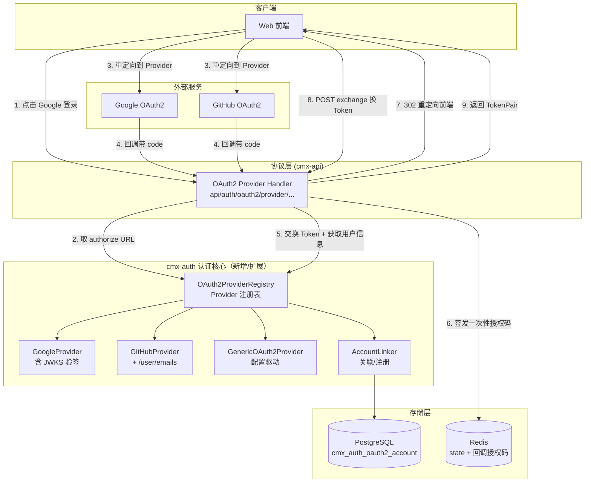
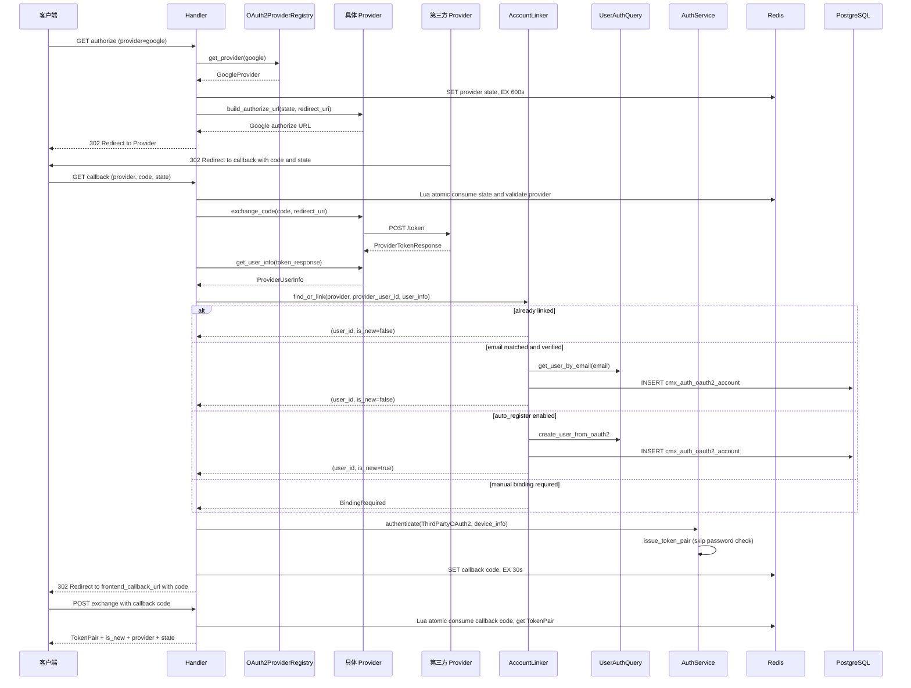

# cmx-auth 第三方 OAuth2 Provider 对接方案

> 模块：`cmx-auth`（crates/libs/cmx-infra/cmx-auth）
> 关联文档：`20260615_cmx-auth_企业级统一认证模块架构方案.md`、`20260622_认证与权限整体架构方案.md`

## 一、背景与目标

### 1.1 现状

`cmx-auth` 的 OAuth2 模块原本仅实现 **Authorization Server** 角色：管理本平台授权码签发 + PKCE 验证，外部 OAuth2 Client 通过本平台授权码换 Token。

无任何第三方 OAuth2 Provider 对接能力，Social Login（Google / GitHub / GitLab 等）需另行实现。

### 1.2 目标

扩展 `cmx-auth` 支持 **OAuth2 Client** 角色，作为客户端对接任意标准 OAuth2 Provider，最终签发本平台 Token：

1. **配置化多 Provider**：TOML 中声明任意数量的 Provider（Google、GitHub、GitLab、企业内部 IdP 等）
2. **标准 Authorization Code Flow**：构建授权 URL → 交换 Token → 获取用户信息
3. **账号关联策略**：邮箱匹配自动关联 + 配置允许时自动注册
4. **安全 Token 传递**：回调签发一次性短生命周期授权码，前端 POST 换 Token（不暴露在 URL Query 中）
5. **解绑安全检查**：保证用户至少保留一种登录方式

> **范围说明**：本期仅支持标准 OAuth2 Authorization Code Flow Provider。WeChat 等非标准流程（appid/secret、openid+unionid、JSON body 等）需独立设计，本期不实现。

***

## 二、架构设计

### 2.1 整体架构（扩展部分）



### 2.2 核心交互时序



### 2.3 模块结构

```
crates/libs/cmx-infra/cmx-auth/src/
  ├── auth_service_impl.rs        # 集成第三方 OAuth2 认证入口
  ├── config.rs                    # AuthConfig + OAuth2Config + OAuth2ProviderConfig + AccountLinkConfig
  ├── error.rs
  └── oauth2/
      ├── mod.rs                   # 模块声明
      ├── flows.rs                 # Authorization Server 流程（不变）
      ├── pkce.rs                  # PKCE 验证器（不变）
      ├── store.rs                 # Redis 存储（含 provider state + callback code 原子消费 Lua）
      └── provider/                # 第三方 OAuth2 Client
          ├── mod.rs               # OAuth2Provider trait + ProviderTokenResponse + ProviderUserInfo
          ├── registry.rs          # OAuth2ProviderRegistry（OnceLock 全局）
          ├── google.rs            # Google 实现（含 JWKS 验签）
          ├── github.rs            # GitHub 实现（含 /user/emails 邮箱验证）
          ├── generic.rs           # 通用实现（配置驱动 + field_mapping）
          └── account_linker.rs    # 关联/注册逻辑
```

***

## 三、核心设计

### 3.1 OAuth2Provider Trait

`crates/libs/cmx-infra/cmx-auth/src/oauth2/provider/mod.rs`：

```rust
#[async_trait]
pub trait OAuth2Provider: Send + Sync {
    /// Provider 唯一标识（如 "google", "github"）
    fn name(&self) -> &str;

    /// Provider 显示名称（如 "Google", "GitHub"）
    fn display_name(&self) -> &str;

    /// Provider 图标 URL（内置 Provider 提供默认值）
    fn icon_url(&self) -> Option<&str> { None }

    /// 品牌色（用于前端按钮样式）
    fn brand_color(&self) -> Option<&str> { None }

    /// 构建授权 URL
    fn build_authorize_url(&self, state: &str, redirect_uri: &str, scopes: &[String]) -> String;

    /// 用授权码交换 Token
    async fn exchange_code(
        &self,
        code: &str,
        redirect_uri: &str,
    ) -> Result<ProviderTokenResponse, AuthError>;

    /// 获取用户信息
    async fn get_user_info(
        &self,
        token_response: &ProviderTokenResponse,
    ) -> Result<ProviderUserInfo, AuthError>;

    /// Provider 特有的 scope 列表（默认值）
    fn default_scopes(&self) -> Vec<String>;

    /// Provider 配置的 redirect_uri
    fn redirect_uri(&self) -> &str;
}

/// 第三方 Provider Token 响应
#[derive(Debug, Clone, Serialize, Deserialize)]
pub struct ProviderTokenResponse {
    pub access_token: String,
    pub token_type: String,
    pub expires_in: Option<u64>,
    pub refresh_token: Option<String>,
    pub scope: Option<String>,
    /// ID Token（OIDC Provider 如 Google 会返回，可用于无 userinfo 调用）
    pub id_token: Option<String>,
}

/// 第三方 Provider 用户信息
#[derive(Debug, Clone, Serialize, Deserialize)]
pub struct ProviderUserInfo {
    pub provider_user_id: String,
    pub email: Option<String>,
    /// 邮箱是否已验证（auto_link_by_email 安全检查必需）
    pub email_verified: Option<bool>,
    pub username: Option<String>,
    pub display_name: Option<String>,
    pub avatar_url: Option<String>,
}
```

### 3.2 OAuth2ProviderRegistry

`crates/libs/cmx-infra/cmx-auth/src/oauth2/provider/registry.rs`：

- 使用 `std::sync::OnceLock` 实现全局单例，由 `cmx-auth` 内部自管理
- `initialize_global()` 启动时由 `web-server` 调用一次
- `get_global()` 提供运行期全局访问

```rust
static GLOBAL_PROVIDER_REGISTRY: OnceLock<OAuth2ProviderRegistry> = OnceLock::new();

#[derive(Clone)]
pub struct OAuth2ProviderRegistry {
    providers: HashMap<String, Arc<dyn OAuth2Provider>>,
}

impl OAuth2ProviderRegistry {
    pub fn new() -> Self { Self { providers: HashMap::new() } }

    pub fn register(&mut self, provider: Arc<dyn OAuth2Provider>) {
        tracing::info!(provider = %provider.name(), display_name = %provider.display_name(), "注册 OAuth2 Provider");
        self.providers.insert(provider.name().to_string(), provider);
    }

    pub fn get_provider(&self, name: &str) -> Result<Arc<dyn OAuth2Provider>, AuthError> {
        self.providers.get(name).cloned()
            .ok_or_else(|| AuthError::OAuth2ProviderNotFound(name.to_string()))
    }

    /// 列出所有 Provider 信息（供前端展示登录按钮）
    pub fn list_providers(&self) -> Vec<cmx_traits::auth::ProviderInfo> { /* ... */ }

    pub fn initialize_global(registry: OAuth2ProviderRegistry) -> Result<(), String> {
        GLOBAL_PROVIDER_REGISTRY.set(registry)
            .map_err(|_| "OAuth2 Provider 注册表已初始化".to_string())
    }

    pub fn get_global() -> Option<&'static OAuth2ProviderRegistry> {
        GLOBAL_PROVIDER_REGISTRY.get()
    }
}
```

> `ProviderInfo` 定义在 `cmx-traits/src/auth/user_query.rs`，由 `cmx-auth` 复用，便于跨 crate 共享。

### 3.3 GenericOAuth2Provider

`crates/libs/cmx-infra/cmx-auth/src/oauth2/provider/generic.rs`：

适用于任何标准 OAuth2 Provider。`provider_type="generic"` 时实例化，配置驱动：

- 端点 URL（authorize/token/userinfo）由 `OAuth2ProviderConfig` 提供
- `field_mapping` 支持字段名差异（如 GitLab `id` / GitHub `id` 是 number 需转 string）
- `token_endpoint_auth_method`：`client_secret_post`（默认）/ `client_secret_basic`

```rust
fn build_authorize_url(&self, state: &str, redirect_uri: &str, scopes: &[String]) -> String {
    let scopes_str = if scopes.is_empty() {
        self.config.scopes.join(" ")
    } else {
        scopes.join(" ")
    };
    format!(
        "{}?response_type=code&client_id={}&redirect_uri={}&scope={}&state={}",
        self.config.authorize_url,
        self.config.client_id,
        urlencoding::encode(redirect_uri),
        urlencoding::encode(&scopes_str),
        state,
    )
}

async fn exchange_code(&self, code: &str, redirect_uri: &str) -> Result<ProviderTokenResponse, AuthError> {
    let mut req = self.http_client.post(&self.config.token_url);
    req = match self.config.token_endpoint_auth_method.as_str() {
        "client_secret_basic" => req
            .basic_auth(&self.config.client_id, Some(&self.config.client_secret))
            .form(&[("grant_type", "authorization_code"), ("code", code), ("redirect_uri", redirect_uri)]),
        _ => req.form(&[
            ("grant_type", "authorization_code"),
            ("code", code),
            ("client_id", &self.config.client_id),
            ("client_secret", &self.config.client_secret),
            ("redirect_uri", redirect_uri),
        ]),
    };
    // 发送请求，失败时返回 OAuth2ProviderUnavailable / OAuth2ProviderTokenError
}
```

`get_user_info` 通过 `field_mapping` 提取字段，`extract_string` / `extract_string_opt` 支持 number→string 自动转换，`extract_bool_opt` 提取邮箱验证状态。

### 3.4 GoogleProvider

`crates/libs/cmx-infra/cmx-auth/src/oauth2/provider/google.rs`：

- **ID Token 验签**：从 Provider 返回的 `id_token` 解码 header 拿 `kid`，通过 Google JWKS endpoint 获取公钥，验证 RS256 签名 + `iss`（`accounts.google.com`）+ `aud`（自己的 client\_id）+ `exp`
- **JWKS 缓存**：`JwksCache` 含 `expires_at`（24h TTL），kid 不匹配时强制刷新重试一次
- **降级路径**：ID Token 验签失败时降级到 `https://www.googleapis.com/oauth2/v3/userinfo`

```rust
struct JwksCache {
    keys: Option<serde_json::Value>,
    expires_at: Option<std::time::Instant>,
}

impl GoogleProvider {
    const JWKS_URL: &'static str = "https://www.googleapis.com/oauth2/v3/certs";
    const JWKS_CACHE_TTL: Duration = Duration::from_secs(24 * 3600);

    async fn fetch_jwks(&self) -> Result<serde_json::Value, AuthError> {
        // 缓存命中直接返回；过期/首次则拉取
    }

    async fn force_refresh_jwks(&self) -> Result<serde_json::Value, AuthError> {
        // kid 不匹配时调用
    }

    async fn verify_id_token(&self, id_token: &str) -> Result<GoogleIdTokenClaims, AuthError> {
        // 1. 解码 header 拿 kid
        // 2. 查 JWKS，找不到则 force_refresh_jwks 再查
        // 3. 用 RSA 公钥 (n, e) 构造 DecodingKey
        // 4. jsonwebtoken::decode 验证签名 + iss + aud
    }
}
```

默认 `scopes = ["openid", "email", "profile"]`，`icon_url` / `brand_color` 提供 Google 品牌色 `#4285F4`。

### 3.5 GitHubProvider

`crates/libs/cmx-infra/cmx-auth/src/oauth2/provider/github.rs`：

- GitHub 无 ID Token，仅 `https://api.github.com/user` 获取基本信息
- `id` 是 number 需转 string
- `email_verified` 通过额外调用 `https://api.github.com/user/emails` 获取（需 `user:email` scope）

```rust
async fn get_user_info(&self, token_response: &ProviderTokenResponse) -> Result<ProviderUserInfo, AuthError> {
    // 调 /user，提取 id(login/email/name/avatar_url)
    // 如 email 存在，调 /user/emails 查 verified 状态
}

async fn fetch_github_email_verified(
    &self,
    access_token: &str,
    primary_email: &Option<String>,
) -> Option<bool> {
    // 遍历 emails 列表，匹配 primary_email 返回 verified；
    // 找不到则取 primary=true 的第一个
}
```

默认 `scopes = ["user:email", "read:user"]`。

### 3.6 AccountLinker

`crates/libs/cmx-infra/cmx-auth/src/oauth2/provider/account_linker.rs`：

#### 3.6.1 核心流程 `find_or_link`

```
1. find_account(provider, provider_user_id)
   ├─ 已关联：update_last_login_at → 返回 (user_id, is_new=false)
   └─ 未关联：
       2. 若 auto_link_by_email=true 且 email_verified=true
          └─ get_user_by_email 匹配：create_account → (user_id, is_new=false)
       3. 若 auto_register=true
          └─ generate_username（带冲突重试）+ create_user_from_oauth2
             + create_account → (user_id, is_new=true)
       4. 否则返回 BindingRequired（handler 转为 AuthError::OAuth2）
```

#### 3.6.2 用户名生成（冲突重试）

```rust
async fn generate_username(&self, provider: &str, user_info: &ProviderUserInfo) -> Result<String, AuthError> {
    const MAX_RETRIES: usize = 3;

    let base = match self.config.username_strategy.as_str() {
        "provider_prefix" => format!("{}_{}", provider, user_info.provider_user_id),
        "email_prefix" => user_info.email.as_ref()
            .map(|e| e.split('@').next().unwrap_or(e).to_string())
            .unwrap_or_else(|| format!("{}_{}", provider, user_info.provider_user_id)),
        _ => user_info.display_name.clone()  // "display_name" 策略
            .unwrap_or_else(|| format!("{}_{}", provider, user_info.provider_user_id)),
    };

    // 首次检查；冲突时追加 4 位随机十六进制后缀，最多 3 次重试
    if self.user_query.get_user_by_username(&base).await?.is_none() {
        return Ok(base);
    }
    for i in 0..MAX_RETRIES {
        let candidate = format!("{}_{}", base, Self::random_suffix());
        if self.user_query.get_user_by_username(&candidate).await?.is_none() {
            return Ok(candidate);
        }
    }
    Err(AuthError::OAuth2UsernameConflict(base))
}
```

#### 3.6.3 解绑安全检查

```rust
pub async fn unlink_account(&self, user_id: &str, provider: &str) -> Result<(), AuthError> {
    let user = self.user_query.get_user_by_id(user_id).await?;
    let has_password = user.as_ref().and_then(|u| u.password_hash.as_ref()).is_some();
    let other_bindings = self.count_other_bindings(user_id, provider).await?;

    // 既无密码又无其他第三方绑定 → 拒绝
    if !has_password && other_bindings == 0 {
        return Err(AuthError::OAuth2LastBindingCannotRemove);
    }
    self.remove_account(user_id, provider).await
}
```

#### 3.6.4 数据访问（GenericCrudService 风格）

`OAuth2AccountBmc` 指向表 `cmx_auth_oauth2_account`，主键 `id`。`OAuth2AccountFilter` 用 `#[derive(FilterNodes)]` 自动生成 `IntoFilterNodes`：

```rust
#[derive(Debug, Clone, modql::filter::FilterNodes, Deserialize, Default)]
pub struct OAuth2AccountFilter {
    pub provider: Option<OpValsString>,
    pub provider_user_id: Option<OpValsString>,
    pub user_id: Option<OpValsString>,
    pub status: Option<OpValsInt64>,
}

#[derive(Debug, Clone, Serialize, Deserialize, Fields)]
pub struct OAuth2AccountForCreate {
    pub user_id: String,
    pub provider: String,
    pub provider_user_id: String,
    #[serde(skip_serializing_if = "Option::is_none")]
    pub provider_username: Option<String>,
    #[serde(skip_serializing_if = "Option::is_none")]
    pub provider_email: Option<String>,
    pub provider_email_verified: Option<bool>,
    #[serde(skip_serializing_if = "Option::is_none")]
    pub provider_display_name: Option<String>,
    #[serde(skip_serializing_if = "Option::is_none")]
    pub provider_avatar_url: Option<String>,
    pub status: Option<i32>,
}
```

`id` 由 `HasSeaFields` 通过 `GenericCrudService::create` 自动生成。

- `find_account` / `create_account` / `count_other_bindings` / `remove_account` / `account_exists` / `update_last_login_at` 全部走 `GenericCrudService`
- `default_db_id` 通过 `DatabaseManager::get_default_db_id()` 动态获取，不写死

### 3.7 AuthService 集成

`crates/libs/cmx-infra/cmx-auth/src/auth_service_impl.rs`：

#### 3.7.1 `Credentials::ThirdPartyOAuth2`

`crates/libs/cmx-traits/src/auth/service.rs` 中已定义：

```rust
pub enum Credentials {
    // ... Password / RefreshToken / ApiKey / AuthorizationCode ...
    ThirdPartyOAuth2 {
        provider: String,
        provider_user_id: String,
        user_id: String,  // 已通过 AccountLinker 关联
    },
}
```

`authenticate()` 收到 `ThirdPartyOAuth2` 时调用 `authenticate_third_party`：

```rust
async fn authenticate_third_party(
    &self,
    user_id: &str,
    provider: &str,
    provider_user_id: &str,
    device_info: Option<DeviceInfo>,
) -> Result<TokenPair, AuthError> {
    let user = self.user_query.get_user_by_id(user_id).await?
        .ok_or(AuthError::OAuth2AccountNotLinked { provider: provider.into(), provider_user_id: provider_user_id.into() })?;
    if user.status == 0 { return Err(AuthError::UserDisabled); }

    let roles = self.user_query.get_user_role_codes(user_id).await?;
    let permissions = self.user_query.get_user_permissions(user_id).await?;
    self.issue_token_pair(user_id, &user.username, &roles, &permissions, None, device_info.as_ref()).await
}
```

`org_id` 统一传 `None`，与密码 / APIKey / OAuth2 授权码分支一致。

#### 3.7.2 `handle_oauth2_callback`

完整流程（state 原子消费 → 交换 Token → 获取用户信息 → 关联/注册 → 签发本平台 Token → 签发一次性回调授权码）：

```rust
async fn handle_oauth2_callback(
    &self,
    provider: &str,
    code: &str,
    state: &str,
    device_info: Option<DeviceInfo>,
) -> Result<OAuth2CallbackResult, AuthError> {
    // 1. Lua 原子消费 state，校验 provider 一致性
    let stored_provider = self.oauth2_store.consume_provider_state(state).await?
        .ok_or(AuthError::OAuth2("OAuth2 Provider state 无效或已过期".into()))?;
    if stored_provider != provider {
        return Err(AuthError::OAuth2("State 中的 provider 与请求不匹配".into()));
    }

    // 2. 获取 Provider 与 redirect_uri
    let registry = crate::oauth2::OAuth2ProviderRegistry::get_global()
        .ok_or(AuthError::Internal("OAuth2 Provider 注册表未初始化".into()))?;
    let provider_impl = registry.get_provider(provider)?;
    let redirect_uri = provider_impl.redirect_uri().to_string();

    // 3. 交换 Token + 获取用户信息
    let token_response = provider_impl.exchange_code(code, &redirect_uri).await?;
    let user_info = provider_impl.get_user_info(&token_response).await?;

    // 4. 关联/注册用户
    let link_result = self.account_linker.find_or_link(provider, &user_info.provider_user_id, &user_info).await?;
    let (user_id, is_new) = match link_result {
        LinkResult::Linked { user_id, is_new } => (user_id, is_new),
        LinkResult::BindingRequired { .. } => {
            return Err(AuthError::OAuth2("账号未注册，请联系管理员开通".into()));
        }
    };

    // 5. 签发本平台 Token
    let token_pair = self.authenticate(
        Credentials::ThirdPartyOAuth2 {
            provider: provider.into(),
            provider_user_id: user_info.provider_user_id,
            user_id: user_id.clone(),
        },
        device_info,
    ).await?;

    // 6. 签发一次性回调授权码（前端用它换 TokenPair）
    let callback_code = uuid::Uuid::new_v4().to_string();
    let callback_data = CallbackCodeData {
        access_token: token_pair.access_token,
        refresh_token: token_pair.refresh_token,
        token_type: token_pair.token_type,
        access_expires_at: token_pair.access_expires_at,
        refresh_expires_at: token_pair.refresh_expires_at,
        is_new,
        provider: provider.into(),
        state: state.into(),
    };
    self.oauth2_store.store_callback_code(&callback_code, &serde_json::to_string(&callback_data)?).await?;

    Ok(OAuth2CallbackResult { callback_code, state: state.into(), is_new, provider: provider.into() })
}
```

`OAuth2CallbackResult` / `OAuth2CallbackExchangeResult` 定义在 `cmx-traits/src/auth/service.rs`，前端 POST `/api/auth/oauth2/provider/exchange` 后由 `exchange_oauth2_callback_code` 返回 TokenPair + `is_new` + `provider` + `state`。

#### 3.7.3 `AuthService` Trait 新增方法

`crates/libs/cmx-traits/src/auth/service.rs`：

```rust
async fn list_oauth2_providers() -> Result<Vec<ProviderInfo>, AuthError>;
async fn handle_oauth2_callback(provider, code, state, device_info) -> Result<OAuth2CallbackResult, AuthError>;
async fn exchange_oauth2_callback_code(code) -> Result<OAuth2CallbackExchangeResult, AuthError>;
async fn link_oauth2_account(user_id, provider, code) -> Result<(), AuthError>;
async fn unlink_oauth2_account(user_id, provider) -> Result<(), AuthError>;
async fn store_oauth2_provider_state(state, provider) -> Result<(), AuthError>;
```

***

## 四、配置设计

### 4.1 OAuth2ProviderConfig

`crates/libs/cmx-infra/cmx-auth/src/config.rs`：

```rust
pub struct OAuth2ProviderConfig {
    /// Provider 唯一标识（如 "google", "github"）
    pub name: String,
    /// Provider 显示名称
    #[serde(default)]
    pub display_name: String,
    /// Provider 类型（"google" / "github" / "generic"）
    #[serde(default = "default_provider_type")]
    pub provider_type: String,
    pub client_id: String,
    pub client_secret: String,
    /// 回调地址（服务端配置，前端不可覆盖，防止 Open Redirect）
    /// 格式：{your-domain}/api/auth/oauth2/provider/{name}/callback
    #[serde(default)]
    pub redirect_uri: String,
    /// 端点 URL（generic 类型必需）
    #[serde(default)] pub authorize_url: String,
    #[serde(default)] pub token_url: String,
    #[serde(default)] pub userinfo_url: String,
    #[serde(default)] pub scopes: Vec<String>,
    /// 字段映射（标准字段名 → JSON 字段名，支持 number→string 自动转换）
    #[serde(default)] pub field_mapping: HashMap<String, String>,
    /// Token 端点认证方式
    #[serde(default = "default_auth_method")]
    pub token_endpoint_auth_method: String,  // "client_secret_post" | "client_secret_basic"
    #[serde(default)] pub icon_url: Option<String>,
    #[serde(default)] pub brand_color: Option<String>,
    #[serde(default = "default_enabled")] pub enabled: bool,
}
```

### 4.2 AccountLinkConfig

```rust
pub struct AccountLinkConfig {
    #[serde(default = "default_auto_link_by_email")]
    pub auto_link_by_email: bool,  // 默认 true
    #[serde(default = "default_auto_register")]
    pub auto_register: bool,       // 默认 false
    #[serde(default)]
    pub default_role: Option<String>,
    /// "provider_prefix" | "email_prefix" | "display_name"
    #[serde(default = "default_username_strategy")]
    pub username_strategy: String,
}
```

### 4.3 OAuth2Config

```rust
pub struct OAuth2Config {
    // Authorization Server 配置（原有）
    #[serde(default = "default_auth_code_ttl")]
    pub auth_code_ttl_secs: u64,  // 默认 600
    #[serde(default = "default_pkce_required")]
    pub pkce_required: bool,      // 默认 true

    // 第三方 Provider 对接（新增）
    #[serde(default)]
    pub providers: Vec<OAuth2ProviderConfig>,
    #[serde(default)]
    pub account_link: AccountLinkConfig,
    #[serde(default = "default_state_ttl")]
    pub state_ttl_secs: u64,            // 默认 600
    #[serde(default = "default_callback_code_ttl")]
    pub callback_code_ttl_secs: u64,    // 默认 30
    /// 登录成功后重定向到前端的 URL
    /// 回调时拼接为：{frontend_callback_url}?code={one_time_code}&state={original_state}
    #[serde(default)]
    pub frontend_callback_url: String,
}
```

### 4.4 TOML 配置示例

`config/config_template.toml` 中 `[auth.oauth2]` 段：

```toml
# ==================== OAuth2 配置（可选） ====================
[auth.oauth2]
# === Authorization Server 配置 ===
# auth_code_ttl_secs = 600
# pkce_required = true

# === 第三方 OAuth2 Provider 对接 ===
# state_ttl_secs = 600
# callback_code_ttl_secs = 30
# 回调时拼接为：{frontend_callback_url}?code={one_time_code}&state={original_state}
frontend_callback_url = "https://app.example.com/auth/callback"

# 第三方账号关联策略
[auth.oauth2.account_link]
auto_link_by_email = true
auto_register = false
# default_role = "user"
username_strategy = "provider_prefix"

# === Google OAuth2（示例） ===
# [[auth.oauth2.providers]]
# name = "google"
# display_name = "Google"
# provider_type = "google"
# client_id = "your-google-client-id.apps.googleusercontent.com"
# client_secret = "your-google-client-secret"
# redirect_uri = "https://your-domain.com/api/auth/oauth2/provider/google/callback"
# scopes = ["openid", "email", "profile"]
# enabled = true

# === GitHub OAuth2（示例） ===
# [[auth.oauth2.providers]]
# name = "github"
# display_name = "GitHub"
# provider_type = "github"
# client_id = "your-github-client-id"
# client_secret = "your-github-client-secret"
# redirect_uri = "https://your-domain.com/api/auth/oauth2/provider/github/callback"
# scopes = ["user:email", "read:user"]
# enabled = true

# === 通用 OAuth2 Provider 示例（GitLab） ===
# [[auth.oauth2.providers]]
# name = "gitlab"
# display_name = "GitLab"
# provider_type = "generic"
# client_id = "your-gitlab-application-id"
# client_secret = "your-gitlab-secret"
# redirect_uri = "https://your-domain.com/api/auth/oauth2/provider/gitlab/callback"
# authorize_url = "https://gitlab.com/oauth/authorize"
# token_url = "https://gitlab.com/oauth/token"
# userinfo_url = "https://gitlab.com/api/v4/user"
# scopes = ["read_user", "email"]
# token_endpoint_auth_method = "client_secret_post"
# enabled = false
# 字段映射使用内联表（标准字段名 = JSON 字段名）
# field_mapping = { provider_user_id = "id", email = "email", username = "username", display_name = "name", avatar_url = "avatar_url" }
```

### 4.5 配置项速查

| 分类          | 配置路径                                    | 关键项                                                                                              | 默认值                                    |
| ----------- | --------------------------------------- | ------------------------------------------------------------------------------------------------ | -------------------------------------- |
| Auth Server | `auth.oauth2`                           | `auth_code_ttl_secs` / `pkce_required`                                                           | 600 / true                             |
| State       | `auth.oauth2`                           | `state_ttl_secs` / `callback_code_ttl_secs` / `frontend_callback_url`                            | 600 / 30 / ""                          |
| 账号关联        | `auth.oauth2.account_link`              | `auto_link_by_email` / `auto_register` / `default_role` / `username_strategy`                    | true / false / None / provider\_prefix |
| Provider 列表 | `auth.oauth2.providers[]`               | `name` / `provider_type` / `client_id` / `client_secret` / `redirect_uri` / `scopes` / `enabled` | -                                      |
| Provider 端点 | `auth.oauth2.providers[]`               | `authorize_url` / `token_url` / `userinfo_url`                                                   | 内置 Provider 自动填充                       |
| Provider 安全 | `auth.oauth2.providers[]`               | `token_endpoint_auth_method`                                                                     | client\_secret\_post                   |
| Provider 映射 | `auth.oauth2.providers[].field_mapping` | `provider_user_id` / `email` / `username` / `display_name` / `avatar_url`                        | 与标准字段同名                                |
| Provider 品牌 | `auth.oauth2.providers[]`               | `icon_url` / `brand_color`                                                                       | None / None                            |

***

## 五、API 设计

### 5.1 端点列表

| 方法     | 路径                                               | 认证  | 说明                                                    |
| ------ | ------------------------------------------------ | --- | ----------------------------------------------------- |
| GET    | `/api/auth/oauth2/providers`                     | 白名单 | 列出已启用 Provider（前端展示登录按钮）                              |
| GET    | `/api/auth/oauth2/provider/{provider}/authorize` | 白名单 | 生成 state → 302 重定向到 Provider 授权页                      |
| GET    | `/api/auth/oauth2/provider/{provider}/callback`  | 白名单 | Provider 回调 → 交换 Token → 关联/注册 → 签发一次性授权码 → 302 重定向前端 |
| POST   | `/api/auth/oauth2/provider/exchange`             | 白名单 | 用一次性授权码换 TokenPair + `is_new` + `provider` + `state`  |
| POST   | `/api/auth/oauth2/provider/{provider}/link`      | 需登录 | 手动绑定第三方账号到当前用户                                        |
| DELETE | `/api/auth/oauth2/provider/{provider}/unlink`    | 需登录 | 解绑第三方账号（含安全检查）                                        |

### 5.2 认证白名单

`crates/libs/cmx-infra/cmx-auth/src/config.rs::BUILTIN_WHITELIST` 已包含：

```rust
pub const BUILTIN_WHITELIST: &[&str] = &[
    "/api/auth/login",
    "/api/auth/refresh",
    "/api/auth/validate",
    "/api/auth/logout",
    "/api/auth/health",
    "/api/auth/oauth2/authorize",
    "/api/auth/oauth2/login",
    "/api/auth/oauth2/token",
    "/api/auth/oauth2/providers",
    "/api/auth/oauth2/provider",  // 前缀匹配：authorize / callback / exchange / link / unlink
    // ...
];
```

### 5.3 关键请求/响应

#### 5.3.1 `GET /providers` 响应

```json
{
  "code": 0,
  "data": [
    { "name": "google",  "display_name": "Google",  "scopes": ["openid","email","profile"], "icon_url": "https://...", "brand_color": "#4285F4" },
    { "name": "github",  "display_name": "GitHub",  "scopes": ["user:email","read:user"],  "icon_url": "https://...", "brand_color": "#24292e" }
  ]
}
```

注册表未初始化时（未配置任何 Provider）返回 `{ "code": 0, "data": [] }`，优雅降级。

#### 5.3.2 `POST /provider/exchange` 请求/响应

请求体：

```json
{ "code": "一次性授权码", "state": "原始 state" }
```

响应：

```json
{
  "code": 0,
  "data": {
    "access_token": "...",
    "refresh_token": "...",
    "token_type": "Bearer",
    "access_expires_at": 1719200000,
    "refresh_expires_at": 1719800000,
    "is_new": false,
    "provider": "google",
    "state": "原始 state"
  }
}
```

#### 5.3.3 `POST /provider/{provider}/link` 请求

```json
{ "code": "Provider 授权回调的 code" }
```

#### 5.3.4 `DELETE /provider/{provider}/unlink`

无请求体；`provider` 来自路径。

***

## 六、数据库与 Redis

### 6.1 数据库表 `cmx_auth_oauth2_account`

```sql
CREATE TABLE "public"."cmx_auth_oauth2_account" (
    "id" varchar(64) NOT NULL,
    "user_id" varchar(64) NOT NULL,
    "provider" varchar(50) NOT NULL,
    "provider_user_id" varchar(255) NOT NULL,
    "provider_username" varchar(200),
    "provider_email" varchar(255),
    "provider_email_verified" bool,
    "provider_display_name" varchar(200),
    "provider_avatar_url" varchar(1000),
    "last_login_at" timestamp,
    "status" int4 DEFAULT 1,
    "archived" int4 DEFAULT 0,
    "create_time" timestamp DEFAULT CURRENT_TIMESTAMP,
    "update_time" timestamp DEFAULT CURRENT_TIMESTAMP,
    "create_by" varchar(100),
    "create_name" varchar(100),
    "update_by" varchar(100),
    "update_name" varchar(100),
    CONSTRAINT "pk_cmx_auth_oauth2_account" PRIMARY KEY ("id"),
    CONSTRAINT "uk_cmx_auth_oauth2_account_provider_user" UNIQUE ("provider", "provider_user_id")
);

CREATE INDEX "idx_cmx_auth_oauth2_account_user" ON "public"."cmx_auth_oauth2_account" ("user_id");
CREATE INDEX "idx_cmx_auth_oauth2_account_provider_email" ON "public"."cmx_auth_oauth2_account" ("provider", "provider_email");

COMMENT ON TABLE "public"."cmx_auth_oauth2_account" IS '第三方 OAuth2 账号关联表';
COMMENT ON COLUMN "public"."cmx_auth_oauth2_account"."user_id" IS '本地用户 ID';
COMMENT ON COLUMN "public"."cmx_auth_oauth2_account"."provider" IS 'OAuth2 Provider 标识（google/github 等）';
COMMENT ON COLUMN "public"."cmx_auth_oauth2_account"."provider_user_id" IS 'Provider 侧用户唯一标识';
COMMENT ON COLUMN "public"."cmx_auth_oauth2_account"."provider_username" IS 'Provider 侧用户名';
COMMENT ON COLUMN "public"."cmx_auth_oauth2_account"."provider_email" IS 'Provider 侧邮箱';
COMMENT ON COLUMN "public"."cmx_auth_oauth2_account"."provider_email_verified" IS 'Provider 侧邮箱是否已验证';
COMMENT ON COLUMN "public"."cmx_auth_oauth2_account"."provider_display_name" IS 'Provider 侧显示名';
COMMENT ON COLUMN "public"."cmx_auth_oauth2_account"."provider_avatar_url" IS 'Provider 侧头像 URL';
COMMENT ON COLUMN "public"."cmx_auth_oauth2_account"."last_login_at" IS '最近一次通过此 Provider 登录时间';
COMMENT ON COLUMN "public"."cmx_auth_oauth2_account"."status" IS '状态：0-禁用，1-启用';
```

### 6.2 Redis Key

| Key 模式                                 | 数据结构                           | TTL                            | 用途                       |
| -------------------------------------- | ------------------------------ | ------------------------------ | ------------------------ |
| `auth:oauth2:provider:state:{state}`   | String (provider\_name)        | `state_ttl_secs` (600s)        | 第三方 OAuth2 CSRF state    |
| `auth:oauth2:provider:callback:{code}` | String (CallbackCodeData JSON) | `callback_code_ttl_secs` (30s) | 一次性回调授权码 → TokenPair 元信息 |

### 6.3 原子消费 Lua 脚本

`crates/libs/cmx-infra/cmx-auth/src/oauth2/store.rs`：

```lua
-- consume_oauth2_provider_state.lua：原子 GET + DEL state
local value = redis.call('GET', KEYS[1])
if not value then
    return nil
end
redis.call('DEL', KEYS[1])
return value

-- consume_oauth2_callback_code.lua：原子 GET + DEL 回调授权码
local value = redis.call('GET', KEYS[1])
if not value then
    return nil
end
redis.call('DEL', KEYS[1])
return value
```

通过 `cache.script().eval_with_fallback(SCRIPT, keys, args)` 调用，与现有 Authorization Server 的 `consume_authorization_code` 风格一致。

***

## 七、AuthError 扩展

`crates/libs/cmx-traits/src/auth/error.rs` 新增变体（与现有 `thiserror` 风格一致）：

```rust
#[derive(Debug, Error)]
pub enum AuthError {
    // ... 现有变体 ...

    /// OAuth2 Provider 不存在
    #[error("OAuth2 Provider 不存在: {0}")]
    OAuth2ProviderNotFound(String),

    /// OAuth2 Provider 服务不可达
    #[error("OAuth2 Provider 服务不可达: {0}")]
    OAuth2ProviderUnavailable(String),

    /// OAuth2 Provider Token 交换失败
    #[error("OAuth2 Provider Token 交换失败: {0}")]
    OAuth2ProviderTokenError(String),

    /// OAuth2 Provider 用户信息获取失败
    #[error("OAuth2 Provider 用户信息获取失败: {0}")]
    OAuth2ProviderUserInfoError(String),

    /// 第三方账号未绑定本地用户
    #[error("第三方账号未绑定本地用户: {provider}:{provider_user_id}")]
    OAuth2AccountNotLinked { provider: String, provider_user_id: String },

    /// Provider 邮箱未验证，无法自动关联
    #[error("Provider 邮箱未验证，无法自动关联")]
    OAuth2EmailNotVerified,

    /// 无法解除最后一个登录绑定
    #[error("无法解除最后一个登录绑定")]
    OAuth2LastBindingCannotRemove,

    /// 用户名冲突，自动注册失败
    #[error("用户名冲突，自动注册失败: {0}")]
    OAuth2UsernameConflict(String),

    /// 回调授权码无效或已过期
    #[error("第三方 OAuth2 回调授权码无效或已过期")]
    OAuth2CallbackCodeInvalid,
}
```

`OAuth2` 通用字符串变体已存在（用于 state 不匹配、未注册账号等通用错误）。

***

## 八、UserAuthQuery Trait 扩展

`crates/libs/cmx-traits/src/auth/user_query.rs`：

```rust
/// 根据邮箱查询用户认证数据（用于第三方 OAuth2 自动关联）
async fn get_user_by_email(
    &self,
    email: &str,
) -> Result<Option<UserAuthData>, TraitError>;

/// 从第三方 OAuth2 信息自动注册用户（当 auto_register=true 时调用）
async fn create_user_from_oauth2(
    &self,
    provider: &str,
    user_info: &OAuth2UserInfo,
) -> Result<String, TraitError>;

/// 第三方 OAuth2 用户信息（用于自动注册）
pub struct OAuth2UserInfo {
    pub provider: String,
    pub provider_user_id: String,
    pub email: Option<String>,
    pub username: Option<String>,
    pub display_name: Option<String>,
    pub avatar_url: Option<String>,
    pub default_role: Option<String>,
}
```

`get_user_by_id` / `get_user_by_username` / `get_user_role_codes` / `get_user_permissions` 复用现有方法。

***

## 九、依赖与启动初始化

### 9.1 新增依赖

`crates/libs/cmx-infra/cmx-auth/Cargo.toml`（workspace 统一定义）：

```toml
# HTTP 客户端（与第三方 Provider 通信）
reqwest = { workspace = true }
# URL 编码
urlencoding = { workspace = true }
# JWT 验证（Google ID Token 验签）
jsonwebtoken = { workspace = true }
# Base64 解码（JWT header 解析）
base64 = { workspace = true }
# 内部依赖 - 查询过滤/字段映射（GenericCrudService 的 FilterNodes + Fields）
modql = { workspace = true, features = ["with-sea-query"] }
# SQL 查询构建器（modql Fields/FilterNodes 宏依赖）
sea-query = { workspace = true }
```

> 不引入 `oauth2` crate（与现有手写 OAuth2 flow 风格不一致，重量级），直接用 `reqwest` 调用 Provider endpoint。

### 9.2 启动流程

```
web-server main.rs:
  1. DatabaseManager::initialize()
  2. CacheManager::initialize()
  3. GlobalAuthService::initialize()
     ├── 加载 AuthConfig（含 OAuth2 Provider 配置）
     ├── import_static_api_keys()
     ├── 构建 OAuth2ProviderRegistry
     │   ├── provider_type="google"  → GoogleProvider::new(config)
     │   ├── provider_type="github"  → GitHubProvider::new(config)
     │   └── provider_type="generic" → GenericOAuth2Provider::new(config)
     ├── 注册到 Registry 后调用 OAuth2ProviderRegistry::initialize_global(registry)
     └── setup_cache_invalidation_handler()
  4. GlobalIamService::initialize()
  5. ...
```

配置加载直接通过 `serde` 从 TOML 反序列化 `OAuth2Config`（含 `Vec<OAuth2ProviderConfig>`），无需 `get_string + serde_json`。

***

## 十、安全考量

### 10.1 CSRF 防护

- 第三方 OAuth2 回调必须验证 `state` 参数
- State 存 Redis + Lua 脚本原子消费（一次性，防重放）

### 10.2 Client Secret 安全

- `client_secret` 仅服务端使用，不暴露给前端
- 生产环境建议 `config.toml` 设置 `chmod 600`
- 远期可支持从环境变量或密钥管理服务读取

### 10.3 Token 不持久化

- 第三方 Provider 签发的 `access_token` / `refresh_token` **不在本平台持久化**
- 仅在回调流程中使用，用后即弃
- 本平台只签发自己的 JWT Token

### 10.4 回调 Token 传递

- 回调**不通过 URL Query 传递 Token**，避免泄露到浏览器历史/Referer/代理日志
- 改为**授权码模式**：回调签发一次性 30s 授权码，前端 `POST /provider/exchange` 换 Token
- 回调授权码使用 Lua 脚本原子消费

### 10.5 ID Token 签名验证

- Google 等 OIDC Provider 返回的 ID Token **必须验证签名**
- 使用 Provider JWKS endpoint 获取公钥，验证 RS256 签名
- 验证 `iss` / `aud` / `exp`
- JWKS 公钥 24h 缓存 + 过期刷新 + kid 不匹配强制刷新

### 10.6 账号关联安全

- `auto_link_by_email=true` 但**要求邮箱已验证**（Provider 返回 `email_verified=true`）
- 邮箱未验证时**降级**：跳过邮箱匹配，继续尝试自动注册或返回未注册错误（不强制要求验证）
- `auto_register=false` 默认，避免自动创建大量用户
- 解绑需验证用户仍有其他登录方式（至少保留密码或一个第三方绑定）

### 10.7 redirect\_uri 安全

- `redirect_uri` 服务端配置（`OAuth2ProviderConfig.redirect_uri`），前端不可覆盖
- 防止 Open Redirect 攻击
- 必须与 Provider 注册时一致，否则 Provider 拒绝

### 10.8 Link 防顶号

- `link_oauth2_account` 调用前 `account_exists` 检查：该 Provider 账号是否已被其他用户绑定
- 若已绑定，返回错误 "该 Provider 账号已被其他用户绑定"

***

## 十一、关键设计决策

| 决策                                                 | 理由                                                                |
| -------------------------------------------------- | ----------------------------------------------------------------- |
| 不引入 `oauth2` crate，直接用 reqwest                     | 与现有手写 OAuth2 flow 风格一致，避免重量级依赖                                    |
| Provider 实现用 trait + 注册表模式（OnceLock 全局）            | 遵循现有 Strategy Pattern，支持动态扩展，cmx-auth 内部自管理                       |
| 通用 Provider 支持配置驱动 + field\_mapping                | 避免为每个 Provider 写代码，配置即可对接标准 OAuth2 服务                             |
| 第三方 Token 不持久化                                     | 减少攻击面，避免密钥泄露风险                                                    |
| `auto_register` 默认 false                           | 安全优先，避免自动创建大量用户                                                   |
| `auto_link_by_email=true` 但要求 `email_verified`     | 用户体验优先，但必须验证邮箱防止账号接管                                              |
| State 存 Redis + Lua 原子消费                           | 与现有 CSRF state 机制一致，一次性消费防重放                                      |
| 回调用授权码模式而非 URL Query 传 Token                       | 遵循 OAuth2 BCP (RFC 6819 §5.3.2)，避免 Token 泄露                       |
| Google ID Token 必须验证签名（JWKS）                       | 防止伪造 ID Token 冒充用户登录                                              |
| `redirect_uri` 服务端配置，前端不可覆盖                        | 防止 Open Redirect 攻击                                               |
| WeChat 延后至下期                                       | WeChat 非标准 OAuth2 流程（appid/secret、openid+unionid）需独立设计            |
| `org_id` 统一传 `None`                                | 与现有密码/APIKey/OAuth2 授权码分支一致，org\_id 数据管道当前为空                      |
| Registry 纳入 `cmx-auth` 内部 OnceLock                 | 与现有 `GLOBAL_PROVIDER_REGISTRY` 单例模式一致，无需新增 `GlobalAuthService` 接口 |
| `BindingRequired` 在 Handler 转为 `AuthError::OAuth2` | 简化上层处理，未注册账号统一由 Handler 返回业务错误                                    |
| username 冲突重试 3 次后放弃                               | 极端情况直接报错，提示管理员介入，避免无限重试                                           |

***

## 十二、远期规划（非本期范围）

| 功能                             | 说明                                                          | 优先级 |
| ------------------------------ | ----------------------------------------------------------- | --- |
| WeChat OAuth2 支持               | 非标准流程（appid/secret、JSON body、openid+unionid）需独立 Provider 实现 | 高   |
| OIDC Discovery                 | 自动发现 Provider 端点 URL，减少手动配置                                 | 中   |
| Provider 健康检查                  | 启动时检测 Provider 可达性，不可达时 enabled=false 并告警                   | 中   |
| 回调速率限制                         | 基于 IP 的速率限制，防止枚举/DoS/暴力破解                                   | 中   |
| `client_secret` 从环境变量/密钥管理服务读取 | 避免明文存储在 `config.toml`                                       | 低   |

