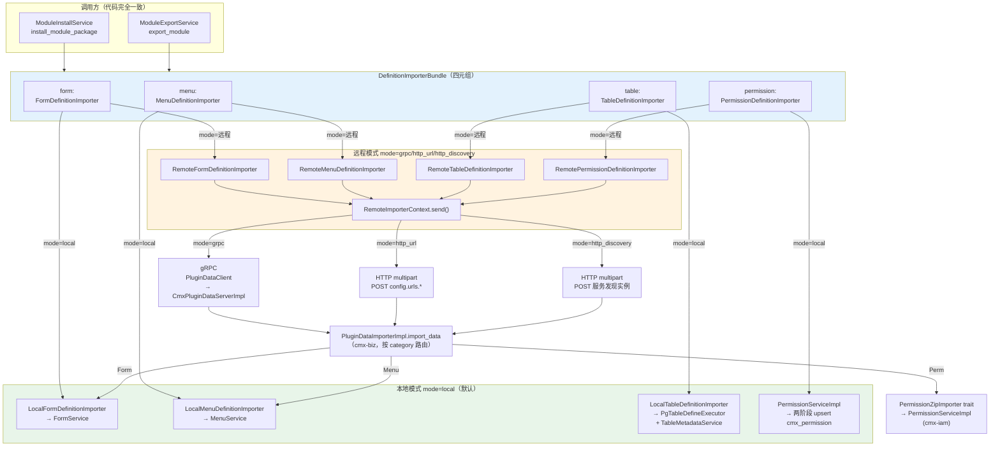
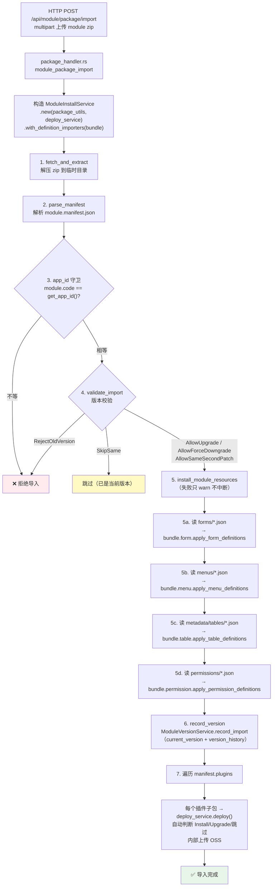
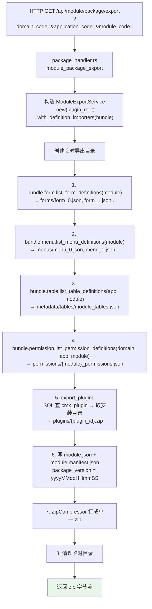
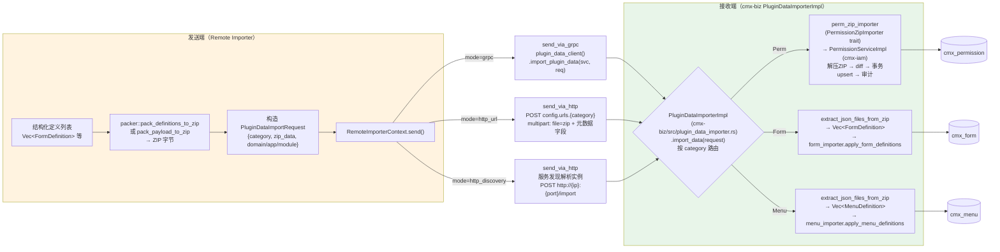
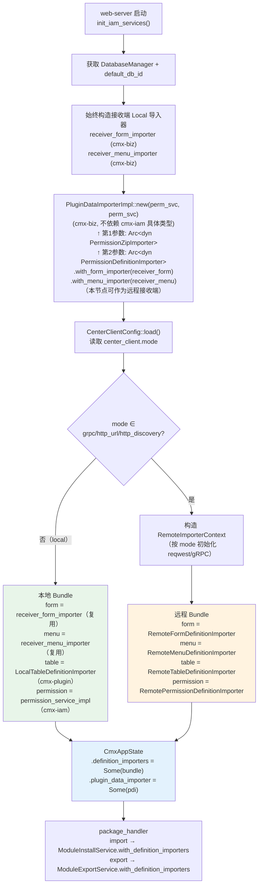
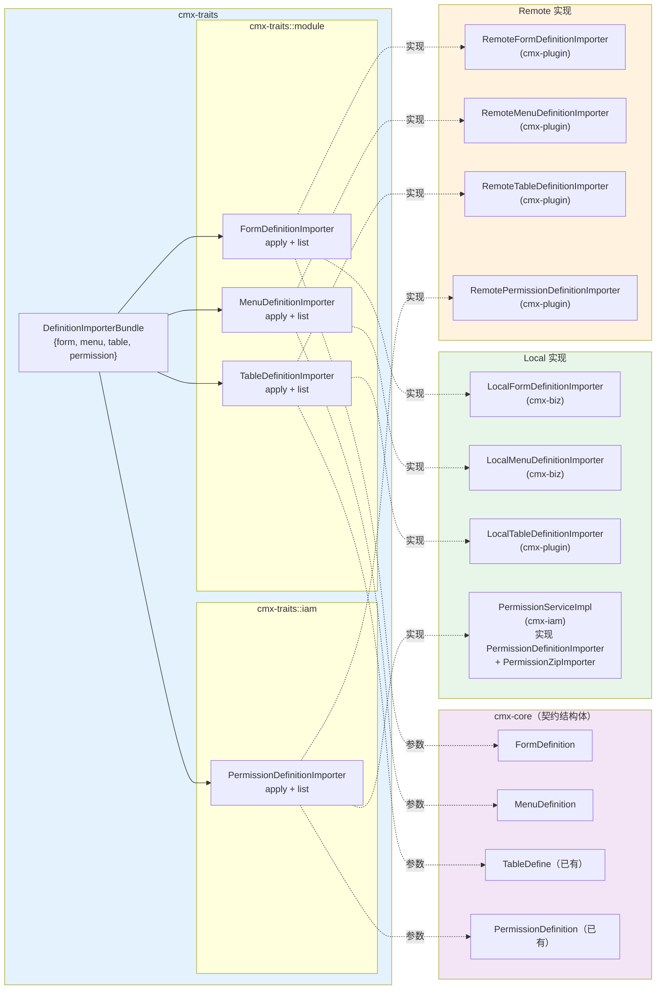
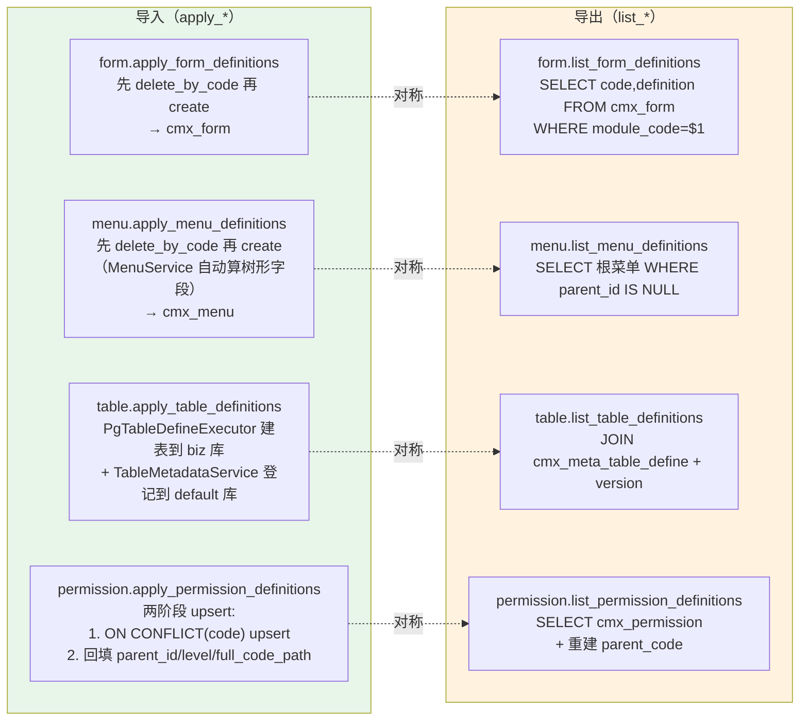

# 模块导入导出流程图

> 用 Mermaid 流程图描述 cmx-container 模块导入/导出的完整代码路径，便于快速理解架构。
>
> **更新日期**：2026-07-03（`PluginDataImporterImpl` 从 cmx-iam 迁移至 cmx-biz，新增 `PermissionZipImporter` trait 解耦）

---

## 一、整体架构（部署模式与数据流）

---

## 二、模块导入流程

---

## 三、模块导出流程

---

## 四、远程传输流程（Remote importer → 接收端入库）

---

## 五、装配流程（web-server 启动）

---

## 六、Trait 与类型关系图

---

## 七、四类资源 apply / list 对照

---

## 八、关键文件索引

| 层级 | 文件 | 职责 |
|------|------|------|
| **HTTP 入口** | `cmx-api/handlers/module/package_handler.rs` | import/export 端点，构造 Service + 注入 bundle |
| **导入编排** | `cmx-plugin/service/module_install.rs` | 解压→校验→install_resources→record_version→deploy 插件 |
| **导出编排** | `cmx-plugin/service/module_export.rs` | list_*→写 JSON→打包 zip |
| **Bundle 定义** | `cmx-traits/src/module/mod.rs` | DefinitionImporterBundle 四元组 |
| **四个 Trait** | `cmx-traits/src/module/{form,menu,table}.rs` + `iam/permission_definition_importer.rs` | apply + list 接口 |
| **契约结构体** | `cmx-core/src/model/module/definitions.rs` + `iam/permission.rs` | FormDefinition / MenuDefinition / PermissionDefinition |
| **Local Form/Menu** | `cmx-biz/src/{form,menu}/definition_importer.rs` | 直调 FormService/MenuService |
| **Local Table** | `cmx-plugin/service/table_definition_importer.rs` | 建表 + 元数据登记 |
| **Remote 四件套** | `cmx-plugin/service/remote_importers/{mod,form,menu,table,permission}.rs` | ZIP 打包 → ctx.send → gRPC/HTTP |
| **传输分发** | `cmx-plugin/service/remote_importers/mod.rs` | RemoteImporterContext.send → grpc/http |
| **ZIP 工具** | `cmx-plugin/src/center_client/packer.rs` | pack_definitions_to_zip / pack_payload_to_zip |
| **配置** | `cmx-plugin/src/center_client/{config,types}.rs` | CenterClientConfig + DataCategory |
| **gRPC 服务端** | `cmx-rpc/src/server/plugin_data.rs` | CmxPluginDataServerImpl → PluginDataImporter |
| **HTTP 接收端** | `cmx-api/src/handlers/iam/permission/import_handler.rs` | multipart 解析 → PluginDataImporter |
| **接收端路由** | `cmx-biz/src/plugin_data_importer.rs` | PluginDataImporterImpl 按 category 路由（从 cmx-iam 迁入） |
| **Perm ZIP 导入 trait** | `cmx-traits/src/iam/permission_definition_importer.rs` | PermissionZipImporter trait（Perm 的 ZIP 导入/清理） |
| **Perm ZIP trait 实现** | `cmx-iam/src/permission/zip_importer.rs` | PermissionServiceImpl 实现 PermissionZipImporter |
| **Perm 结构化导入** | `cmx-iam/src/permission/service/definition_importer.rs` | 两阶段 upsert（已实现 PermissionDefinitionImporter） |
| **装配** | `web-server/src/config/iam.rs` | 按 mode 选 Local/Remote bundle + 注入接收端 |
| **状态注入** | `cmx-api/src/app_state.rs` | CmxAppState.definition_importers |
