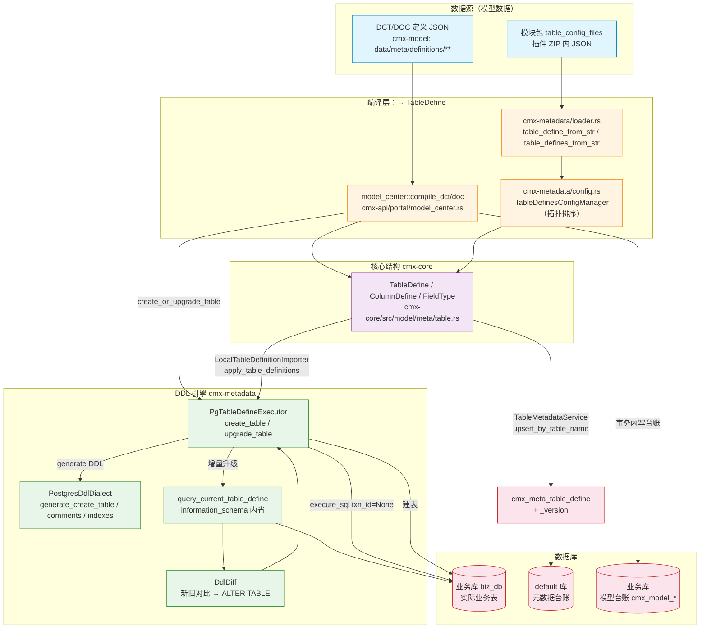
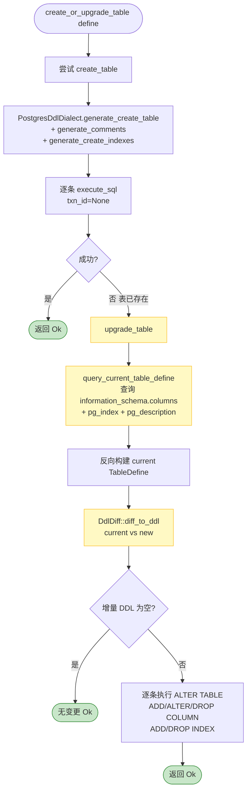
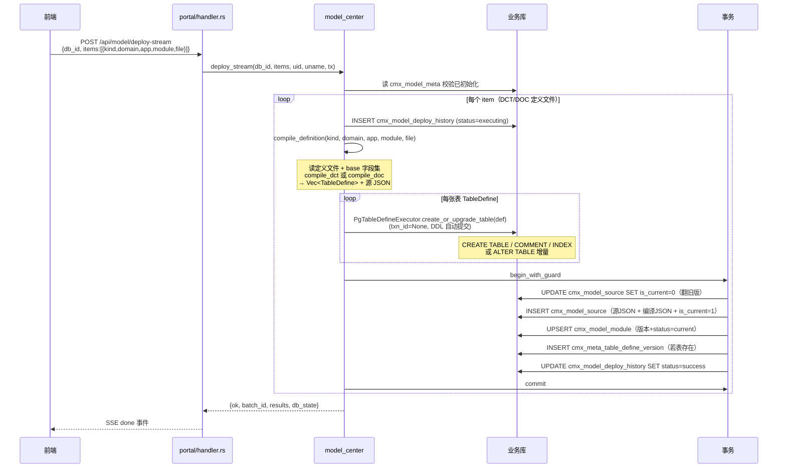
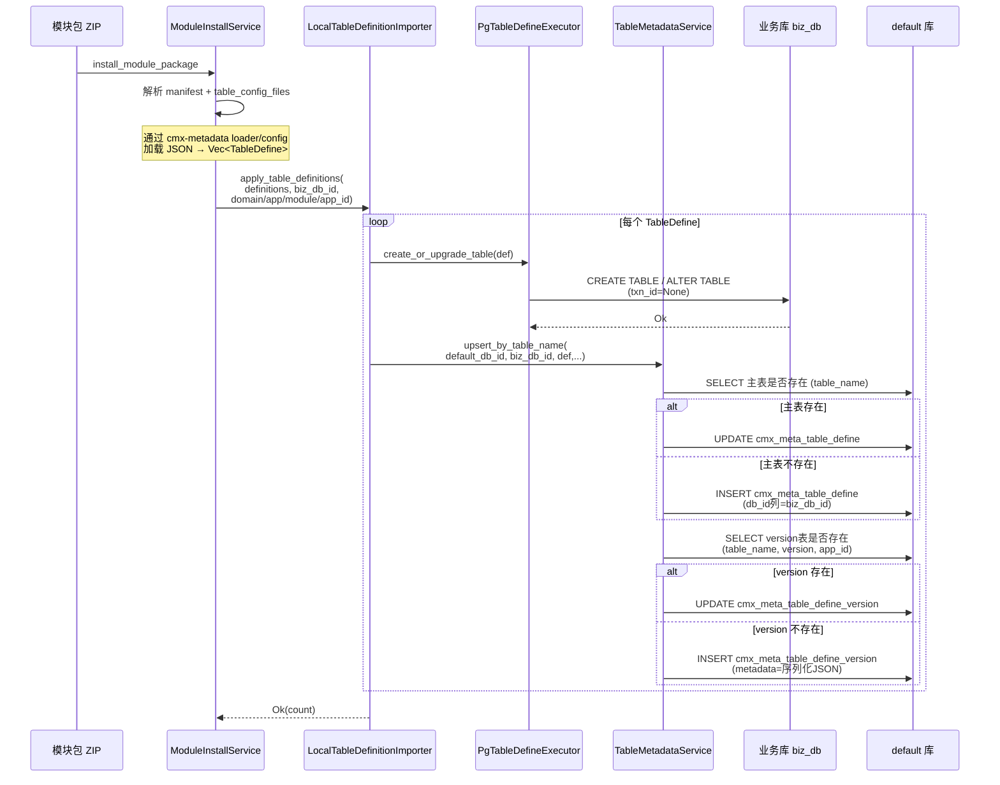

# cmx 模型数据 → 建表语句生成与执行 流程总结

> 范围：梳理「模型数据（TableDefine / DCT / DOC 定义）转换为 PostgreSQL 建表语句并执行落库」的完整代码流程。
> 包含 crate 间的职责划分、关键数据结构、两条入口路径、以及 Mermaid 流程图。
>
> 结论先行：**`cmx-model` crate 本身不建表**。它是纯 JSON 文件存储的元数据建模服务（五项元数据 definitions + context_profile + 字典检索）。真正「模型 → DDL → 执行」的核心在 **`cmx-metadata`**，配合 **`cmx-core`**（TableDefine 结构）、**`cmx-plugin`**（表元数据台账登记）、**`cmx-api/portal/model_center`**（DCT/DOC 定义编译器）协作完成。

---

## 一、Crate 职责划分

| Crate | 角色 | 与建表的关系 |
|-------|------|-------------|
| **cmx-core** | 核心数据结构 | 定义 `TableDefine` / `ColumnDefine` / `FieldType` / `IndexDefine`（`model/meta/table.rs`、`model/cell.rs`）—— 建表的「数据模型」 |
| **cmx-metadata** | DDL 引擎（核心） | ① JSON → `TableDefine`（`loader.rs`）② DDL 生成（`ddl/postgres.rs`）③ 增量 DDL diff（`ddl/diff.rs`）④ DDL 执行（`executor.rs`）⑤ 种子数据执行（`seed/`）|
| **cmx-model** | 元数据建模服务 | **不建表**。JSON 文件存储（`data/meta/definitions/**`、`data/dict/**`）。提供 DCT/DOC/CP 等定义文件给模型中心读取 |
| **cmx-plugin** | 表元数据台账 | `TableMetadataService` 维护 `cmx_meta_table_define` + `cmx_meta_table_define_version` 两张元数据登记表；`LocalTableDefinitionImporter` 是模块安装路径的建表+登记入口 |
| **cmx-api** | HTTP 入口 | ① `portal/model_center.rs`：DCT/DOC 定义 JSON → 编译为 TableDefine → 建表到目标库 + 写模型台账 ② `table_metadata/handler.rs`：表元数据 CRUD 查询 |

### 1.1 关键依赖关系

```
cmx-api (model_center, table_metadata handlers)
   ├── cmx-metadata     (DDL 生成 + 执行)
   │     └── cmx-core   (TableDefine 结构定义)
   ├── cmx-plugin       (TableMetadataService 元数据登记)
   │     ├── cmx-metadata
   │     └── cmx-core
   └── cmx-model        (定义文件 JSON 存储，仅读取)
```

---

## 二、核心数据结构

### 2.1 `TableDefine`（cmx-core/src/model/meta/table.rs）

建表的「蓝图」，完全描述一张 PostgreSQL 表：

```rust
pub struct TableDefine {
    pub table_name: String,              // 表名，如 "sale_order"
    pub display_name: String,            // 显示名（→ COMMENT ON TABLE）
    pub columns: Vec<ColumnDefine>,      // 列定义
    pub primary_keys: Vec<String>,       // 主键列
    pub indexes: Vec<IndexDefine>,       // 索引（唯一/普通）
    pub version: u32,                    // 定义版本
    pub i18n: bool,                      // 是否生成多语言伴生表
    pub comment: Option<String>,         // 表注释
    pub schema: Option<String>,          // 默认 "public"
    pub tablespace: Option<String>,      // 表空间
    pub is_partitioned: bool,            // 分区表
    pub partition_type: Option<PartitionType>,
    pub partition_columns: Vec<String>,
    pub extensions: HashMap<String, JsonValue>,
}

pub struct ColumnDefine {
    pub name: String,                    // 列名
    pub label: String,                   // UI 显示名（→ COMMENT ON COLUMN）
    pub field_type: FieldType,           // 通用类型枚举
    pub is_primary_key: bool,
    pub is_nullable: bool,
    pub default_value: Option<String>,   // SQL 表达式
    pub length: Option<u32>,             // VARCHAR(n)
    pub precision: Option<u32>,          // NUMERIC(p,s)
    pub scale: Option<u32>,
    pub db_type: Option<String>,         // 原始 DB 类型（round-trip 模式用）
    pub ordinal: Option<u32>,            // 列顺序
    // ...
}
```

### 2.2 `FieldType` → PostgreSQL 类型映射（ddl/postgres.rs）

```
String   → VARCHAR(length) / TEXT
Int      → BIGINT
Float    → DOUBLE PRECISION
Decimal  → NUMERIC(p,s)
DateTime → TIMESTAMP WITH TIME ZONE
Date     → DATE
Bool     → BOOLEAN
Text     → TEXT
Binary   → BYTEA
Array    → JSONB
Json     → JSONB
Uuid     → UUID
```

---

## 三、DDL 生成与执行引擎（cmx-metadata）

### 3.1 模块结构

```
cmx-metadata/src/
├── loader.rs       # JSON 文件 → TableDefine
├── config.rs       # TableDefinesConfigManager（多配置 + 拓扑排序）
├── ddl/
│   ├── mod.rs      # DdlDialect trait + 便捷函数
│   ├── postgres.rs # PostgresDdlDialect 实现（生成 CREATE/COMMENT/INDEX/ALTER）
│   └── diff.rs     # DdlDiff（增量 DDL：新旧 TableDefine 比对 → ALTER）
├── executor.rs     # PgTableDefineExecutor（执行 DDL 到数据库）
├── i18n.rs         # 多语言伴生表生成
├── parser/         # 反向解析：现有库 → TableDefine（information_schema 内省）
├── seed/           # 种子数据执行（PgSeedDataExecutor）
└── lib.rs
```

### 3.2 DDL 方言 trait（ddl/mod.rs）

```rust
pub trait DdlDialect {
    fn map_column_type(&self, col: &ColumnDefine) -> String;
    fn generate_create_table(&self, table: &TableDefine) -> Result<String, MetadataError>;
    fn generate_create_indexes(&self, table: &TableDefine) -> Result<Vec<String>, MetadataError>;
    fn generate_comments(&self, table: &TableDefine) -> Result<Vec<String>, MetadataError>;
    fn generate_full_ddl(&self, table: &TableDefine) -> Result<String, MetadataError>; // 上述三者合并
    fn generate_add_column(...) -> Result<String, MetadataError>;
    fn generate_drop_column(...) -> Result<String, MetadataError>;
    fn generate_alter_column(...) -> Result<Vec<String>, MetadataError>;
    fn generate_drop_table(&self, table: &TableDefine) -> Result<String, MetadataError>;
}
```

- 便捷函数：`table_to_pg_ddl(&table)` / `tables_to_pg_ddl(&tables)` / `table_to_pg_ddl_roundtrip(&table)`（优先用 `col.db_type`）

### 3.3 执行器（executor.rs）

```rust
#[async_trait]
pub trait TableDefineDbExecutor: Send + Sync {
    async fn create_table(&self, define: &TableDefine) -> Result<(), BaseError>;
    async fn upgrade_table(&self, define: &TableDefine) -> Result<(), BaseError>;
    async fn create_or_upgrade_table(&self, define: &TableDefine) -> Result<(), BaseError> {
        // 默认实现：先尝试 create_table，失败则 upgrade_table
        if self.create_table(define).await.is_ok() { return Ok(()); }
        self.upgrade_table(define).await
    }
}

pub struct PgTableDefineExecutor {
    pub db_id: String,          // 目标业务库 ID
    pub txn_id: Option<String>, // None（PG DDL 自动提交）
}
```

**`create_table` 流程**：
1. `PostgresDdlDialect::generate_create_table` → `CREATE TABLE ...`
2. `generate_comments` → `COMMENT ON TABLE/COLUMN ...`
3. `generate_create_indexes` → `CREATE [UNIQUE] INDEX ...`
4. 逐条通过 `get_default_db_manager().execute_sql(db_id, None, stmt)` 执行

**`upgrade_table` 流程（增量）**：
1. `query_current_table_define` — 通过 `information_schema.columns` / `pg_index` / `pg_description` 查询当前库的实际表结构，反向构建 `TableDefine`
2. `DdlDiff::diff_to_ddl(&dialect, &[current], &[new])` — 新旧对比生成 `ALTER TABLE ADD/ALTER/DROP COLUMN` 等增量 DDL
3. 逐条执行增量 DDL

**重要约束**：`txn_id = None`（PG DDL 语句自动提交，不能放进事务）；台账 DML 在事务内；失败经 `cmx_model_deploy_history` 状态可对账。

---

## 四、两条建表入口路径

### 4.1 路径 A：模型中心部署（cmx-api/portal/model_center.rs）

**场景**：用户在前端「模型中心」勾选 DCT/DOC 定义文件，部署到指定业务库。

**HTTP 入口**（`cmx-api/src/handlers/portal/handler.rs`）：
- `GET  /api/model/db-state` → `model_center::db_state`
- `POST /api/model/init-db` → `model_center::init_db`（建 4 张台账系统表：`cmx_model_meta` / `cmx_model_module` / `cmx_model_deploy_history` / `cmx_model_source`）
- `POST /api/model/deploy` → `model_center::deploy`（同步部署）
- `POST /api/model/deploy-plan-stream` → SSE 流式生成部署计划（只读预览）
- `POST /api/model/deploy-stream` → SSE 流式部署（实时进度）
- `POST /api/model/init-plan-stream` / `init-db-stream` → SSE 流式初始化

**核心编译器**（model_center.rs 内部）：

```rust
// DCT（字典表）定义 JSON → TableDefine
fn compile_dct(doc: &Value, base: &Value) -> Vec<TableDefine>
// DOC（单据表）定义 JSON → TableDefine
fn compile_doc(doc: &Value, base: &Value) -> Vec<TableDefine>

// 单字段 → ColumnDefine
fn field_to_column(f: &Value, id_field: &str, ordinal: u32) -> Option<ColumnDefine>
// dataType 词元 → FieldType
fn map_field_type(data_type: &str) -> FieldType
```

**部署流程**（`deploy_with_events`）：
1. 前置校验：目标库必须已 `init_db`
2. 写 `cmx_model_deploy_history`（status=executing，对账锚点）
3. `compile_definition(kind, domain, app, module, file)` — 读定义文件 + base 字段集，编译为 `Vec<TableDefine>` + 源 JSON
4. 对每个 `TableDefine`：`PgTableDefineExecutor::create_or_upgrade_table(def)` 建表到业务库（DDL 自动提交，txn_id=None）
5. 开启事务，写台账 DML：
   - `cmx_model_source`（源 JSON 留档 + 编译结果 JSON）
   - `cmx_model_module`（模块态 UPSERT，记 dct/doc 版本与 status=current）
   - `cmx_meta_table_define_version`（对象台账快照，若该表存在）
   - `cmx_model_deploy_history`（status=success）
6. 提交事务；失败则回滚 + 更新历史为 failed

### 4.2 路径 B：模块安装（cmx-plugin）

**场景**：导入模块包（cmx-module-package ZIP），其中包含 `table_config_files`（建表配置 JSON）。

**入口**：`cmx-plugin/src/service/table_definition_importer.rs` 的 `LocalTableDefinitionImporter`（实现 `cmx_traits::resource::TableDefinitionImporter` trait）。

```rust
async fn apply_table_definitions(
    &self, domain_code, app_code, module_code, app_id,
    definitions: &[TableDefine], biz_db_id: &str,
) -> Result<usize, TraitError> {
    let executor = PgTableDefineExecutor::new(biz_db_id, None);
    for table_def in definitions {
        // ① 建表到业务库（biz_db_id）
        executor.create_or_upgrade_table(table_def).await?;
        // ② 登记元数据到 default 库（db_id 列标记 biz_db_id）
        TableMetadataService::upsert_by_table_name(
            &self.mm, &self.default_db_id, biz_db_id, table_def,
            domain_code, app_code, module_code, app_id,
        ).await?;
    }
}
```

**种子数据**：`cmx-plugin/src/service/utils.rs::execute_seed_data` — 插件单独安装时，建表 DDL 已迁移到模块安装流程，但 seeddata（CSV 种子数据）仍在插件包内由 `PgSeedDataExecutor` 执行。

### 4.3 元数据台账（cmx-plugin/infrastructure/database/table_metadata/）

两张元数据登记表（在 default 库）：
- **`cmx_meta_table_define`**（主表）：表名、显示名、所属库 db_id（业务库）、plugin_id、version、domain/application/module_code、ddl_status
- **`cmx_meta_table_define_version`**（版本表）：完整 `metadata` JSON（序列化的 TableDefine），按 (table_name, version, app_id, db_id) 关联主表

**关键方法**（`service.rs`）：
- `upsert_by_table_name` — 先查 `(table_name, version, app_id)` 是否存在，存在 UPDATE 否则 INSERT（**避免重复导入产生重复 version 记录**，这是之前修复的 bug）
- `list_by_module(app_code, module_code)` — 连查主表 + version 表，反序列化 metadata JSON 为 `Vec<TableDefine>`，供模块导出复用
- `get_by_table_name` / `list` / `page` / `list_versions` — 查询接口

---

## 五、整体流程图

### 5.1 完整建表流程（两条入口）



### 5.2 create_or_upgrade_table 内部决策（executor.rs）



### 5.3 模型中心部署流程（model_center.rs deploy_with_events）



### 5.4 模块安装建表流程（cmx-plugin）



---

## 六、关键设计要点

### 6.1 双库语义（路径 B 特有）

模块安装路径明确区分两个库：
- **业务库（biz_db_id）**：实际业务表所在库，由 `PgTableDefineExecutor` 执行 DDL
- **default 库**：元数据台账所在库（`cmx_meta_table_define` / `_version`），由 `TableMetadataService` 执行 DML
- 主表 `db_id` 列登记 `biz_db_id`，标记业务表所在库

模型中心路径（路径 A）则是「目标库即业务库」，模型台账表（`cmx_model_*`）也建在同一个目标库内。

### 6.2 additive-only 升级策略

`create_or_upgrade_table` 只**加列/加索引/改类型**，**绝不 DROP**：
- `create_table` 失败（表已存在）→ 走 `upgrade_table`
- `upgrade_table` 通过 `DdlDiff` 生成增量 DDL，默认不生成 `DROP COLUMN` / `DROP INDEX`
- 满足「允许多次部署，但不删数据，只做加性升级」的运维约束

### 6.3 DDL 与事务的边界

- **DDL 语句**（CREATE/ALTER/COMMENT/INDEX）：`txn_id = None`，PG 中 DDL 自动提交，不能放进事务
- **台账 DML**（INSERT/UPDATE 元数据表）：在事务内（`begin_with_guard` → commit）
- 失败对账：通过 `cmx_model_deploy_history.status`（executing/success/failed）+ 时间戳还原执行状态

### 6.4 round-trip 模式

`PostgresDdlDialect { prefer_db_type: true }` 优先使用 `ColumnDefine.db_type`（原始 DB 类型字符串），而非根据 `FieldType` 自动映射。
- 用途：从现有库内省（`query_current_table_define`）还原的 TableDefine 再生成 DDL 时，保持类型完全一致（如 `VARCHAR2(30)` 不被映射成 `VARCHAR(30)`）
- 便捷函数：`table_to_pg_ddl_roundtrip(&table)`

### 6.5 内省（反向解析）

`query_current_table_define` 通过以下系统目录查询还原 TableDefine：
1. `information_schema.columns` — 列信息（名/类型/长度/可空/默认值/顺序）
2. `pg_index` + `pg_attribute` — 主键列
3. `pg_class` + `pg_index` + `pg_attribute` — 索引（排除主键）
4. `obj_description` — 表注释
5. `col_description` — 列注释

类型映射：`pg_type_to_field_type` + `build_pg_db_type` + `clean_pg_default`（清理 `'active'::varchar` 后缀、`nextval()` 序列引用）

---

## 七、扩展方言（未来）

`DdlDialect` trait 已抽象，当前仅 `PostgresDdlDialect` 实现。未来新增 MySQL/Oracle 等只需：
1. 实现 `DdlDialect` trait（类型映射 + DDL 语法）
2. 实现 `TableDefineDbExecutor`（执行器）
3. 在入口处按 db_id 类型选择方言

---

## 八、相关文件索引

| 文件 | 说明 |
|------|------|
| `crates/libs/cmx-core/src/model/meta/table.rs` | `TableDefine` / `ColumnDefine` / `FieldType` 定义 |
| `crates/libs/cmx-core/src/model/cell.rs` | `DataValue` 值类型（建表不直接用，但 DML 参数绑定用） |
| `crates/libs/cmx-metadata/src/loader.rs` | JSON → TableDefine |
| `crates/libs/cmx-metadata/src/config.rs` | `TableDefinesConfigManager`（多配置 + 拓扑排序） |
| `crates/libs/cmx-metadata/src/ddl/mod.rs` | `DdlDialect` trait + 便捷函数 |
| `crates/libs/cmx-metadata/src/ddl/postgres.rs` | `PostgresDdlDialect`（CREATE/COMMENT/INDEX/ALTER 生成） |
| `crates/libs/cmx-metadata/src/ddl/diff.rs` | `DdlDiff`（增量 DDL 生成） |
| `crates/libs/cmx-metadata/src/executor.rs` | `PgTableDefineExecutor` + `query_current_table_define`（内省） |
| `crates/libs/cmx-metadata/src/seed/` | 种子数据执行（`PgSeedDataExecutor`） |
| `crates/libs/cmx-api/src/handlers/portal/model_center.rs` | DCT/DOC 定义编译器 + 模型中心部署入口 |
| `crates/libs/cmx-api/src/handlers/portal/handler.rs:1475+` | 模型中心 HTTP 路由 handler |
| `crates/libs/cmx-plugin/src/service/table_definition_importer.rs` | `LocalTableDefinitionImporter`（模块安装建表入口） |
| `crates/libs/cmx-plugin/src/service/utils.rs` | `execute_seed_data`（插件种子数据） |
| `crates/libs/cmx-plugin/src/infrastructure/database/table_metadata/service.rs` | `TableMetadataService`（元数据台账 CRUD + upsert_by_table_name） |
| `crates/libs/cmx-plugin/src/infrastructure/database/table_metadata/` | 元数据台账 entity/bmc/filter |
| `crates/libs/cmx-api/src/handlers/table_metadata/handler.rs` | 表元数据查询 HTTP handler |
