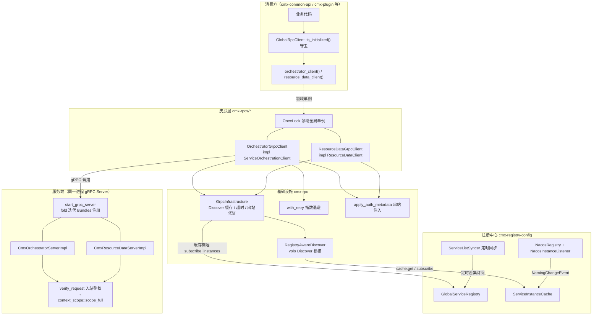
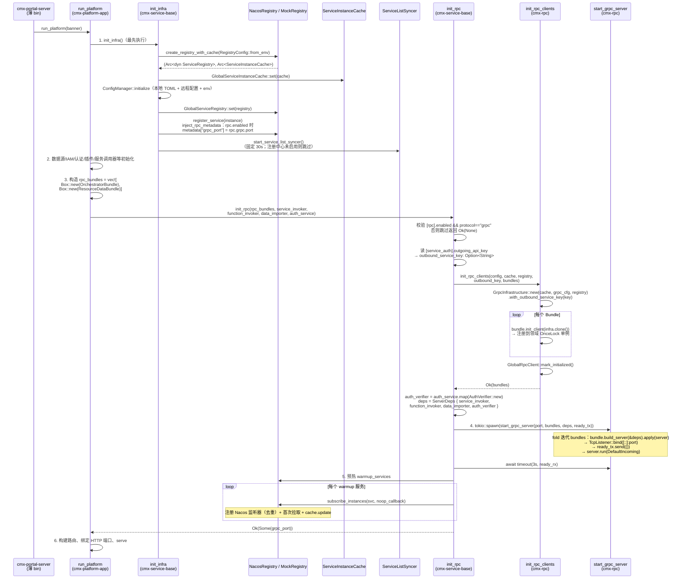
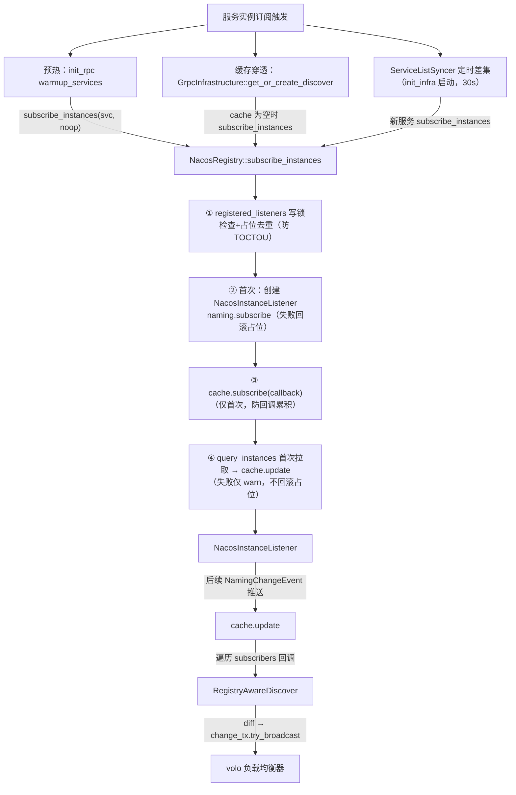
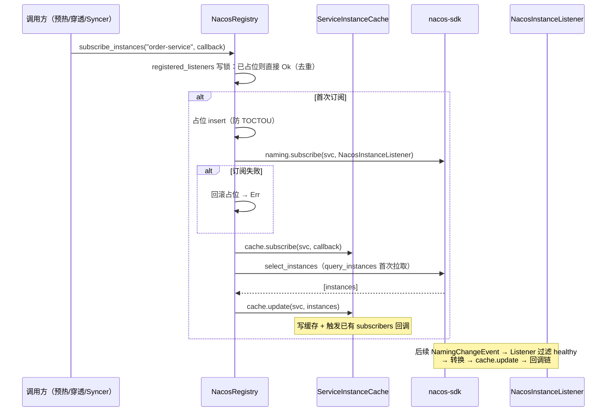
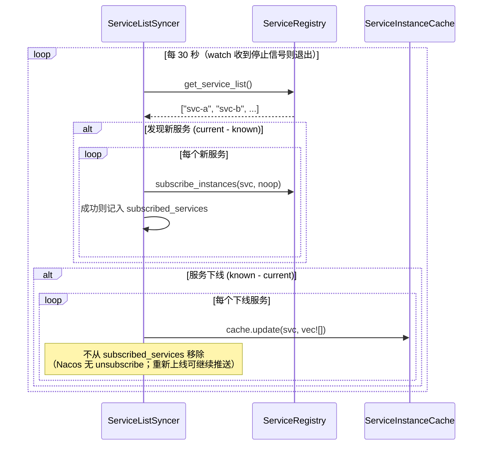
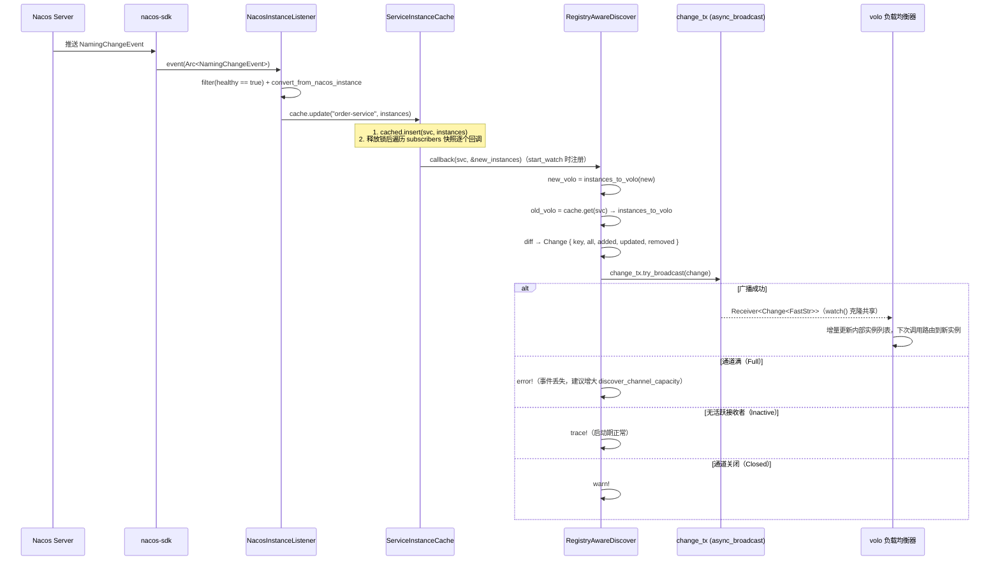
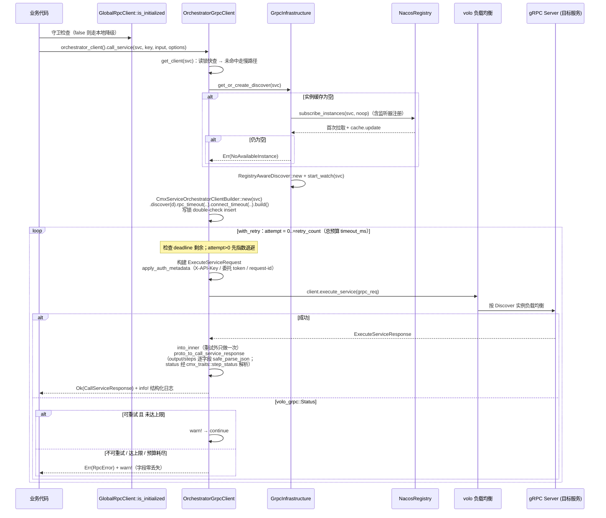
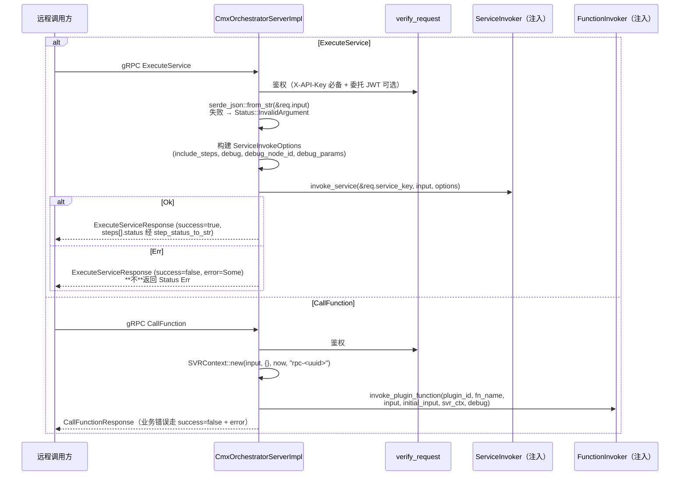
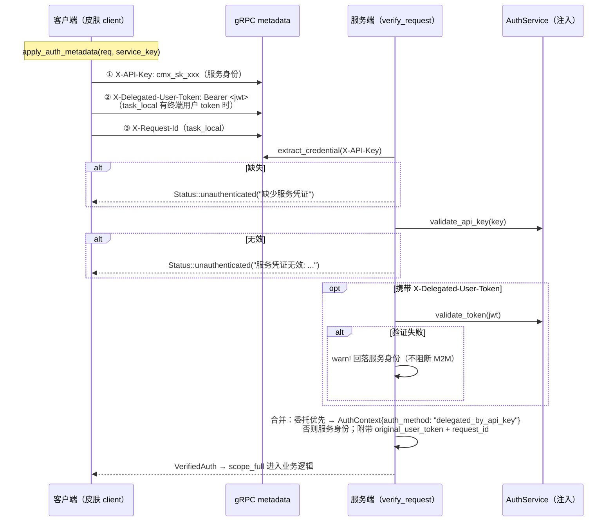
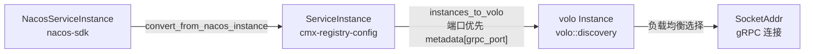

# 微服务 RPC 调用架构 — 流程详解

> **2026-08-14 重写**：本文是原《RPC架构流程详解.md》的全面重写版，与「RPC 皮肤归域 + 契约集中」重构落地代码完全同步（重构方案与落地记录见根仓库 [20260814_cmx-rpc_RPC皮肤归域与契约集中重构方案.md](../../../.trae/documents/20260814_cmx-rpc_RPC皮肤归域与契约集中重构方案.md)）。
>
> 内容基于以下最新源码：
> - `crates/libs/cmx-rpc-gen/`（proto 契约集中 crate：volo-build 代码生成 + 域别名）
> - `crates/libs/cmx-infra/cmx-rpc/`（RPC 基础设施：Bundle 装配接口 / 共享设施 / Server 启动器 / 全局守卫）
> - `crates/libs/cmx-rpcs/cmx-orchestrator-rpc/`、`crates/libs/cmx-rpcs/cmx-resource-rpc/`（领域皮肤 crate）
> - `crates/libs/cmx-service-base/src/rpc.rs`（通用 `init_rpc`）、`src/registry_config.rs`（`init_infra`）
> - `crates/libs/cmx-platform-app/src/lib.rs`（组装层 —— 主应用 RPC 能力唯一决定点）
> - `crates/libs/cmx-infra/cmx-registry-config/`（注册中心抽象与 Nacos/Mock 实现）
> - `crates/libs/cmx-traits/src/rpc/`（RPC trait 抽象与错误类型）

---

## 一、整体架构概览

设计原则：**契约中心化 · 实现归域 · 装配显式**。

| 层 | crate | 职责 |
|------|-------|------|
| proto 契约 | `cmx-rpc-gen` | 集中管理全部 `.proto`（按域分子目录 `idl/<域>/`），volo-build 编译期生成类型，提供 `orchestrator_proto` / `resource_data_proto` 便捷别名 |
| 基础设施 | `cmx-infra/cmx-rpc` | 纯共享设施：`RpcServiceBundle` 装配接口、`GrpcInfrastructure`（发现缓存）、`with_retry`、出/入站鉴权、`start_grpc_server`、`GlobalRpcClient` 初始化守卫。**不含任何领域实现** |
| 皮肤 | `cmx-rpcs/cmx-orchestrator-rpc`、`cmx-rpcs/cmx-resource-rpc` | 每域三件套：client 全局访问器 + server impl + Bundle。依赖 cmx-rpc + cmx-rpc-gen + cmx-traits，**不依赖业务 service crate**（业务实现经 `ServerDeps` 注入） |
| 组装 | `cmx-platform-app` | **显式收集皮肤 Bundle 列表**传入 `init_rpc` —— 主应用对外提供哪些 gRPC 服务的唯一决定点 |

与 HTTP 层同构（对标 api 拆分）：契约 `cmx-rpc-gen` ↔ ApiDoc；基础设施 `cmx-rpc` ↔ `cmx-api-core`；皮肤 `cmx-rpcs/*` ↔ `cmx-apis/*-api`；组装 `init_rpc(bundles)` ↔ `api_routes().merge()`。

依赖方向：皮肤 → cmx-rpc / cmx-rpc-gen / cmx-traits；组装层 → 皮肤；`cmx-service-base` 只依赖 cmx-rpc（bundles 参数是 trait object，不依赖任何皮肤）。



---

## 二、核心组件说明

| 组件 | 所在 Crate | 文件 | 职责 |
|------|-----------|------|------|
| `ServiceOrchestrationClient` trait | cmx-traits | `src/rpc/orchestrator.rs` | 服务编排客户端抽象（`call_service` / `call_function`） |
| `ResourceDataClient` trait | cmx-traits | `src/rpc/resource_data.rs` | 资源数据客户端抽象（import / cleanup / list） |
| `RpcError` | cmx-traits | `src/rpc/error.rs` | 7 变体：`ServiceNotFound` / `NoAvailableInstance` / `RpcCallFailed` / `UnsupportedProtocol` / `Timeout` / `Unauthenticated` / `PermissionDenied` |
| `RpcServiceBundle` trait | cmx-rpc | `src/bundle.rs` | 领域装配接口（`name` / `init_client` / `build_server`），OCP 核心 |
| `ServerDeps` / `ServerRegistration` | cmx-rpc | `src/bundle.rs` | 服务端依赖聚合（4 字段，按需取用）/ 类型擦除注册闭包 |
| `init_rpc_clients` | cmx-rpc | `src/factory.rs` | 迭代**外部传入**的 Bundle 初始化客户端，标记全局守卫 |
| `start_grpc_server` | cmx-rpc | `src/server_runner.rs` | fold 迭代 Bundle 注册服务并启动（先绑端口再发就绪信号） |
| `GlobalRpcClient` | cmx-rpc | `src/global.rs` | 全局初始化状态守卫（`is_initialized`），不再持有客户端 |
| `GrpcInfrastructure` | cmx-rpc | `src/client/infra.rs` | 客户端共享设施：Discover 缓存、注册中心懒订阅、超时/重试配置、出站凭证 |
| `with_retry` / `RetryStats` | cmx-rpc | `src/client/retry.rs` | 带总预算的指数退避重试（闭包只返回原始 Status） |
| `apply_auth_metadata` | cmx-rpc | `src/client/auth_outbound.rs` | 出站三层凭证注入（X-API-Key / X-Delegated-User-Token / X-Request-Id） |
| `AuthVerifier` / `verify_request` | cmx-rpc | `src/server/auth_layer.rs` | 入站鉴权（服务身份必备 + 委托用户可选回落） |
| `safe_parse_json` | cmx-rpc | `src/client/mod.rs` | JSON 容错解析（失败降级 Null + warn） |
| `RegistryAwareDiscover` | cmx-rpc | `src/discover.rs` | 实现 volo `Discover`，桥接实例缓存与变更广播 |
| `RpcConfig` / `GrpcConfig` | cmx-rpc | `src/config.rs` | `[rpc]` 配置模型 |
| `OrchestratorGrpcClient` / `OrchestratorBundle` / `orchestrator_client()` | cmx-orchestrator-rpc | `src/client.rs` | 服务编排域皮肤（client + Bundle + 领域单例） |
| `CmxOrchestratorServerImpl` | cmx-orchestrator-rpc | `src/server.rs` | `CmxServiceOrchestrator` gRPC 服务端实现 |
| `ResourceDataGrpcClient` / `ResourceDataBundle` / `resource_data_client()` | cmx-resource-rpc | `src/client.rs` | 资源数据域皮肤（client + Bundle + 领域单例） |
| `CmxResourceDataServerImpl` | cmx-resource-rpc | `src/server.rs` | `CmxResourceDataService` gRPC 服务端实现 |
| `orchestrator_proto` / `resource_data_proto` | cmx-rpc-gen | `src/lib.rs` | volo-build 生成类型的域别名模块 |
| `init_rpc` | cmx-service-base | `src/rpc.rs` | RPC 子系统初始化（bundles 参数为 trait object，本库不依赖皮肤） |
| `init_infra` | cmx-service-base | `src/registry_config.rs` | 注册中心/配置中心初始化 + 服务注册（注入 `grpc_port` metadata）+ 启动 Syncer |
| `run_platform` | cmx-platform-app | `src/lib.rs` | 主应用装配：构造 `rpc_bundles` 列表并调用 `init_rpc`（:158-170） |
| `GlobalServiceRegistry` / `GlobalServiceInstanceCache` | cmx-registry-config | `src/global_registry.rs` / `src/global_instance_cache.rs` | 注册中心 / 实例缓存全局单例（OnceLock） |
| `ServiceInstanceCache` | cmx-registry-config | `src/registry/instance_cache.rs` | 实例内存缓存；`update` 触发 subscribers 回调 |
| `NacosRegistry` / `NacosInstanceListener` | cmx-registry-config | `src/registry/nacos.rs` | Nacos 实现与变更监听 |
| `ServiceListSyncer` | cmx-registry-config | `src/registry/service_list_syncer.rs` | 定时拉服务列表、差集自动订阅（由 `init_infra` 启动） |

---

## 三、服务启动初始化流程

主应用入口是**薄 bin** `cmx-portal-server`（位于 cmx-portalservice 仓库，跨 workspace 依赖），仅调用 `cmx_platform_app::run_platform(banner)`。全部装配逻辑在 `cmx-platform-app::run_platform`。



### 3.1 关键步骤说明

1. **`init_infra()`**（[registry_config.rs](../../crates/libs/cmx-service-base/src/registry_config.rs)）
   - `RegistryConfig::from_env()` + `create_registry_with_cache()` 创建 `(registry, cache)`；
   - 设置 `GlobalServiceInstanceCache` / `GlobalServiceRegistry` / `GlobalConfigCenter` 全局单例；
   - **注册服务实例**：`register_service` 经 `inject_rpc_metadata` 在 `[rpc].enabled == true` 时把 `grpc_port` 写入实例 metadata —— 消费方 `instances_to_volo` 据此直接连 gRPC 端口；
   - **启动 `ServiceListSyncer`**（固定 30s 间隔，watch 信号优雅停止）：定时 `get_service_list()` 差集比对，新服务自动 `subscribe_instances`，下线服务 `cache.update(vec![])`。

2. **构造 `rpc_bundles`**（[cmx-platform-app/src/lib.rs:158-161](../../crates/libs/cmx-platform-app/src/lib.rs)）——**主应用 RPC 能力唯一决定点**：

   ```rust
   let rpc_bundles: Vec<Box<dyn cmx_rpc::bundle::RpcServiceBundle>> = vec![
       Box::new(cmx_orchestrator_rpc::OrchestratorBundle),
       Box::new(cmx_resource_rpc::ResourceDataBundle),
   ];
   let grpc_port = init_rpc(
       rpc_bundles,
       cmx_traits::service::GlobalServiceInvoker::get().clone(),
       build_function_invoker(),          // portal 专属：绑 cmx-biz BizFunctionInvoker
       resource_data_importer.clone(),
       Some(auth_service.clone()),        // 启用 gRPC 服务端鉴权
   ).await?;
   ```

   裁剪能力（精简版/独立微服务形态）只需增删本列表，cmx-rpc 与皮肤 crate 零改动。

3. **`init_rpc`**（[cmx-service-base/src/rpc.rs](../../crates/libs/cmx-service-base/src/rpc.rs)）：读 `[rpc]` 段；仅 `enabled && protocol=="grpc"` 继续；初始化客户端（工厂迭代传入 bundles）→ 构造 `AuthVerifier` 与 `ServerDeps` → 后台 spawn gRPC Server（3s 就绪超时，失败 abort 并报错）→ 预热 → 返回 `Some(grpc_port)`。

4. **`start_grpc_server`**（[server_runner.rs](../../crates/libs/cmx-infra/cmx-rpc/src/server_runner.rs)）：`fold` 迭代 bundles，每个 Bundle 通过 `build_server(&deps)` 返回类型擦除的 `ServerRegistration` 闭包，把本域 service `add_service` 到 volo Server；**先 `TcpListener::bind` 再发就绪信号**，避免启动竞态。

---

## 四、Bundle 装配机制（OCP）

每个领域封装为一个 `RpcServiceBundle`（皮肤 crate 提供）：

```rust
pub trait RpcServiceBundle: Send + Sync {
    fn name(&self) -> &'static str;                              // 领域名（日志/诊断）
    fn init_client(&self, infra: Arc<GrpcInfrastructure>);       // 构建客户端并注册到领域全局单例
    fn build_server(&self, deps: &ServerDeps) -> ServerRegistration; // 构建服务端注册闭包
}
```

- **新增 gRPC 服务 = cmx-rpc-gen 加 proto + 新建 `cmx-rpcs/*` 皮肤 crate（含 Bundle）+ platform-app 列表加一行**；`factory` / `server_runner` 零改动（对扩展开放、对修改关闭）。
- `ServerDeps` 含 4 字段（`service_invoker` / `function_invoker` / `data_importer` / `auth_verifier`），各 Bundle 按需取用、互不感知。这是换取 OCP 的合理耦合代价；当皮肤 ≥5 域且字段频繁增长时，演进路线是改为 `HashMap<TypeId, Arc<dyn Any>>` 按类型取用的容器（见 `bundle.rs` 模块文档）。
- `ServerRegistration` 用 `Box<dyn FnOnce(Server) -> Server>` 做类型擦除：volo-grpc 的 `add_service` 接收任意 service 类型（存入内部 Router 而非类型参数），闭包在 Bundle 内部 monomorphize。
- **注册点唯一性**：同一 gRPC service 全名（如 `cmx.CmxServiceOrchestrator`）重复 `add_service` 会触发 volo Router 内部 panic。装配层必须保证 Bundle 列表不重复 —— 这是 `init_rpc_clients` 只处理「外部传入 bundles」的原因。

---

## 五、服务发现与实例订阅流程

### 5.1 两种触发订阅的途径（统一走 `subscribe_instances`）



> ⚠️ **与重构前版本的差异**：旧版预热路径只做 query+update、**不注册** Nacos 监听器（服务后续上线不感知）。现统一走 `registry.subscribe_instances`，**预热与缓存穿透都会注册监听器**（`registered_listeners` 去重），服务上下线变更全程可感知。

### 5.2 subscribe_instances 详细流程（NacosRegistry）



`MockRegistry`（开发/测试）：`subscribed_services` HashSet 去重，`cache.subscribe` + 拉取 + `cache.update`；`register`/`deregister` 会主动刷新缓存。

### 5.3 ServiceListSyncer 定时同步

由 `init_infra` 的 `start_service_list_syncer()` 启动（注册中心未启用时跳过），固定 30s 间隔：



---

## 六、Nacos 实例变更实时推送流程



### 6.1 Change 事件结构

`volo::discovery::Change<K>`：`key`（服务名）/ `all`（全量）/ `added`（新地址）/ `removed`（旧地址不在新集合）/ `updated`（地址相同但 weight/tags 变化）。volo 据此增量更新，无需重建连接。

### 6.2 Discover 生命周期与通道容量

- `GrpcInfrastructure` 按 `service_name` 缓存 `RegistryAwareDiscover`（double-check locking；网络 IO 在写锁外完成）。**每个 Discover 持有独立 broadcast 通道**，容量取 `rpc.grpc.discover_channel_capacity`（默认 1024，0 回落默认值）。
- `instances_to_volo` **优先取 `metadata["grpc_port"]`** 作为端口（`init_infra` 注册时注入），回退 `ServiceInstance.port`；`weight = (weight * 100.0) as u32`；metadata 全量映射为 volo `tags`；地址解析失败的实例 warn 后跳过。

---

## 七、RPC 调用完整流程

消费方统一模式：**`GlobalRpcClient::is_initialized()` 守卫 → 领域访问器 → trait 方法**。

```rust
if !cmx_rpc::GlobalRpcClient::is_initialized() { /* 降级本地路径 */ }
let resp = cmx_orchestrator_rpc::orchestrator_client()
    .call_service(server_name, service_key, input, options).await?;
```

现有消费点：
- `cmx-common-api/src/handlers/service/handler.rs`（守卫 :576 / :605 → `orchestrator_client()` :579 / :614）
- `cmx-plugin/src/host_functions.rs`（守卫 :226 / :267 → :233 / :280）
- `cmx-plugin/src/service/remote_importers/mod.rs`（守卫 :182 / :305 → `resource_data_client()` :189 / :312）

### 7.1 call_service 流程（服务编排）



### 7.2 call_function 流程（插件函数调用）

与 7.1 相同的服务发现与重试骨架；请求体为 `CallFunctionRequest { plugin_id, function_name, input, initial_input: None, debug: false }`；响应 `result` 字段经 `safe_parse_json` 解析为 `FunctionCallResult.result: Option<Value>`。

### 7.3 resource_data 流程（import / cleanup / list —— 不走重试）

`ResourceDataGrpcClient` 三个方法**直接调用、不经 `with_retry`**（模块文档说明理由）：传输 ZIP 二进制大包（gRPC 默认上限 4MB），重试放大带宽与下游负载，且需下游幂等保证；import 由插件安装流程驱动，失败可由上层重试整个安装任务。失败时 `status_to_rpc_error` 保留鉴权类别：`UNAUTHENTICATED → RpcError::Unauthenticated`、`PERMISSION_DENIED → RpcError::PermissionDenied`，其余坍缩为 `RpcCallFailed`。

### 7.4 重试与退避策略

| 维度 | 取值 | 来源 |
|------|------|------|
| 单次 RPC 超时 | `rpc.grpc.timeout_ms`（默认 30000） | volo `rpc_timeout` |
| 连接超时 | `rpc.grpc.connect_timeout_ms`（默认 3000） | volo `connect_timeout` |
| 最大重试次数 | `rpc.grpc.retry_count`（默认 0） | 皮肤 client 经 `infra.retry_count()` |
| 退避序列 | `50ms → 100ms → 200ms → 400ms → 800ms`（上限 800ms） | `retry_backoff(attempt-1)` |
| 总时间预算 | `timeout_ms`（与单次 RPC 同源 —— 已知设计债，未来拆分） | 超出返回 `Err(Timeout)` |
| 可重试错误 | `UNAVAILABLE` / `DEADLINE_EXCEEDED` / `RESOURCE_EXHAUSTED` / `ABORTED` | `is_retryable_error` |
| 不可重试错误 | `INVALID_ARGUMENT` / `NOT_FOUND` / `PERMISSION_DENIED` 等业务错误 | 立即失败 |

> **使用约束**：`with_retry` 的闭包只能返回原始 `volo_grpc::Status`；`into_inner` 与 proto 转换必须在重试返回后做一次，否则重试分支重复消费 response。

### 7.5 JSON 容错

- 服务端 `execute_service`：`serde_json::from_str(&req.input)` 失败返回 `Status::InvalidArgument`。
- 客户端 `safe_parse_json(raw, context)`：失败记 `warn!` 降级 `Value::Null`，不让响应解析失败拖垮整个调用。

---

## 八、gRPC Server 请求处理流程

### 8.1 服务注册

`start_grpc_server` fold 迭代 bundles：`bundle.build_server(&deps).apply(server)`。orchestrator Bundle 注册 `CmxServiceOrchestratorServer`，resource Bundle 注册 `CmxResourceDataServiceServer`；若 `deps.auth_verifier` 为 `Some`，各 impl 经 `with_auth_verifier` 注入鉴权器。

### 8.2 方法入口统一模式

```
auth(req.metadata())            —— 有 verifier 走 verify_request，无则直接 None（兼容无鉴权部署）
→ 解构 VerifiedAuth { context, original_user_token, request_id }
→ context_scope::scope_full(auth_ctx, user_token, request_id, None, async { 业务逻辑 })
→ 注入的 trait 实现（ServerDeps 提供）
```

`scope_full` 建立 task_local scope：server 内部出站调用可经 `current_original_token()` / `current_request_id()` 透传委托用户，支持链式 on-behalf-of。

### 8.3 execute_service / call_function



### 8.4 import / cleanup / list_resource_data

`CmxResourceDataServerImpl` 同样「鉴权 → scope_full → importer」；`data_importer` 为 `None` 时返回 `success=false, "data_importer 未配置"`。入参校验：

- `category` 必须是 `menu/perm/form/flow`（`ResourceDataCategory::parse_from_str`）；
- `domain_code` / `application_code` / `module_code` 全部类别必填；
- `Perm` 类别额外要求 `plugin_id` / `app_id` / `version` 非空；
- `list` 要求 `module_code` 非空。

校验失败与业务错误一律响应体 `success=false + message`（不返回 Status）。

### 8.5 业务错误约定与 StepStatus 稳定性

业务错误（编排失败、插件函数未找到、导入失败）一律通过响应体 `success=false` + `error`/`message` 字段表达，**不**返回 `volo_grpc::Status` Err（调用方走正常响应路径，避免触发 volo 默认错误码处理）；仅输入格式错误（JSON 解析失败）返回 `INVALID_ARGUMENT`，鉴权失败返回 `UNAUTHENTICATED`。

`ExecutionStep.status` 在 proto 中是 `string`（非 enum），由 `cmx_traits::step_status` 单一来源编解码：`Success` / `Failed` / `Skipped` / `DebugPaused`；客户端收到未知值时 `parse_step_status` warn 并降级 `Failed`。

---

## 九、鉴权模型（三层凭证 · 出站/入站）



**Header 语义约定**：`Authorization: Bearer` 严格只承载终端用户 JWT；服务级 API Key（`cmx_sk_` 前缀）只走 `X-API-Key`，让接收端按 header 直接区分认证通道。

**部署形态**：`init_rpc(auth_service: None)` 时不构造 `AuthVerifier`，服务端跳过鉴权（warn 提示）——兼容单体/loopback 部署。出站侧未配置 `[service_auth].outgoing_api_key` 时不注入 `X-API-Key`。

---

## 十、数据流转与类型转换

### 10.1 服务实例数据流转



| 字段 | Nacos | cmx ServiceInstance | volo Instance |
|------|-------|---------------------|---------------|
| 地址 | `ip:port`（port 常为 HTTP 端口） | `ip: String, port: u16` | `Address::Ip(SocketAddr)`，端口优先 `metadata["grpc_port"]` |
| 权重 | `weight: f64` | `weight: f64` | `weight: u32 = (weight * 100.0) as u32` |
| 标签 | `cluster_name`, `metadata` | `cluster_name: Option<String>`, `metadata: HashMap` | `tags: HashMap<Cow<str>, Cow<str>>`（metadata 全量映射） |
| 健康 | `healthy: bool` | `healthy: bool` | Listener 已过滤 `healthy == true` |

### 10.2 Request/Response 字段映射

#### ExecuteServiceRequest / ExecuteServiceResponse（orchestrator 域）

| 字段 | 类型 | 说明 |
|------|------|------|
| `service_key` | `string` | 服务编排标识 |
| `input` | `string` (JSON) | `Value::to_string()` |
| `include_steps` | `bool` | 是否返回步骤详情 |
| `debug` / `debug_node_id` / `debug_params` | `bool` / `optional string` / `map<string,string>` | 调试模式三件套 |
| 响应：`success` / `output` / `steps` / `total_elapsed_us` / `error` | | `output` 与 `steps[].output`/`previous_output` 均为 JSON 字符串，客户端 `safe_parse_json` |

#### CallFunctionRequest / CallFunctionResponse（orchestrator 域）

| 字段 | 类型 | 说明 |
|------|------|------|
| `plugin_id` / `function_name` / `input` | `string` | 必填；`input` 为 JSON 字符串 |
| `initial_input` / `debug` | `optional string` / `bool` | 客户端当前固定 `None` / `false` |
| 响应：`success` / `result` / `elapsed_us` / `error` | | `result` JSON 字符串 → `FunctionCallResult.result: Option<Value>` |

#### resource_data 域（`idl/resource/cmx_resource_data.proto`）

| 消息 | 关键字段 |
|------|---------|
| `ImportResourceDataRequest` | `category`（menu/perm/form/flow）、`domain_code`、`application_code`、`module_code`、`plugin_id`、`app_id`、`version`、`zip_data: bytes`（默认上限 4MB） |
| `ImportResourceDataResponse` | `success`、`message`、`created_count`、`updated_count`、`deleted_count` |
| `CleanupResourceDataRequest` | 同上去掉 `version` / `zip_data` |
| `ListResourceDataRequest` | `category`、`domain_code`、`application_code`、`module_code` |
| `ListResourceDataResponse` | `success`、`message`、`json_data: bytes`（定义列表 JSON 数组） |

> JSON 字符串传输约定：`input`/`output`/`result` 用 `string` 承载 JSON（protobuf 无原生 JSON 值类型）：`Value → to_string → proto string → 传输 → from_str → Value`。

---

## 十一、关键源码索引

| 流程 | 文件 | 关键符号 |
|------|------|---------|
| proto 契约（编排域） | [idl/orchestrator/cmx_service.proto](../../crates/libs/cmx-rpc-gen/idl/orchestrator/cmx_service.proto) | `service CmxServiceOrchestrator` |
| proto 契约（资源域） | [idl/resource/cmx_resource_data.proto](../../crates/libs/cmx-rpc-gen/idl/resource/cmx_resource_data.proto) | `service CmxResourceDataService` |
| volo-build 配置 | [cmx-rpc-gen/volo.yml](../../crates/libs/cmx-rpc-gen/volo.yml) | 两 entry：filename/path |
| 生成代码重导出 + 别名 | [cmx-rpc-gen/src/lib.rs](../../crates/libs/cmx-rpc-gen/src/lib.rs) | `orchestrator_proto` / `resource_data_proto` |
| Bundle 装配接口 | [cmx-rpc/src/bundle.rs](../../crates/libs/cmx-infra/cmx-rpc/src/bundle.rs) | `RpcServiceBundle`、`ServerDeps`、`ServerRegistration` |
| 客户端工厂 | [cmx-rpc/src/factory.rs](../../crates/libs/cmx-infra/cmx-rpc/src/factory.rs) | `init_rpc_clients(config, cache, registry, outbound_key, bundles)` |
| Server 启动器 | [cmx-rpc/src/server_runner.rs](../../crates/libs/cmx-infra/cmx-rpc/src/server_runner.rs) | `start_grpc_server(port, bundles, deps, ready_tx)` |
| 全局初始化守卫 | [cmx-rpc/src/global.rs](../../crates/libs/cmx-infra/cmx-rpc/src/global.rs) | `GlobalRpcClient::is_initialized` |
| 共享基础设施 | [cmx-rpc/src/client/infra.rs](../../crates/libs/cmx-infra/cmx-rpc/src/client/infra.rs) | `GrpcInfrastructure::get_or_create_discover` |
| 重试 | [cmx-rpc/src/client/retry.rs](../../crates/libs/cmx-infra/cmx-rpc/src/client/retry.rs) | `with_retry`、`is_retryable_error`、`retry_backoff` |
| 出站鉴权注入 | [cmx-rpc/src/client/auth_outbound.rs](../../crates/libs/cmx-infra/cmx-rpc/src/client/auth_outbound.rs) | `apply_auth_metadata` |
| 入站鉴权 | [cmx-rpc/src/server/auth_layer.rs](../../crates/libs/cmx-infra/cmx-rpc/src/server/auth_layer.rs) | `AuthVerifier`、`verify_request`、`VerifiedAuth` |
| volo Discover 桥接 | [cmx-rpc/src/discover.rs](../../crates/libs/cmx-infra/cmx-rpc/src/discover.rs) | `RegistryAwareDiscover`、`instances_to_volo`（grpc_port 优先） |
| RPC 配置 | [cmx-rpc/src/config.rs](../../crates/libs/cmx-infra/cmx-rpc/src/config.rs) | `RpcConfig`、`GrpcConfig`、`HttpRestConfig`（预留） |
| 编排域皮肤 | [cmx-rpcs/cmx-orchestrator-rpc/src/client.rs](../../crates/libs/cmx-rpcs/cmx-orchestrator-rpc/src/client.rs) / [server.rs](../../crates/libs/cmx-rpcs/cmx-orchestrator-rpc/src/server.rs) | `orchestrator_client`、`OrchestratorBundle`、`CmxOrchestratorServerImpl` |
| 资源域皮肤 | [cmx-rpcs/cmx-resource-rpc/src/client.rs](../../crates/libs/cmx-rpcs/cmx-resource-rpc/src/client.rs) / [server.rs](../../crates/libs/cmx-rpcs/cmx-resource-rpc/src/server.rs) | `resource_data_client`、`ResourceDataBundle`、`CmxResourceDataServerImpl` |
| RPC trait 抽象 | [cmx-traits/src/rpc/](../../crates/libs/cmx-traits/src/rpc/) | `ServiceOrchestrationClient`、`ResourceDataClient`、`RpcError`、`FunctionCallResult` |
| RPC 子系统初始化 | [cmx-service-base/src/rpc.rs](../../crates/libs/cmx-service-base/src/rpc.rs) | `init_rpc(bundles, ...)`、`load_rpc_config`、`load_service_auth_config` |
| 基础设施初始化 | [cmx-service-base/src/registry_config.rs](../../crates/libs/cmx-service-base/src/registry_config.rs) | `init_infra`、`register_service`、`inject_rpc_metadata`、`start_service_list_syncer` |
| 组装层（唯一决定点） | [cmx-platform-app/src/lib.rs](../../crates/libs/cmx-platform-app/src/lib.rs) | `rpc_bundles` 列表（:158-161）+ `init_rpc` 调用（:162-170） |
| 注册中心全局单例 | [cmx-registry-config/src/global_registry.rs](../../crates/libs/cmx-infra/cmx-registry-config/src/global_registry.rs) / [global_instance_cache.rs](../../crates/libs/cmx-infra/cmx-registry-config/src/global_instance_cache.rs) | `GlobalServiceRegistry`、`GlobalServiceInstanceCache` |
| Nacos 订阅 | [cmx-registry-config/src/registry/nacos.rs](../../crates/libs/cmx-infra/cmx-registry-config/src/registry/nacos.rs) | `subscribe_instances`、`NacosInstanceListener` |
| 定时同步 | [cmx-registry-config/src/registry/service_list_syncer.rs](../../crates/libs/cmx-infra/cmx-registry-config/src/registry/service_list_syncer.rs) | `ServiceListSyncer::run/sync_once` |

---

## 十二、配置参考

```toml
[rpc]
# 是否启用 RPC（false 时 init_rpc 直接跳过，全本地调用）
enabled = true
# 通信协议（目前仅支持 "grpc"）
protocol = "grpc"
# 预热服务列表（启动时 subscribe_instances 预订阅，含 Nacos 监听器注册）
warmup_services = ["cmx-portal-server"]

[rpc.grpc]
# gRPC Server 监听端口（注册时写入实例 metadata["grpc_port"]）
port = 9090
# 单次 RPC 超时（毫秒，默认 30000）—— 同时作为重试总时间预算（已知设计债，未来拆分）
timeout_ms = 30000
# 连接超时（毫秒，默认 3000）
connect_timeout_ms = 3000
# 重试次数（仅对可重试错误生效，默认 0）
retry_count = 0
# query_instances 过滤：默认 group（None = 不过滤）
#default_group = "DEFAULT_GROUP"
# query_instances 过滤：默认集群列表（空 = 不过滤）
default_clusters = []
# RegistryAwareDiscover 内部 broadcast 通道容量（默认 1024，0 回落默认）
discover_channel_capacity = 1024

[rpc.http_rest]   # 预留字段，本期不实现
port = 8080
timeout_ms = 5000

[service_auth]
# 本服务作为调用方时携带的服务级凭证（cmx_sk_xxx）；留空 = 出站不携带服务身份
outgoing_api_key = "cmx_sk_xxx"
```

> 注册中心配置（`SERVICE_REGISTRY_*` / `NACOS_*` 环境变量）独立于 `[rpc]` 段。入站鉴权开关不在配置：由组装层是否向 `init_rpc` 注入 `auth_service` 决定。

---

## 十三、扩展指南

### 13.1 新增一个 gRPC 服务（标准 SOP，9 步）

proto（域子目录）→ volo.yml entry → lib.rs 别名 → 新建 `cmx-rpcs/cmx-<域>-rpc` 皮肤 crate（client/server/lib 三文件）→ workspace 注册 → （可选）cmx-traits 新 trait + `ServerDeps` 字段 → platform-app `rpc_bundles` 加一行 → 消费方带守卫调用 → 三 workspace check/clippy。完整步骤见 [cmx-rpc/README.md](../../crates/libs/cmx-infra/cmx-rpc/README.md)。

### 13.2 新增 RPC 协议（如 HTTP/REST）

`RpcConfig` 已预留 `HttpRestConfig`。新增协议实现不触碰 Bundle 装配（Bundle 面向 gRPC 服务端注册）；客户端侧若引入新协议，应在皮肤 crate 内按协议选择实现，或在 cmx-rpc 增设协议无关的客户端工厂分支。

### 13.3 主应用裁剪 RPC 能力

只改 `cmx-platform-app` 的 `rpc_bundles` 列表：增删 `Box::new(<域>Bundle)` 即增删对外 gRPC 服务。例如精简版只保留编排能力，删掉 `ResourceDataBundle` 一行即可，cmx-rpc 与皮肤 crate 零改动。

---

## 十四、常见问题与排查

### 14.1 `NoAvailableInstance`

`call_*` / `import_*` 收到 `RpcError::NoAvailableInstance`：目标服务未注册到 Nacos、`subscribe_instances` 后实例仍为空（group/cluster 过滤不匹配）、或注册中心临时不可用。排查：Nacos 控制台确认注册；核对 `default_group` / `default_clusters`；等待 Syncer（30s）发现新服务。

### 14.2 皮肤访问器 panic：`xxx client not initialized`

`orchestrator_client()` / `resource_data_client()` 未初始化即调用会 panic。消费方必须先 `cmx_rpc::GlobalRpcClient::is_initialized()` 守卫（false 时走本地降级路径）。若守卫为 true 但特定域 panic：该域 Bundle 未进入 `rpc_bundles` 列表 —— 到 platform-app 装配点补注册。

### 14.3 gRPC Server 启动失败 / 超时

`init_rpc` 等待就绪信号 3 秒，超时返回 `Setup("gRPC Server 启动超时")` 并 abort task。常见原因：端口占用（检查 `rpc.grpc.port`）；绑定权限不足（< 1024 端口）。日志链：「在后台启动 gRPC Server」→「gRPC 端口绑定成功」→「gRPC Server 启动成功」。

### 14.4 volo 重复注册 panic

同名 gRPC service（如 `cmx.CmxServiceOrchestrator`）重复 `add_service` 会使 volo Router 内部 panic、应用启动失败。注册点唯一（`rpc_bundles` 列表），不要在多处重复构造同一 Bundle。

### 14.5 实例变更未生效

`try_broadcast` 按错误类型分级记录：`Full` → error!（通道满，事件丢失，增大 `discover_channel_capacity`）；`Inactive` → trace!（无接收者，启动期正常）；`Closed` → warn!。确认对应服务的客户端已创建（`get_client` 成功后 volo 才会订阅 `change_rx`）。

### 14.6 JSON 解析失败降级

响应 JSON 字段（`output`、`steps[].output`、`call_function.result`）解析失败时 warn 并降级 `Value::Null`（日志：「RPC 返回 JSON 解析失败，降级为 Null」）。排查响应端序列化是否符合 RFC 8259。

### 14.7 旧路径去哪了（重构迁移对照）

| 旧（重构前） | 新（当前） |
|---|---|
| `cmx_rpc::orchestrator_client()` | `cmx_orchestrator_rpc::orchestrator_client()` |
| `cmx_rpc::resource_data_client()` | `cmx_resource_rpc::resource_data_client()` |
| `cmx_rpc::client::orchestrator` / `server::orchestrator` | `cmx-rpcs/cmx-orchestrator-rpc/src/{client,server}.rs` |
| `cmx_rpc::client::resource_data` / `server::resource_data` | `cmx-rpcs/cmx-resource-rpc/src/{client,server}.rs` |
| `cmx_rpc_gen::cmx::cmx_service_orchestrator::…` 深路径 | `cmx_rpc_gen::orchestrator_proto` / `resource_data_proto` 别名 |
| `idl/cmx_service.proto` | `idl/orchestrator/cmx_service.proto`（+ 新增 `idl/resource/cmx_resource_data.proto`） |
| `GlobalRpcClient::get().call_service(...)` | `GlobalRpcClient::is_initialized()` 守卫 + 领域访问器 |
