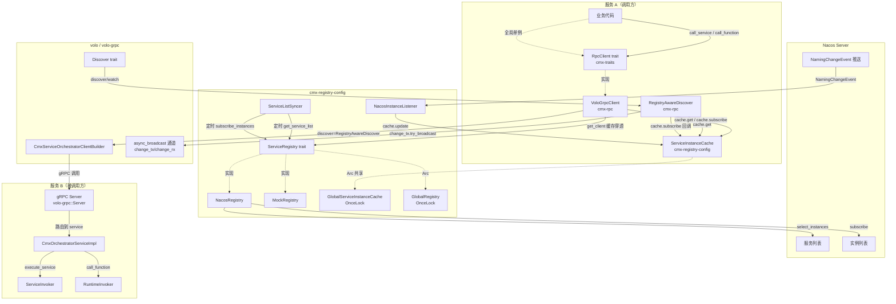
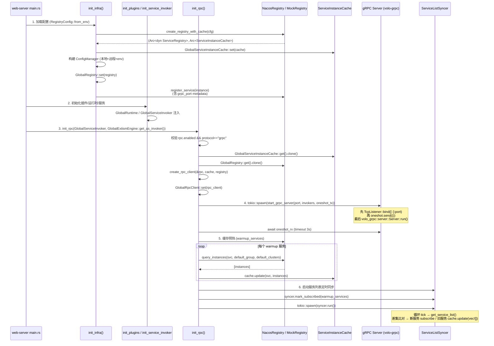
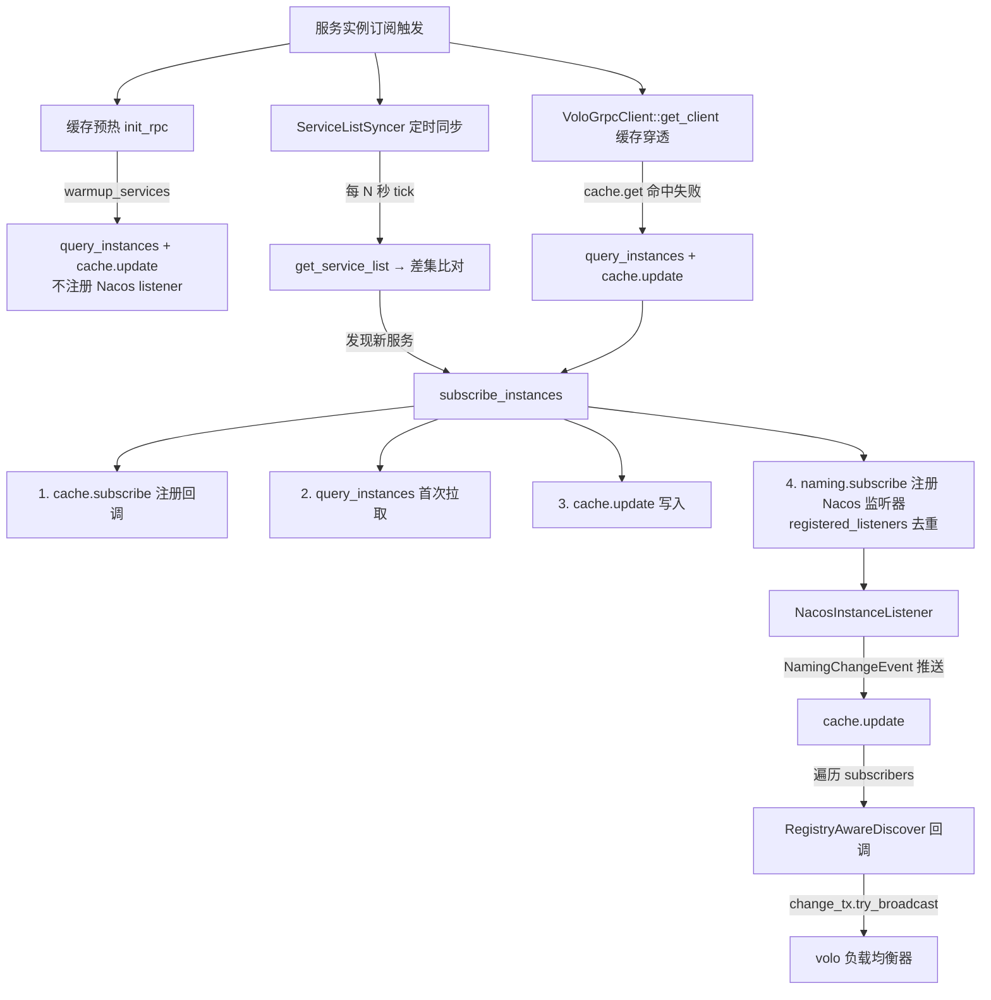
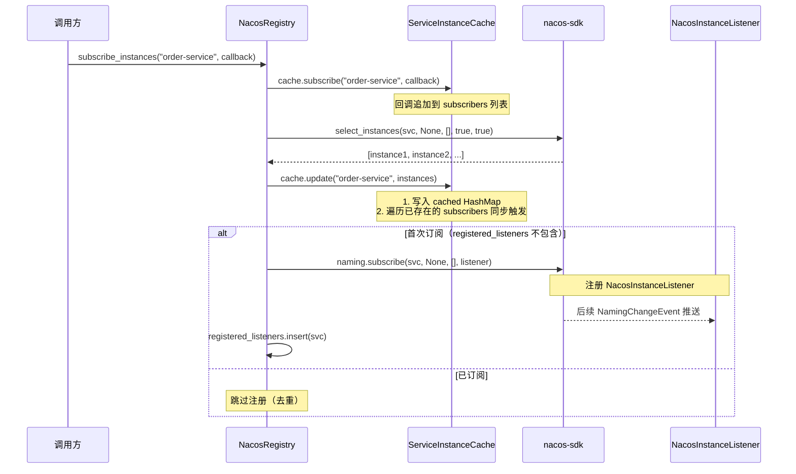
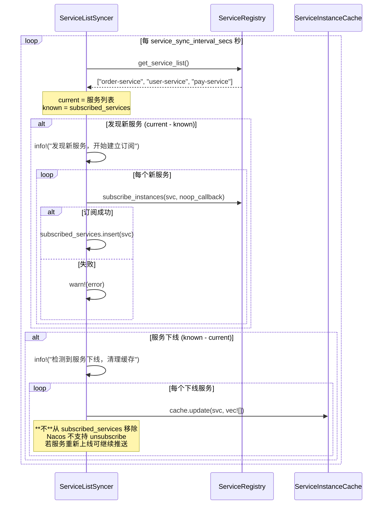
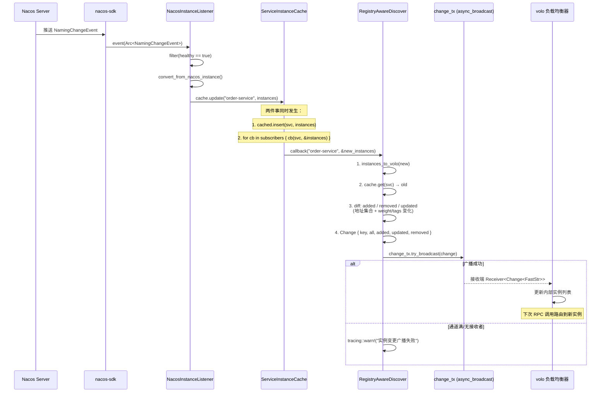
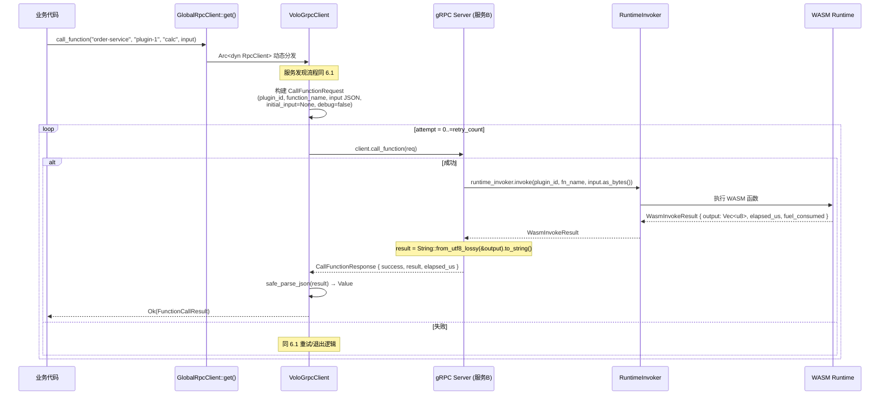
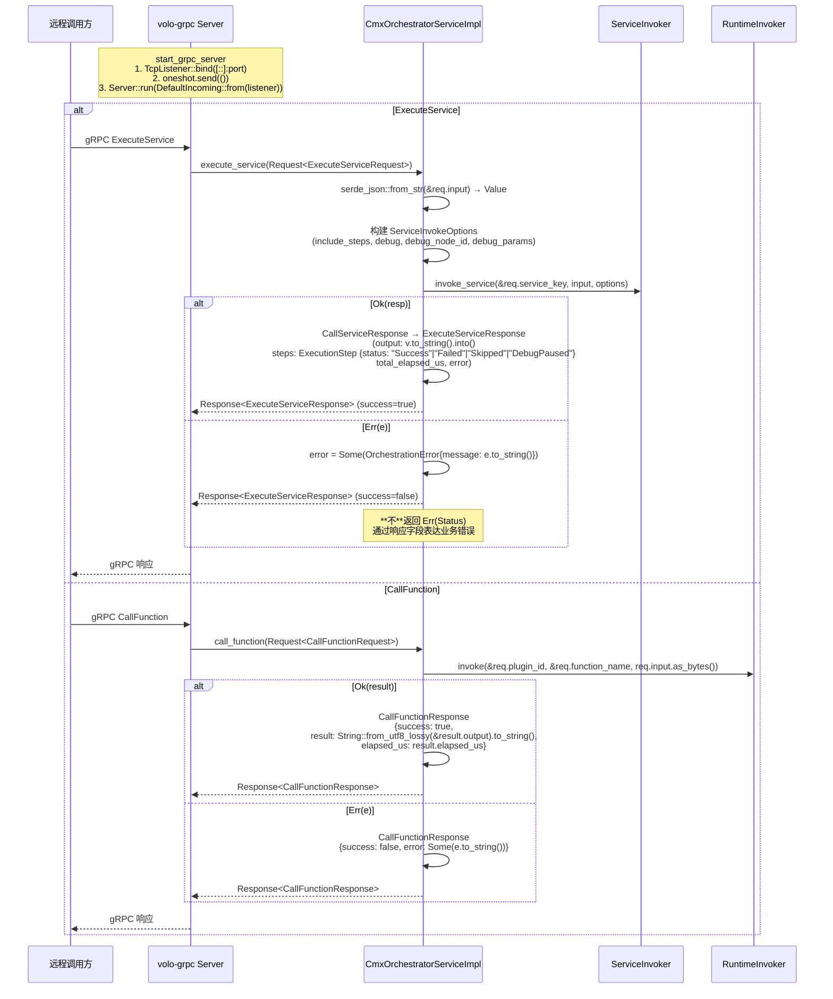

# 微服务 RPC 调用架构 — 流程详解

> 本文档详细描述 cmx-container 微服务框架中服务发现、服务实例订阅、RPC 调用的完整流程，
> 帮助开发人员快速理解代码架构和数据流转。内容基于以下最新源码：
> - `crates/libs/cmx-infra/cmx-rpc/`（gRPC 客户端/服务端、Discover 桥接、工厂、全局单例）
> - `crates/libs/cmx-rpc-gen/`（volo-build 生成的 protobuf 代码）
> - `crates/libs/cmx-infra/cmx-registry-config/src/registry/`（注册中心抽象与 Nacos/Mock 实现）
> - `crates/libs/cmx-traits/src/rpc_client.rs`（`RpcClient` trait 与错误类型）
> - `crates/web/web-server/src/config/rpc.rs`、`config/infra_init.rs`（启动初始化与注册）

---

## 一、整体架构概览



---

## 二、核心组件说明

| 组件 | 所在 Crate | 文件 | 职责 |
|------|-----------|------|------|
| `RpcClient` trait | cmx-traits | `src/rpc_client.rs` | RPC 调用统一接口（策略模式） |
| `RpcError` / `FunctionCallResult` | cmx-traits | `src/rpc_client.rs` | RPC 错误与函数调用结果类型 |
| `ServiceInvokeOptions` | cmx-traits | `src/service_invoker.rs` | 服务调用选项（include_steps、debug 等） |
| `ServiceInstance` | cmx-registry-config | `src/registry/trait_rs.rs` | 注册中心无关的实例数据模型 |
| `ServiceRegistry` trait | cmx-registry-config | `src/registry/trait_rs.rs` | 注册中心抽象接口（register/deregister/query/subscribe） |
| `ServiceInstanceCache` | cmx-registry-config | `src/registry/instance_cache.rs` | 通用服务实例内存缓存 + 变更回调（注册中心无关） |
| `MockRegistry` | cmx-registry-config | `src/registry/mock.rs` | 内存级注册中心实现（开发/测试） |
| `NacosRegistry` | cmx-registry-config | `src/registry/nacos.rs` | Nacos 注册中心实现 |
| `NacosInstanceListener` | cmx-registry-config | `src/registry/nacos.rs` | Nacos `NamingChangeEvent` 监听器 |
| `ServiceListSyncer` | cmx-registry-config | `src/registry/service_list_syncer.rs` | 定时拉取服务名列表 + 自动建立订阅 |
| `GlobalRegistry` | cmx-registry-config | `src/global_registry.rs` | 全局 `Arc<dyn ServiceRegistry>` 单例（OnceLock） |
| `GlobalServiceInstanceCache` | cmx-registry-config | `src/global_instance_cache.rs` | 全局 `Arc<ServiceInstanceCache>` 单例（OnceLock） |
| `VoloGrpcClient` | cmx-rpc | `src/client.rs` | gRPC 协议的 `RpcClient` 实现 |
| `RegistryAwareDiscover` | cmx-rpc | `src/discover.rs` | 实现 volo `Discover` trait，桥接缓存与变更广播 |
| `CmxOrchestratorServiceImpl` | cmx-rpc | `src/server.rs` | gRPC 服务端实现（`ExecuteService` / `CallFunction`） |
| `start_grpc_server` | cmx-rpc | `src/server_runner.rs` | volo-grpc Server 启动器（先 bind 端口再发就绪信号） |
| `create_rpc_client` | cmx-rpc | `src/factory.rs` | 协议驱动的客户端工厂函数 |
| `GlobalRpcClient` | cmx-rpc | `src/global.rs` | 全局 `Arc<dyn RpcClient>` 单例（OnceLock） |
| `RpcConfig` / `GrpcConfig` | cmx-rpc | `src/config.rs` | RPC 配置模型（超时/重试/连接池/预热/同步） |
| `RpcFrameworkError` | cmx-rpc | `src/error.rs` | RPC 框架层错误（Server 启动等） |
| `CmxServiceOrchestrator` | cmx-rpc-gen | `idl/cmx_service.proto` → `src/lib.rs` 重导出 | volo-build 生成的 protobuf Client/Server |
| `init_infra` | web-server | `src/config/infra_init.rs` | 创建注册中心/配置中心单例，注入缓存，注册服务实例 |
| `init_rpc` | web-server | `src/config/rpc.rs` | 初始化 RPC 子系统（Client + Server + 预热 + 定时同步） |

---

## 三、服务启动初始化流程



### 3.1 初始化步骤详解

1. **`init_infra()`**（[infra_init.rs](file:///media/yqs/工作/rustspace/cmx/cmx-container/crates/web/web-server/src/config/infra_init.rs)）
   - 从环境变量加载 `RegistryConfig` / `ConfigCenterFullConfig`
   - 调用 `cmx_registry_config::create_registry_with_cache()` 创建 `(registry, cache)`
   - 设置 `GlobalServiceInstanceCache::set(cache)`（共享缓存，供 RPC Client 与 Syncer 共用）
   - 合并本地 TOML + 远程配置 + 环境变量，初始化 `ConfigManager`
   - 设置 `GlobalRegistry::set(registry)` 与 `GlobalConfigCenter::set(...)`
   - **注册服务实例**：调用 `registry.register(instance)`；若 RPC 已启用，会把 `rpc.grpc.port` 写入 `instance.metadata["grpc_port"]`，便于其他服务通过元数据感知 gRPC 端口

2. **`init_plugins()` / `init_service_invoker()`**
   - 初始化 `GlobalRuntime` / `GlobalPluginManager` / `GlobalServiceQuery`
   - `init_service_invoker()` 注入 `GlobalServiceInvoker` 单例

3. **`init_rpc()`**（[rpc.rs](file:///media/yqs/工作/rustspace/cmx/cmx-container/crates/web/web-server/src/config/rpc.rs)）
   - 读取 `[rpc]` 配置（`enabled` / `protocol` / `grpc.port` / `warmup_services` / `service_sync_interval_secs`）
   - 仅当 `enabled == true && protocol == "grpc"` 时继续；否则 warn 跳过
   - 取出共享 `cache` 与 `registry`
   - 工厂函数 `create_rpc_client(&rpc, cache, registry)` 返回 `Arc<dyn RpcClient>`
   - `GlobalRpcClient::set(rpc_client)` 注入全局单例

4. **后台启动 gRPC Server**
   - `tokio::spawn(start_grpc_server(port, service_invoker, runtime_invoker, ready_tx))`
   - `start_grpc_server`（[server_runner.rs](file:///media/yqs/工作/rustspace/cmx/cmx-container/crates/libs/cmx-infra/cmx-rpc/src/server_runner.rs)）：
     - 解析 `[::]:port`
     - 创建 `CmxOrchestratorServiceImpl`
     - 先 `TcpListener::bind(addr)`（确保端口可用） → `oneshot.send(())` → `volo_grpc::server::Server::run(incoming)`
   - 主流程 `tokio::time::timeout(3s, ready_rx)` 等待就绪信号

5. **缓存预热**（`warmup_services`）
   - 对每个 `svc`：`registry.query_instances(svc, default_group, default_clusters)` → `cache.update(svc, instances)`
   - 使用与客户端 `get_client` 缓存穿透完全一致的 group/cluster 过滤

6. **启动 ServiceListSyncer**
   - `ServiceListSyncer::new(registry, cache, interval_secs)`
   - 将 `warmup_services` 全部 `mark_subscribed`（避免重复订阅）
   - `tokio::spawn(syncer.run())`，每 N 秒一次 `sync_once()`

---

## 四、服务发现与实例订阅流程

### 4.1 三种触发订阅的途径



### 4.2 缓存预热与订阅的差异

| 触发源 | 是否注册 Nacos 监听器 | 写入缓存 | 后续推送 |
|--------|----------------------|---------|---------|
| 启动缓存预热 | **否** | 是（直接 `cache.update`） | **不会**（无监听器） |
| 定时同步 (Syncer) | 是（首次） | 是 | 是 |
| RPC 客户端缓存穿透 | **否** | 是 | **不会** |

> ⚠️ **设计权衡**：预热路径和缓存穿透路径只写缓存、不注册 Nacos 监听器。
> 这意味着若启动时把服务加入 `warmup_services` 但 Nacos 中尚无该服务，后续该服务上线时**不会自动感知**。
> 生产环境中应保证预热/穿透目标服务在 Nacos 中已存在；新服务上线应通过 `ServiceListSyncer` 的定时轮询发现。

### 4.3 subscribe_instances 详细流程



### 4.4 ServiceListSyncer 定时同步流程



---

## 五、Nacos 实例变更实时推送流程



### 5.1 Change 事件结构

`volo::discovery::Change<K>`：

| 字段 | 类型 | 说明 |
|------|------|------|
| `key` | `FastStr` | 服务名 |
| `all` | `Vec<Arc<Instance>>` | 当前全量实例 |
| `added` | `Vec<Arc<Instance>>` | 新增实例（新地址） |
| `removed` | `Vec<Arc<Instance>>` | 移除实例（旧地址不在新集合） |
| `updated` | `Vec<Arc<Instance>>` | 更新实例（地址相同但 `weight` 或 `tags` 变化） |

> volo 内部根据 `Change` 增量更新其服务发现缓存，**无需重启连接池**。

### 5.2 广播通道容量

`RegistryAwareDiscover::new(cache, channel_capacity)` 中的 `channel_capacity` 默认 `1024`
（配置项 `rpc.grpc.discover_channel_capacity`）。`async_broadcast` 通道满时
`try_broadcast` 返回 `Err`，**不阻塞**变更回调——业务日志可观察到 warn。

---

## 六、RPC 调用完整流程

### 6.1 call_service 流程（执行服务编排）

```mermaid
sequenceDiagram
    participant Biz as 业务代码
    participant Global as GlobalRpcClient::get()
    participant Client as VoloGrpcClient
    participant Cache as ServiceInstanceCache
    participant Registry as NacosRegistry
    participant Discover as RegistryAwareDiscover
    participant VoloLB as volo 负载均衡
    participant Server as gRPC Server (服务B)
    participant Invoker as ServiceInvoker

    Biz->>Global: call_service("order-service", "create_order", input, options)
    Global->>Client: Arc<dyn RpcClient> 动态分发
    Client->>Client: start=Instant::now(); deadline=start+timeout_ms

    Client->>Client: get_client("order-service")
    alt clients.read() 缓存命中
        Client-->>Client: 返回 cached.client.clone()
    else 缓存未命中
        Client->>Client: clients.write() + double-check
        alt cache.get(svc) 为空或空 Vec
            Client->>Registry: query_instances(svc, default_group, default_clusters)
            Registry-->>Client: [instances]
            Client->>Cache: cache.update(svc, instances)
            alt 仍为空
                Client-->>Biz: Err(NoAvailableInstance)
            end
        end
        Client->>Discover: new(cache, channel_capacity).start_watch(svc)
        Client->>Client: CmxServiceOrchestratorClientBuilder::new(svc)
        Client->>Client:   .discover(discover)
        Client->>Client:   .rpc_timeout(Option<Duration>)
        Client->>Client:   .connect_timeout(Duration)
        Client->>Client:   .build()
        Client->>Client: clients.insert(svc, CachedClient{client, _discover})
    end

    Client->>Client: 构建 ExecuteServiceRequest<br/>(service_key, input JSON,<br/>include_steps, debug, debug_node_id,<br/>debug_params AHashMap)

    loop attempt = 0..=retry_count
        Note over Client: 检查 deadline 剩余预算
        alt attempt > 0
            Client->>Client: 指数退避 sleep(min(50ms<<n, remaining))
        end
        Client->>VoloLB: volo 内部按 Discover::discover 获取实例
        VoloLB-->>Client: SocketAddr (经负载均衡选择)
        Client->>Server: client.execute_service(req)

        alt 成功
            Server->>Invoker: service_invoker.invoke_service(svc_key, Value, options)
            Invoker-->>Server: CallServiceResponse
            Server-->>Client: ExecuteServiceResponse (success=true)
            Client->>Client: proto_to_call_service_response()
            Client-->>Biz: Ok(CallServiceResponse)
        else volo_grpc::Error
            Note over Client: is_retryable = UNAVAILABLE<br/>| DEADLINE_EXCEEDED<br/>| RESOURCE_EXHAUSTED<br/>| ABORTED
            alt 可重试 且 attempt < max
                Client->>Client: tracing::warn!("失败可重试")
                Client->>Client: continue
            else 不可重试 或 已达上限
                Client-->>Biz: Err(RpcCallFailed)
            end
        end
    end
```

### 6.2 call_function 流程（调用插件函数）



### 6.3 重试与退避策略

| 维度 | 取值 | 来源 |
|------|------|------|
| 单次 RPC 超时 | `rpc.grpc.timeout_ms`（默认 5000） | volo `rpc_timeout` |
| 连接超时 | `rpc.grpc.connect_timeout_ms`（默认 3000） | volo `connect_timeout` |
| 最大重试次数 | `rpc.grpc.retry_count`（默认 0） | `VoloGrpcClient` |
| 退避序列 | `50ms → 100ms → 200ms → 400ms → 800ms`（上限 800ms） | `retry_backoff(attempt-1)` |
| 总时间预算 | `timeout_ms`（与单次 RPC 共享） | 超出预算返回 `Err(Timeout)` |
| 可重试错误 | `UNAVAILABLE`、`DEADLINE_EXCEEDED`、`RESOURCE_EXHAUSTED`、`ABORTED` | `is_retryable_error` |
| 不可重试错误 | `INVALID_ARGUMENT`、`NOT_FOUND`、`PERMISSION_DENIED` 等 | — |

> 退避时间不会超过 deadline 剩余预算；超出则 `Err(Timeout)`。

### 6.4 JSON 容错

- **服务端解析**：`CmxOrchestratorServiceImpl::execute_service` 在 `serde_json::from_str(&req.input)` 失败时返回 `Status::InvalidArgument`。
- **客户端解析**：`safe_parse_json(raw, context)` 在 `serde_json::from_str` 失败时记录 `warn!` 并降级为 `Value::Null`，避免响应解析失败导致整个调用失败。

---

## 七、gRPC Server 请求处理流程



> 业务错误（如编排失败、插件函数未找到）一律通过响应体的 `success=false` + `error` 字段表达，
> **不**返回 `volo_grpc::Status` 的 Err。这样调用方可以走正常的 200 响应路径，
> 避免触发 volo 默认的错误码处理逻辑。

### 7.1 StepStatus 字符串稳定性

`ExecutionStep.status` 在 protobuf 中定义为 `string`（非 enum），由 `step_status_to_str()` 稳定编码：

| Rust 枚举 | protobuf 字符串 |
|----------|----------------|
| `StepStatus::Success` | `"Success"` |
| `StepStatus::Failed` | `"Failed"` |
| `StepStatus::Skipped` | `"Skipped"` |
| `StepStatus::DebugPaused` | `"DebugPaused"` |
| 其他（版本不一致时） | 客户端 `parse_step_status` 收到未知值 → warn + 降级为 `Failed` |

---

## 八、数据流转与类型转换

### 8.1 服务实例数据流转


| 字段 | Nacos | cmx ServiceInstance | volo Instance |
|------|-------|---------------------|---------------|
| 地址 | `ip:port` | `ip: String, port: u16` | `Address::Ip(SocketAddr)` |
| 权重 | `weight: f64` | `weight: f64` | `weight: u32 = (weight * 100.0) as u32` |
| 标签 | `cluster_name`, `metadata` | `cluster_name: Option<String>`, `metadata: HashMap` | `tags: HashMap<Cow<str>, Cow<str>>` |
| 健康 | `healthy: bool` | `healthy: bool` | 已被 NacosInstanceListener 过滤 |
| 临时实例 | `ephemeral` | `ephemeral` | 不直接体现 |

### 8.2 请求/响应类型转换

```mermaid
graph TD
    subgraph "call_service 类型转换"
        A1[serde_json::Value<br/>业务层] -->|to_string| A2[String → FastStr<br/>protobuf input]
        A2 -->|ExecuteServiceRequest| A3[gRPC 传输]
        A3 -->|ExecuteServiceResponse| A4[FastStr → safe_parse_json]
        A4 --> A5[CallServiceResponse<br/>success / output / steps / error]
        A5 -->|解析 steps[].status| A6[StepStatus::Success/Failed/Skipped/DebugPaused]
    end

    subgraph "call_function 类型转换"
        B1[serde_json::Value<br/>业务层] -->|to_string| B2[String → FastStr<br/>protobuf input]
        B2 -->|CallFunctionRequest| B3[gRPC 传输]
        B3 -->|CallFunctionResponse| B4[FastStr → safe_parse_json]
        B4 --> B5[FunctionCallResult<br/>success / result / elapsed_us / error]
    end
```

### 8.3 Request/Response 字段映射

#### ExecuteServiceRequest

| 字段 | 类型 | 来源 |
|------|------|------|
| `service_key` | `string` | `RpcClient::call_service` 的 `service_key` 参数 |
| `input` | `string` (JSON 字符串) | `serde_json::Value::to_string()` |
| `include_steps` | `bool` | `ServiceInvokeOptions::include_steps` |
| `debug` | `bool` | `ServiceInvokeOptions::debug` |
| `debug_node_id` | `optional string` | `ServiceInvokeOptions::debug_node_id.map(String)` |
| `debug_params` | `map<string,string>` | `ServiceInvokeOptions::debug_params` |

#### ExecuteServiceResponse

| 字段 | 类型 | 说明 |
|------|------|------|
| `success` | `bool` | 编排是否成功 |
| `output` | `optional string` (JSON) | 最终输出（`Value::to_string()`） |
| `steps` | `repeated ExecutionStep` | 各节点执行详情 |
| `total_elapsed_us` | `uint64` | 总耗时（μs） |
| `error` | `optional OrchestrationError` | 编排错误 |

#### CallFunctionRequest

| 字段 | 类型 | 来源 |
|------|------|------|
| `plugin_id` | `string` | `call_function` 参数 |
| `function_name` | `string` | `call_function` 参数 |
| `input` | `string` (JSON) | `Value::to_string()` |
| `initial_input` | `optional string` | 当前未使用，传 `None` |
| `debug` | `bool` | 当前固定 `false` |

#### CallFunctionResponse

| 字段 | 类型 | 说明 |
|------|------|------|
| `success` | `bool` | 函数是否执行成功 |
| `result` | `optional string` | `String::from_utf8_lossy(&WasmInvokeResult.output)` |
| `elapsed_us` | `uint64` | WASM 执行耗时 |
| `error` | `optional string` | 错误信息 |

---

## 九、关键源码索引

| 流程 | 文件 | 关键符号 |
|------|------|---------|
| 全局注册中心单例 | [cmx-registry-config/src/global_registry.rs](file:///media/yqs/工作/rustspace/cmx/cmx-container/crates/libs/cmx-infra/cmx-registry-config/src/global_registry.rs) | `GlobalRegistry::set/get` |
| 全局服务实例缓存单例 | [cmx-registry-config/src/global_instance_cache.rs](file:///media/yqs/工作/rustspace/cmx/cmx-container/crates/libs/cmx-infra/cmx-registry-config/src/global_instance_cache.rs) | `GlobalServiceInstanceCache::set/get` |
| 服务实例缓存 | [cmx-registry-config/src/registry/instance_cache.rs](file:///media/yqs/工作/rustspace/cmx/cmx-container/crates/libs/cmx-infra/cmx-registry-config/src/registry/instance_cache.rs) | `ServiceInstanceCache::update/subscribe/get` |
| 注册中心 trait | [cmx-registry-config/src/registry/trait_rs.rs](file:///media/yqs/工作/rustspace/cmx/cmx-container/crates/libs/cmx-infra/cmx-registry-config/src/registry/trait_rs.rs) | `ServiceRegistry`、`ServiceInstance` |
| Nacos 注册中心实现 | [cmx-registry-config/src/registry/nacos.rs](file:///media/yqs/工作/rustspace/cmx/cmx-container/crates/libs/cmx-infra/cmx-registry-config/src/registry/nacos.rs) | `NacosRegistry::new_with_cache`、`NacosInstanceListener::event`、`subscribe_instances` |
| Mock 注册中心实现 | [cmx-registry-config/src/registry/mock.rs](file:///media/yqs/工作/rustspace/cmx/cmx-container/crates/libs/cmx-infra/cmx-registry-config/src/registry/mock.rs) | `MockRegistry::new_with_cache` |
| 服务列表定时同步 | [cmx-registry-config/src/registry/service_list_syncer.rs](file:///media/yqs/工作/rustspace/cmx/cmx-container/crates/libs/cmx-infra/cmx-registry-config/src/registry/service_list_syncer.rs) | `ServiceListSyncer::run/sync_once` |
| 注册中心工厂 | [cmx-registry-config/src/registry/mod.rs](file:///media/yqs/工作/rustspace/cmx/cmx-container/crates/libs/cmx-infra/cmx-registry-config/src/registry/mod.rs) | `create_registry_with_cache` |
| RPC trait 与错误 | [cmx-traits/src/rpc_client.rs](file:///media/yqs/工作/rustspace/cmx/cmx-container/crates/libs/cmx-traits/src/rpc_client.rs) | `RpcClient` trait、`RpcError`、`FunctionCallResult` |
| 服务调用选项 | [cmx-traits/src/service_invoker.rs](file:///media/yqs/工作/rustspace/cmx/cmx-container/crates/libs/cmx-traits/src/service_invoker.rs) | `ServiceInvokeOptions` |
| WASM 调用 trait | [cmx-traits/src/runtime_invoker.rs](file:///media/yqs/工作/rustspace/cmx/cmx-container/crates/libs/cmx-traits/src/runtime_invoker.rs) | `RuntimeInvoker::invoke`、`WasmInvokeResult` |
| RPC 客户端 | [cmx-rpc/src/client.rs](file:///media/yqs/工作/rustspace/cmx/cmx-container/crates/libs/cmx-infra/cmx-rpc/src/client.rs) | `VoloGrpcClient::get_client`、`call_service`、`call_function`、`is_retryable_error`、`retry_backoff`、`safe_parse_json`、`proto_to_call_service_response` |
| volo Discover 桥接 | [cmx-rpc/src/discover.rs](file:///media/yqs/工作/rustspace/cmx/cmx-container/crates/libs/cmx-infra/cmx-rpc/src/discover.rs) | `RegistryAwareDiscover::new/start_watch`、`instances_to_volo`、`Discover::discover/watch` |
| gRPC 服务端实现 | [cmx-rpc/src/server.rs](file:///media/yqs/工作/rustspace/cmx/cmx-container/crates/libs/cmx-infra/cmx-rpc/src/server.rs) | `CmxOrchestratorServiceImpl::execute_service/call_function`、`execution_step_to_proto` |
| gRPC Server 启动器 | [cmx-rpc/src/server_runner.rs](file:///media/yqs/工作/rustspace/cmx/cmx-container/crates/libs/cmx-infra/cmx-rpc/src/server_runner.rs) | `start_grpc_server`（先 bind 再 oneshot） |
| RPC 工厂 | [cmx-rpc/src/factory.rs](file:///media/yqs/工作/rustspace/cmx/cmx-container/crates/libs/cmx-infra/cmx-rpc/src/factory.rs) | `create_rpc_client`（协议 match） |
| RPC 全局客户端 | [cmx-rpc/src/global.rs](file:///media/yqs/工作/rustspace/cmx/cmx-container/crates/libs/cmx-infra/cmx-rpc/src/global.rs) | `GlobalRpcClient::set/get/is_initialized` |
| RPC 配置 | [cmx-rpc/src/config.rs](file:///media/yqs/工作/rustspace/cmx/cmx-container/crates/libs/cmx-infra/cmx-rpc/src/config.rs) | `RpcConfig`、`GrpcConfig`、`HttpRestConfig` |
| RPC 框架错误 | [cmx-rpc/src/error.rs](file:///media/yqs/工作/rustspace/cmx/cmx-container/crates/libs/cmx-infra/cmx-rpc/src/error.rs) | `RpcFrameworkError` |
| protobuf IDL | [cmx-rpc-gen/idl/cmx_service.proto](file:///media/yqs/工作/rustspace/cmx/cmx-container/crates/libs/cmx-rpc-gen/idl/cmx_service.proto) | `service CmxServiceOrchestrator` |
| volo-build 配置 | [cmx-rpc-gen/volo.yml](file:///media/yqs/工作/rustspace/cmx/cmx-container/crates/libs/cmx-rpc-gen/volo.yml) | proto 源/输出文件名 |
| protobuf 代码重导出 | [cmx-rpc-gen/src/lib.rs](file:///media/yqs/工作/rustspace/cmx/cmx-container/crates/libs/cmx-rpc-gen/src/lib.rs) | `cmx::cmx_service_orchestrator` |
| 基础设施初始化 | [web-server/src/config/infra_init.rs](file:///media/yqs/工作/rustspace/cmx/cmx-container/crates/web/web-server/src/config/infra_init.rs) | `init_infra`、`register_service`（注入 `grpc_port` metadata） |
| RPC 初始化 | [web-server/src/config/rpc.rs](file:///media/yqs/工作/rustspace/cmx/cmx-container/crates/web/web-server/src/config/rpc.rs) | `init_rpc`（预热/oneshot/Syncer） |
| web-server 入口 | [web-server/src/main.rs](file:///media/yqs/工作/rustspace/cmx/cmx-container/crates/web/web-server/src/main.rs) | `main` 中调用 `init_rpc` |

---

## 十、配置参考

```toml
[rpc]
# 是否启用 RPC
enabled = true
# 通信协议（目前仅支持 "grpc"）
protocol = "grpc"
# 预热服务列表（启动时预先发现的服务名；不注册 Nacos 监听器）
warmup_services = ["order-service", "user-service"]
# 服务列表同步间隔（秒，0=禁用，默认 30）
service_sync_interval_secs = 30

[rpc.grpc]
# gRPC Server 监听端口
port = 9090
# RPC 调用超时（毫秒，默认 5000）—— 同时作为总时间预算
timeout_ms = 5000
# 连接超时（毫秒，默认 3000）
connect_timeout_ms = 3000
# 重试次数（仅对可重试错误生效，默认 0）
retry_count = 0
# query_instances 过滤：默认 group（None=不过滤）
default_group = "DEFAULT_GROUP"
# query_instances 过滤：默认集群列表（空=不过滤）
default_clusters = []
# RegistryAwareDiscover 内部 async_broadcast 通道容量（默认 1024）
discover_channel_capacity = 1024

[rpc.http_rest]   # 预留字段，本期不实现
port = 8080
timeout_ms = 5000
```

> **环境变量**：`[rpc]` 配置也支持通过 `RPC_*` 环境变量覆盖（具体由 `cmx_utils::ConfigManager` 决定）。
> 注册中心配置（`SERVICE_REGISTRY_*` / `NACOS_*`）独立维护在 `[registry]` 段。

---

## 十一、扩展新 RPC 协议指南

如需支持新的 RPC 协议（如 HTTP/REST、gRPC-Web），只需：

1. 在 `crates/libs/cmx-infra/cmx-rpc/src/` 下新增协议实现（如 `http_rest_client.rs`）
2. 在该文件中实现 `RpcClient` trait（参考 `VoloGrpcClient`）
3. 在 `factory.rs` 的 `create_rpc_client()` 中增加 `match` 分支
4. 在 `RpcConfig` 中已预留 `HttpRestConfig` 字段，按需补充子配置

业务代码无需任何修改，仍通过 `GlobalRpcClient::get().call_service(...)` 调用。

---

## 十二、常见问题与排查

### 12.1 `NoAvailableInstance`

调用 `call_service` / `call_function` 收到 `RpcError::NoAvailableInstance`，原因可能：

1. **该服务从未注册到 Nacos**（未执行 `registry.register`）
2. **缓存预热失败**：服务在 Nacos 中存在但 `query_instances` 返回空（group/cluster 不匹配）
3. **缓存穿透失败**：首次调用时 Nacos 临时不可用

排查：
- 确认 Nacos 控制台中服务已注册
- 检查 `rpc.grpc.default_group` / `default_clusters` 是否与 Nacos 中的 group/cluster 一致
- 确认 `service_sync_interval_secs > 0`，等待同步器发现新服务

### 12.2 gRPC Server 启动失败

`init_rpc` 在 `tokio::time::timeout(3s, server_ready_rx)` 等待就绪信号，
3 秒内未收到 `oneshot.send(())` 则返回 `Err(ServerSetup("gRPC Server 启动超时"))`。

常见原因：
- 端口被占用 → 检查 `rpc.grpc.port`
- 端口绑定权限不足（如绑定 < 1024 端口）

### 12.3 实例变更未生效

`change_tx.try_broadcast` 失败时仅记录 `warn!`，**不重试**：

```
实例变更广播失败: 通道已满或无接收者
```

- 通道满：增大 `rpc.grpc.discover_channel_capacity`（k8s 滚动更新高频场景）
- 无接收者：确认 `VoloGrpcClient::get_client` 已成功创建（volo 内部会订阅 `change_rx`）

### 12.4 JSON 解析失败

服务端响应中的 JSON 字段（`output`、`step.output`、`call_function.result`）解析失败时，
客户端会 `warn!` 后降级为 `Value::Null`：

```
RPC 返回 JSON 解析失败，降级为 Null
```

排查：检查 `ExecuteServiceResponse` / `CallFunctionResponse` 的 JSON 字段是否符合 RFC 8259。
