# 微服务 RPC 调用架构 — 流程详解

> 本文档详细描述 cmx-container 微服务框架中服务发现、服务实例订阅、RPC 调用的完整流程，
> 帮助开发人员快速理解代码架构和数据流转。

---

## 一、整体架构概览

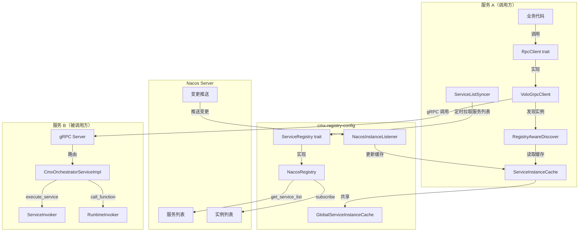

---

## 二、核心组件说明

| 组件 | 所在 Crate | 职责 |
|------|-----------|------|
| `ServiceRegistry` trait | cmx-registry-config | 注册中心抽象接口（注册/注销/查询/订阅） |
| `NacosRegistry` | cmx-registry-config | Nacos 注册中心实现 |
| `NacosInstanceListener` | cmx-registry-config | Nacos 实例变更监听器 |
| `ServiceInstanceCache` | cmx-registry-config | 通用服务实例内存缓存（注册中心无关） |
| `GlobalServiceInstanceCache` | cmx-registry-config | 全局缓存单例（OnceLock） |
| `ServiceListSyncer` | cmx-registry-config | 服务列表定时同步器 |
| `RpcClient` trait | cmx-traits | RPC 调用统一接口（策略模式） |
| `VoloGrpcClient` | cmx-rpc | gRPC 协议的 RpcClient 实现 |
| `RegistryAwareDiscover` | cmx-rpc | 桥接 ServiceInstanceCache ↔ volo Discover |
| `CmxOrchestratorServiceImpl` | cmx-rpc | gRPC 服务端实现 |
| `CmxServiceOrchestrator` | cmx-rpc-gen | volo-build 生成的 protobuf 代码 |

---

## 三、服务启动初始化流程

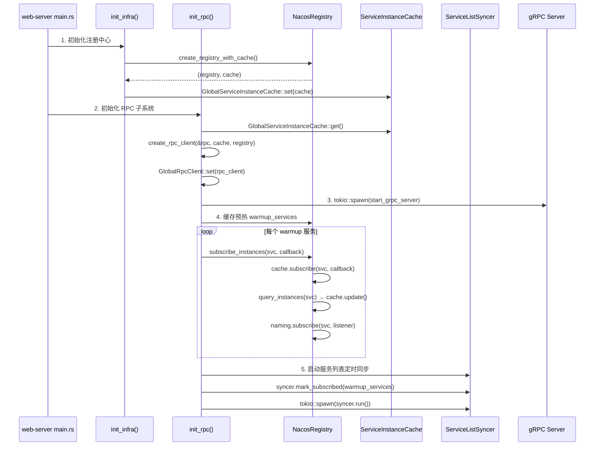

### 初始化步骤详解

1. **`init_infra()`**：创建 `NacosRegistry` + `ServiceInstanceCache`，设置全局缓存单例
2. **`init_rpc()`**：
   - 从全局缓存获取共享 `cache`
   - 通过工厂函数 `create_rpc_client()` 创建 `VoloGrpcClient`
   - 注册到 `GlobalRpcClient` 全局单例
3. **启动 gRPC Server**：在后台 tokio task 中运行，监听独立端口（默认 9090）
4. **缓存预热**：遍历 `warmup_services` 配置，对每个服务调用 `subscribe_instances()`
5. **启动 ServiceListSyncer**：定时轮询注册中心服务列表，发现新服务自动订阅

---

## 四、服务发现与实例订阅流程

### 4.1 三种触发订阅的途径

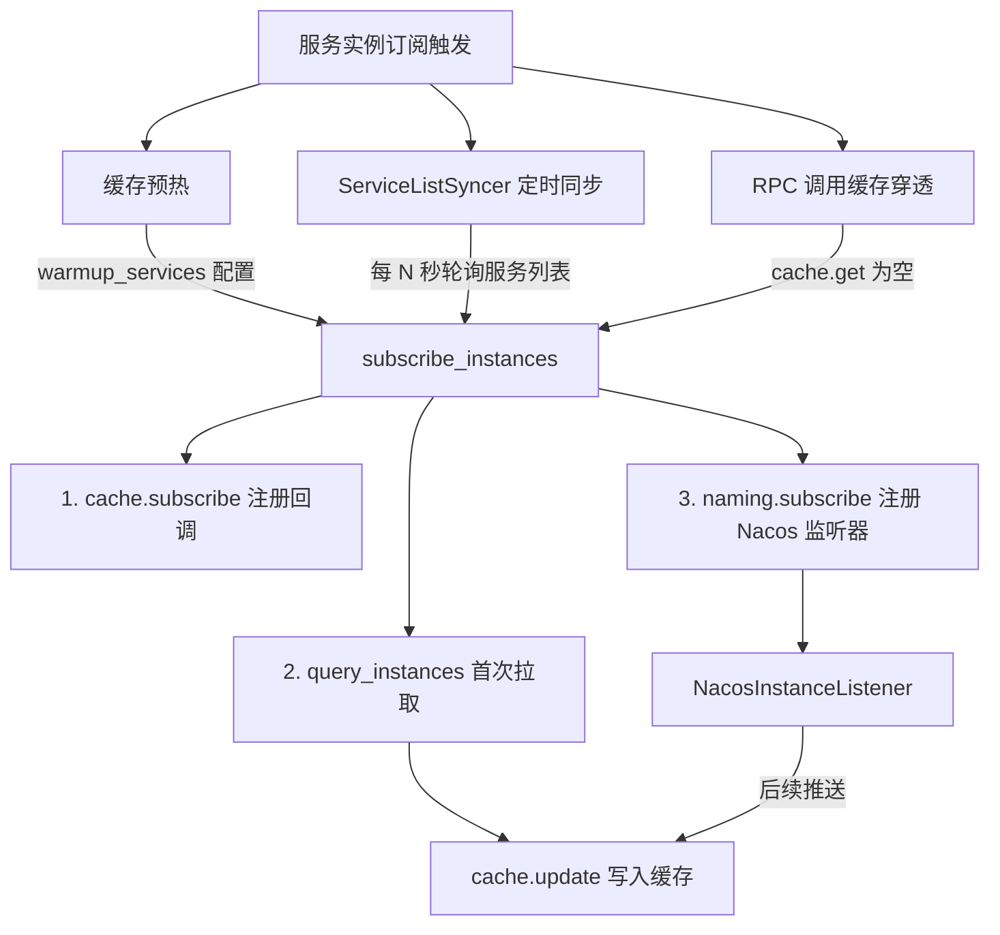

### 4.2 subscribe_instances 详细流程

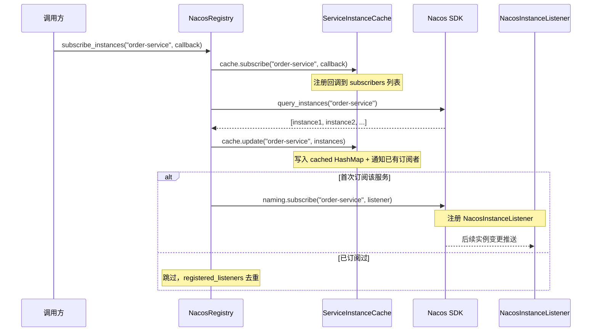

### 4.3 ServiceListSyncer 定时同步流程

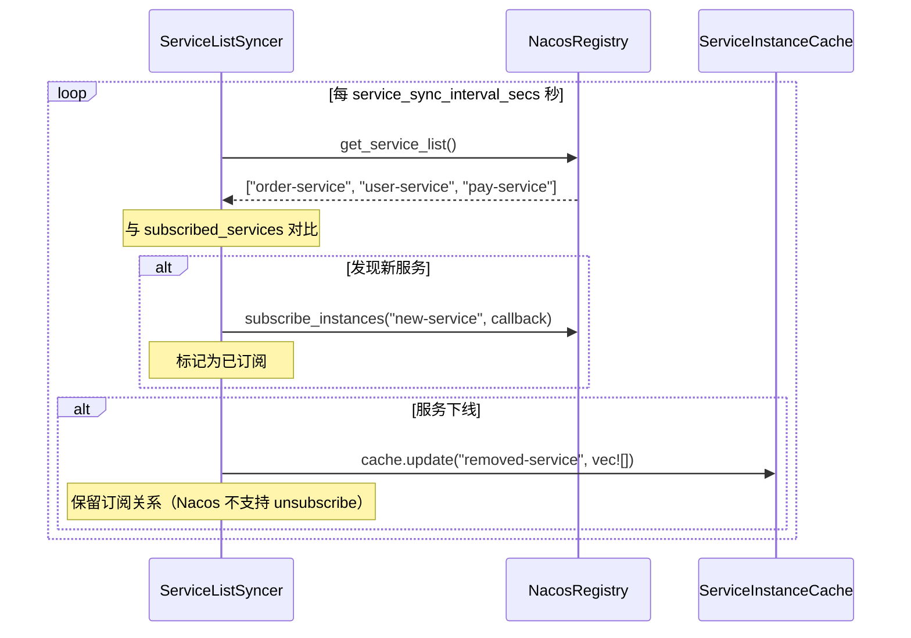

---

## 五、Nacos 实例变更实时推送流程

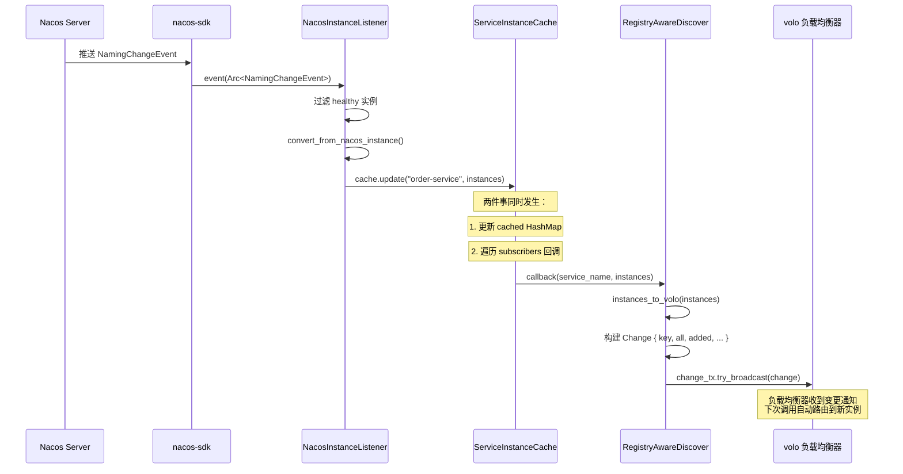

---

## 六、RPC 调用完整流程

### 6.1 call_service 流程（执行服务编排）

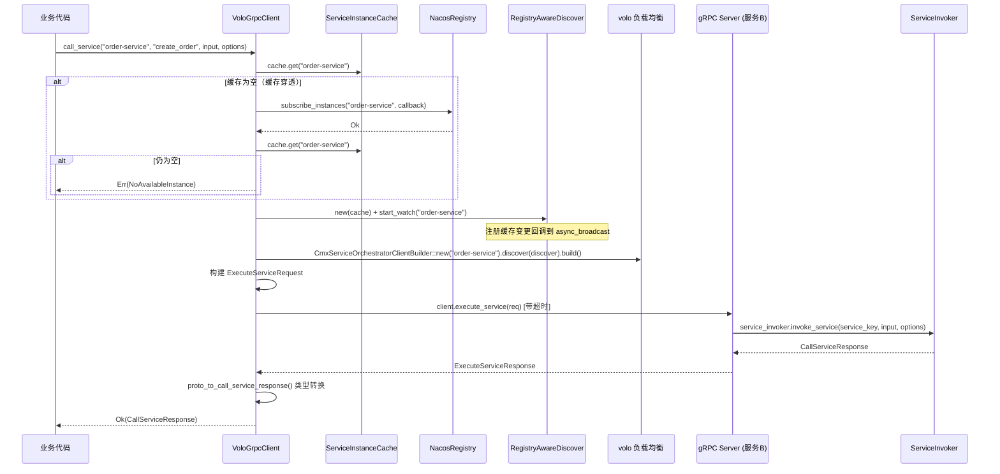

### 6.2 call_function 流程（调用插件函数）

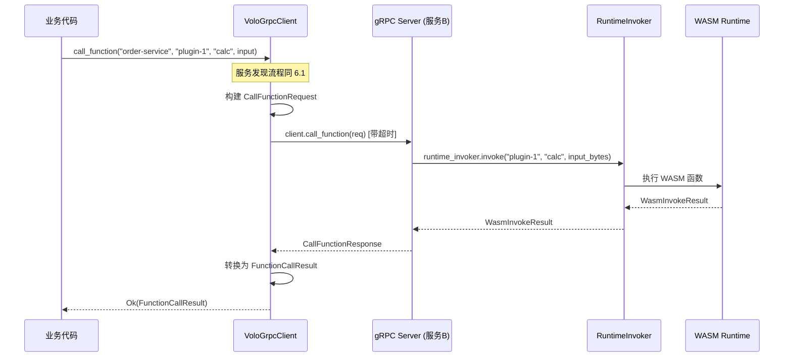

---

## 七、gRPC Server 请求处理流程

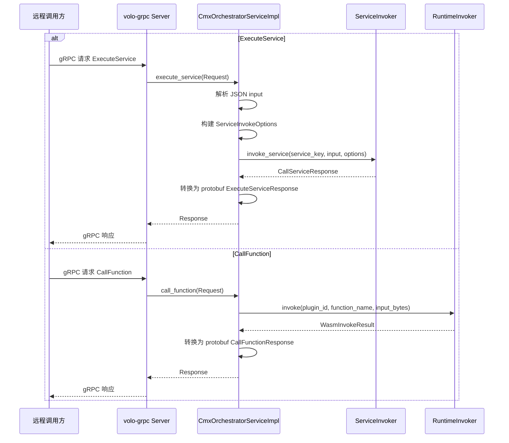

---

## 八、数据流转与类型转换

### 8.1 服务实例数据流转

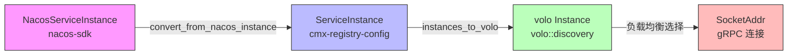

### 8.2 请求/响应类型转换

```mermaid
graph TD
    subgraph "call_service 类型转换"
        A1[serde_json::Value] -->|序列化| A2[FastStr]
        A2 -->|protobuf 传输| A3[ExecuteServiceRequest]
        A3 -->|gRPC| A4[ExecuteServiceResponse]
        A4 -->|proto_to_call_service_response| A5[CallServiceResponse]
    end

    subgraph "call_function 类型转换"
        B1[serde_json::Value] -->|序列化| B2[FastStr]
        B2 -->|protobuf 传输| B3[CallFunctionRequest]
        B3 -->|gRPC| B4[CallFunctionResponse]
        B4 -->|类型转换| B5[FunctionCallResult]
    end
```

---

## 九、关键源码索引

| 流程 | 文件 | 关键方法/结构体 |
|------|------|----------------|
| 注册中心初始化 | `cmx-registry-config/src/registry/mod.rs` | `create_registry_with_cache()` |
| Nacos 实例变更监听 | `cmx-registry-config/src/registry/nacos.rs` | `NacosInstanceListener::event()` |
| 服务实例缓存 | `cmx-registry-config/src/registry/instance_cache.rs` | `ServiceInstanceCache::update()` |
| 服务列表定时同步 | `cmx-registry-config/src/registry/service_list_syncer.rs` | `ServiceListSyncer::sync_once()` |
| RPC 初始化 | `web-server/src/config/rpc.rs` | `init_rpc()` |
| RPC 客户端 | `cmx-rpc/src/client.rs` | `VoloGrpcClient::get_client()` |
| volo Discover 桥接 | `cmx-rpc/src/discover.rs` | `RegistryAwareDiscover` |
| RPC 工厂函数 | `cmx-rpc/src/factory.rs` | `create_rpc_client()` |
| gRPC 服务端 | `cmx-rpc/src/server.rs` | `CmxOrchestratorServiceImpl` |
| gRPC Server 启动 | `cmx-rpc/src/server_runner.rs` | `start_grpc_server()` |
| protobuf 定义 | `cmx-rpc-gen/idl/cmx_service.proto` | `CmxServiceOrchestrator` service |
| RPC trait 定义 | `cmx-traits/src/rpc_client.rs` | `RpcClient` trait |

---

## 十、配置参考

```toml
[rpc]
# 是否启用 RPC
enabled = true
# 通信协议（目前仅支持 "grpc"）
protocol = "grpc"
# 预热服务列表（启动时预先发现的服务名）
warmup_services = ["order-service", "user-service"]
# 服务列表同步间隔（秒，0=禁用，默认 30）
service_sync_interval_secs = 30

[rpc.grpc]
# gRPC Server 监听端口
port = 9090
# 调用超时时间（毫秒）
timeout_ms = 5000
# 重试次数
retry_count = 0
# 连接池大小
pool_size = 4
```

---

## 十一、扩展新 RPC 协议指南

如需支持新的 RPC 协议（如 HTTP/REST），只需：

1. 在 `cmx-rpc/src/` 下新增协议实现（如 `http_rest_client.rs`）
2. 实现 `RpcClient` trait
3. 在 `factory.rs` 的 `create_rpc_client()` 中增加 match 分支
4. 在 `RpcConfig` 中添加新协议的配置段

业务代码无需任何修改，仍通过 `GlobalRpcClient::get().call_service(...)` 调用。
