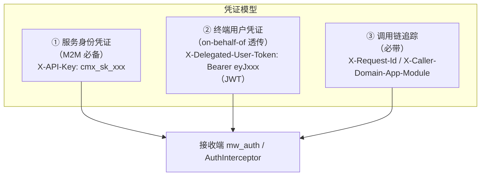
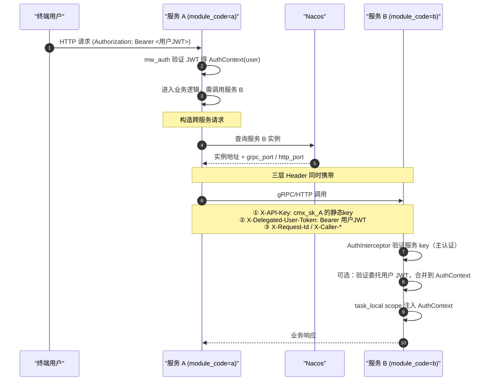
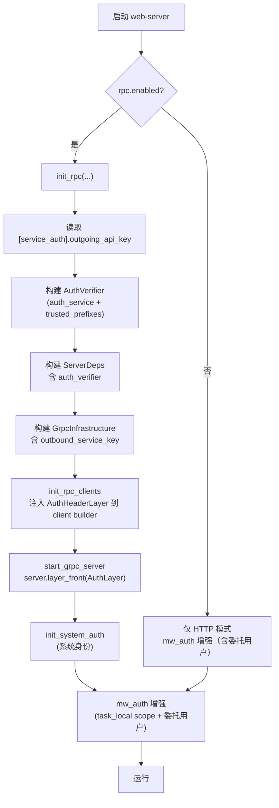
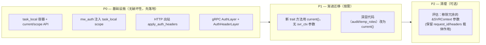

# 跨服务认证与 AuthContext 传播方案设计

> **主题**：RPC（gRPC）与跨服务 HTTP 调用的统一认证；请求内 AuthContext 上下文传播
> **设计日期**：2026-07-07
> **目标**：① 让跨服务调用支持「服务级 API Key」与「用户 JWT 透传」双凭证；② 让请求内任意深度代码都能便捷获取 AuthContext，摆脱 `&SVRContext` 手工透传
> **关联文档**：`docs/deployment-mode-review.md`（A-1/A-2/A-3 项的落地方案）

---

## 一、设计目标与现状基线

### 1.1 设计目标

| 编号 | 目标 | 验收标准 |
|------|------|---------|
| G1 | 跨服务 gRPC 调用强制鉴权 | gRPC 9090 端口无凭证访问一律返回 `UNAUTHENTICATED` |
| G2 | 跨服务 HTTP 调用携带凭证 | `RemoteImporterContext` 出站请求必带 `Authorization`/`X-API-Key` |
| G3 | 双凭证并存（服务身份 + 终端用户） | M2M 用服务级静态 key；用户发起的调用链透传终端用户身份 |
| G4 | AuthContext 请求内任意位置可读 | `AuthContext::current()` 在 `async fn` 中无参获取，无需层层透传 `&SVRContext` |
| G5 | 向后兼容 | 现有 `&SVRContext` 参数保持可用；新增能力为 opt-in |

### 1.2 现状基线（已核实）

- **HTTP 入口**：`mw_auth` 中间件（`cmx-api/src/middleware/mw_auth.rs:246`）已支持 `X-API-Key` 与 `Authorization: Bearer` 双通道，API Key 优先。验证成功后将 `AuthContext` 注入 `CmxSvrContext.0.auth_context`（行 291）。
- **API Key 体系**：已完备。`[[auth.static_api_keys]]` 启动期导入静态 key（`cmx_sk_` 前缀，SHA256 存储，无 `user_id` 即为服务专用 key），两层 Redis 缓存，`ApiKeyEntity` 已含 `service_name` 与 `scopes` 字段。
- **AuthContext 结构**：`cmx-core/src/model/service/context.rs:22`，`Clone + Serialize + Deserialize`，无敏感字段，跨 WASM 安全。字段：`user_id/username/roles/permissions/org_id/session_id/device_type/auth_method`。
- **上下文透传现状**：`&SVRContext` 作为第二参数手工透传至 ~20+ trait 方法（IAM CRUD、审计助手、编排入口）；深层代码（如 `audit_helper.rs:48`、`temp_roles.rs:128`）必须依赖调用方层层带入，遗漏则静默丢失操作者身份。
- **gRPC 现状**：`start_grpc_server`（`server_runner.rs:46-80`）无任何认证层；客户端（`client/orchestrator.rs`、`client/resource_data.rs`）不注入任何出站 metadata。
- **跨服务 HTTP 现状**：`RemoteImporterContext::send_via_http`（`remote_importers/mod.rs:289`）与 `list_via_http`（行 160）出站请求**完全无 header**；接收端 `/api/plugin/data/import` 已受 `mw_auth` 保护——意味着当前跨服务调用会被接收端 401 拒绝（除非接收端未配置 `GlobalAuthService` 或加入白名单）。
- **task_local 现状**：全工程零 `tokio::task_local!`；唯一的 `thread_local!`（`cmx-traits/src/runtime/invoke_context.rs:102`）仅用于同步 WASM 调用深度守卫。`cmx-traits` 已依赖 `tokio`，引入 task_local 无需新依赖。
- **volo-grpc 版本**：0.12.2，采用 motore Layer 模式（类 tower），支持 `Server::layer`/`layer_front`、`ServiceBuilder::layer`、`ClientBuilder::layer_inner`。`Request<T>` 携带 `MetadataMap`，`Request::map` 保留 metadata。

### 1.3 决策摘要（已与用户确认）

| 决策点 | 选定方案 |
|--------|---------|
| 上下文传播 | **task_local + 保留 `&SVRContext` 参数**（渐进，新代码用 `current()`，老代码零改动） |
| 跨服务凭证来源 | **服务级静态 API Key**（复用 `[[auth.static_api_keys]]`，无状态、可吊销、可审计） |
| 终端用户透传 | **需要（二段式 header）**：服务身份 + 委托用户身份分层 |
| 文档形式 | **设计文档含代码骨架**（不落源码，评审后实施） |

---

## 二、认证体系总览

### 2.1 三层凭证模型



| 层 | Header | 载荷 | 用途 |
|----|--------|------|------|
| ① 服务身份 | `X-API-Key: cmx_sk_xxx` | 静态 API Key | 验证调用方是合法服务（M2M 主认证） |
| ② 委托用户 | `X-Delegated-User-Token: Bearer <JWT>` | 终端用户 JWT | on-behalf-of 调用链，下游可做用户级审计/鉴权 |
| ③ 追踪 | `X-Request-Id`、`X-Caller-Domain/App/Module` | 字符串 | 链路追踪、调用源归属 |

**关键约定**：

- **服务身份严格走 `X-API-Key`**。`Authorization: Bearer` 遵循 OAuth2 Bearer 语义，**只承载终端用户 JWT**，不混入服务 key。这样接收端按 header 名即可区分认证通道（`X-API-Key` → API Key 通道；`Authorization` → JWT 通道），无需对载荷做前缀猜测。
- **终端用户身份始终用独立 Header**（`X-Delegated-User-Token`），不与 ① 抢 `X-API-Key`，语义清晰。
- 服务发起纯 M2M 调用（无用户上下文）时，省略 ② 层即可。

### 2.2 端到端认证时序



---

## 三、方案一：跨服务认证（gRPC + HTTP）

### 3.1 服务级 API Key 配置

复用现有 `[[auth.static_api_keys]]` 机制。每个服务实例在自身配置中声明一个专属服务 key：

```toml
# config/config_template.toml —— 新增「本服务对外身份」段
[service_auth]
# 本服务作为调用方时携带的凭证（对应一个 static_api_keys 条目）
# 必须同时在下方 [[auth.static_api_keys]] 注册，否则接收端无法验证
outgoing_api_key = "cmx_sk_svc_a_XXXXXX"
```

> **约定**：服务 key 命名建议 `cmx_sk_svc_<module_code>_XXXXXX`，便于审计区分。无 `user_id` 的 key 在 `validate_api_key` 路径下会得到 `auth_method="api_key"` 的服务专用 `AuthContext`（已由 `apikey.rs:120-144` 支持）。

### 3.2 HTTP 出站凭证注入

修改 `RemoteImporterContext`（`crates/libs/cmx-plugin/src/service/remote_importers/mod.rs`），在构造期持有凭证，出站请求统一注入。

```rust
// remote_importers/mod.rs —— 改造后骨架
use cmx_core::AuthContext; // 仅示意，task_local 访问见第四节

#[derive(Clone)]
pub struct RemoteImporterContext {
    config: CenterClientConfig,
    http_client: Option<reqwest::Client>,
    /// 本服务对外的服务级凭证（cmx_sk_xxx）
    outgoing_credential: Option<Credential>,
}

/// 出站凭证（统一抽象 Authorization / X-API-Key 两种形态）
#[derive(Clone)]
pub struct Credential {
    /// 载荷（服务级 API Key 明文，cmx_sk_xxx）
    pub value: String,
}

impl RemoteImporterContext {
    /// 构造时注入凭证（来源：[service_auth].outgoing_api_key）
    pub fn with_credential(mut self, cred: Credential) -> Self {
        self.outgoing_credential = Some(cred);
        self
    }

    /// 统一给 reqwest 请求打上三层 header
    fn apply_auth_headers(
        &self,
        req: reqwest::RequestBuilder,
    ) -> reqwest::RequestBuilder {
        let mut req = req;
        // ① 服务身份层：X-API-Key（服务 key 不占用 Authorization，保持 Bearer 专用于 JWT）
        if let Some(cred) = &self.outgoing_credential {
            req = req.header("X-API-Key", &cred.value);
        }
        // ② 委托用户层：从 task_local 取当前用户 JWT（见第四节）
        if let Some(user_jwt) = AuthContext::current_original_token() {
            req = req.header("X-Delegated-User-Token", format!("Bearer {}", user_jwt));
        }
        // ③ 追踪层
        req = req
            .header("X-Request-Id", current_request_id())
            .header("X-Caller-Domain", current_caller_domain())
            .header("X-Caller-Application", current_caller_application())
            .header("X-Caller-Module", current_caller_module());
        req
    }

    async fn send_via_http(/* ... */) -> PluginResult<ResourceDataImportResult> {
        let url = self.resolve_http_url(category).await?;
        let form = /* 现有 multipart 构造，不变 */;
        // 关键：把裸 .post(&url).multipart(form).send()
        //       改为经 apply_auth_headers 包装
        let resp = self.apply_auth_headers(
            self.http_client.as_ref().unwrap().post(&url).multipart(form)
        ).send().await?;
        /* 响应处理不变 */
    }
}
```

**装配点**（`crates/web/web-server/src/config/iam.rs:135` 构造 `RemoteImporterContext` 处）：

```rust
// web-server/src/config/iam.rs —— 改造后
let cred = Credential {
    value: service_auth_config.outgoing_api_key.clone(),
};
let remote_ctx = RemoteImporterContext::new(center_client_config)
    .with_credential(cred);
```

> 接收端**无需任何改动**：`/api/plugin/data/import` 已受 `mw_auth` 保护，`mw_auth` 优先识别 `X-API-Key`（走 `validate_api_key`），验证通过即放行。委托用户层由接收端在需要时从 `X-Delegated-User-Token` 提取（见 3.4）。

### 3.3 gRPC 出站/入站凭证注入

#### 3.3.1 服务端：统一认证 Layer

在 `cmx-rpc` 新增 `auth` 模块，实现 motore `Layer`/`Service`，对所有 gRPC 方法统一鉴权。

```rust
// crates/libs/cmx-infra/cmx-rpc/src/server/auth_layer.rs —— 新增
use std::sync::Arc;
use volo_grpc::{Request, Response, Status, metadata::MetadataValue};
use motore::{service::Service, layer::Layer};
use cmx_traits::auth::AuthService;
use cmx_core::AuthContext;

/// 鉴权所需依赖（注入到 ServerDeps）
#[derive(Clone)]
pub struct AuthVerifier {
    pub auth_service: Arc<dyn AuthService>,
}

/// Layer：把每个 service 包一层 AuthServer
#[derive(Clone)]
pub struct AuthLayer {
    verifier: AuthVerifier,
}

impl AuthLayer {
    pub fn new(verifier: AuthVerifier) -> Self { Self { verifier } }
}

impl<S> Layer<S> for AuthLayer {
    type Service = AuthServer<S>;
    fn layer(self, inner: S) -> Self::Service {
        AuthServer { inner, verifier: self.verifier }
    }
}

/// 包裹层：调用前验证 metadata
#[derive(Clone)]
pub struct AuthServer<S> {
    inner: S,
    verifier: AuthVerifier,
}

impl<S, ReqBody> Service<volo_grpc::server::ServerContext, Request<ReqBody>> for AuthServer<S>
where
    S: Service<volo_grpc::server::ServerContext, Request<ReqBody>, Response = Response<ReqBody>, Error = Status>
        + Clone + Send + Sync + 'static,
    ReqBody: Send + 'static,
{
    type Response = S::Response;
    type Error = Status;
    type Future = futures::future::BoxFuture<'static, Result<Self::Response, Self::Error>>;

    fn call(&mut self, cx: &mut volo_grpc::server::ServerContext, req: Request<ReqBody>) -> Self::Future {
        let verifier = self.verifier.clone();
        let mut inner = self.inner.clone();
        Box::pin(async move {
            // ① 提取服务身份凭证（Authorization 或 X-API-Key 二选一）
            let cred = extract_credential(req.metadata())
                .ok_or_else(|| Status::unauthenticated("缺少服务凭证"))?;

            // ② 验证（复用 AuthService，API Key 与 JWT 均支持）
            let svc_ctx = verify_credential(&verifier, &cred).await
                .map_err(|e| Status::unauthenticated(format!("服务凭证无效: {e}")))?;

            // ③ 可选：提取委托用户 JWT，做 on-behalf-of
            let user_ctx = if let Some(user_token) = req.metadata().get("x-delegated-user-token") {
                let raw = user_token.to_str().ok()
                    .and_then(|s| s.strip_prefix("Bearer ")).unwrap_or("");
                verifier.auth_service.validate_token(raw).await.ok()
            } else {
                None
            };

            // ④ 合并：优先用委托用户，回落服务身份
            let final_ctx = user_ctx.unwrap_or(svc_ctx);

            // ⑤ 写入 gRPC server context extensions，供 handler 读取
            cx.extensions_mut().insert(final_ctx);

            inner.call(cx, req).await
        })
    }
}

/// 凭证提取：服务身份只认 X-API-Key（Authorization: Bearer 专用于终端用户 JWT，
/// 不在此处提取；终端用户身份经 X-Delegated-User-Token 或本地 mw_auth 处理）
fn extract_credential(meta: &volo_grpc::MetadataMap) -> Option<String> {
    let v = meta.get("x-api-key")?;
    let s = v.to_str().ok()?;
    if s.is_empty() { None } else { Some(s.to_string()) }
}

async fn verify_credential(verifier: &AuthVerifier, api_key: &str) -> Result<AuthContext, String> {
    verifier.auth_service.validate_api_key(api_key).await.map_err(|e| e.to_string())
}
```

**装配到 server**（修改 `bundle.rs` 的 `ServerDeps` 与 `server_runner.rs`）：

```rust
// crates/libs/cmx-infra/cmx-rpc/src/bundle.rs —— 改造后
pub struct ServerDeps {
    pub service_invoker: Arc<dyn ServiceInvoker>,
    pub function_invoker: Arc<dyn FunctionInvoker>,
    pub data_importer: Option<Arc<dyn ResourceDataImporter>>,
    /// 新增：服务端鉴权依赖（None = 不启用 gRPC 鉴权，兼容单体无 RPC 场景）
    pub auth_verifier: Option<crate::server::AuthVerifier>,
}
```

```rust
// crates/libs/cmx-infra/cmx-rpc/src/server_runner.rs —— 改造后关键段
pub async fn start_grpc_server(
    port: u16,
    bundles: Vec<Box<dyn RpcServiceBundle>>,
    deps: ServerDeps,
    ready_tx: tokio::sync::oneshot::Sender<()>,
) -> Result<(), RpcFrameworkError> {
    let server = bundles.into_iter()
        .fold(volo_grpc::server::Server::new(), |server, bundle| {
            bundle.build_server(&deps).apply(server)
        });

    // 关键：若有 auth_verifier，在最外层包一层 AuthLayer
    let server = if let Some(verifier) = deps.auth_verifier.clone() {
        server.layer_front(crate::server::AuthLayer::new(verifier))
    } else {
        server
    };
    /* 绑定端口、run 等不变 */
}
```

#### 3.3.2 客户端：出站 metadata 注入

两种粒度，推荐**全局 Layer**（所有出站调用自动带 header）：

```rust
// crates/libs/cmx-infra/cmx-rpc/src/client/auth_outbound.rs —— 新增
#[derive(Clone)]
pub struct AuthHeaderLayer {
    /// 本服务静态 key（cmx_sk_xxx）
    service_key: String,
}
impl AuthHeaderLayer {
    pub fn new(service_key: String) -> Self { Self { service_key } }
}

impl<S, Req> Layer<S> for AuthHeaderLayer
where S: Service<volo_grpc::client::ClientContext, Request<Req>> + Clone + Send + Sync + 'static
{
    type Service = AuthHeaderClient<S>;
    fn layer(self, inner: S) -> Self::Service {
        AuthHeaderClient { inner, key: self.service_key }
    }
}

#[derive(Clone)]
pub struct AuthHeaderClient<S> {
    inner: S,
    key: String,
}

impl<S, Req> Service<volo_grpc::client::ClientContext, Request<Req>> for AuthHeaderClient<S>
where S: Service<volo_grpc::client::ClientContext, Request<Req>> + Clone + Send + Sync + 'static
{
    type Response = S::Response;
    type Error = S::Error;
    type Future = futures::future::BoxFuture<'static, Result<Self::Response, S::Error>>;
    fn call(&mut self, cx: &mut volo_grpc::client::ClientContext, mut req: Request<Req>) -> Self::Future {
        // ① 服务身份：X-API-Key: <cmx_sk_xxx>（不占用 Authorization，Bearer 专用于 JWT）
        req.metadata_mut().insert(
            "x-api-key",
            MetadataValue::from_str(&self.key).unwrap_or_default(),
        );
        // ② 委托用户：从 task_local 取（见第四节）
        if let Some(user_jwt) = AuthContext::current_original_token() {
            req.metadata_mut().insert(
                "x-delegated-user-token",
                MetadataValue::from_str(&format!("Bearer {}", user_jwt)).unwrap_or_default(),
            );
        }
        // ③ 追踪
        if let Some(rid) = AuthContext::current_request_id() {
            req.metadata_mut().insert("x-request-id", MetadataValue::from_str(&rid).unwrap_or_default());
        }
        let mut inner = self.inner.clone();
        Box::pin(async move { inner.call(cx, req).await })
    }
}
```

**装配到客户端构造**（修改 `client/orchestrator.rs:65-90`、`client/resource_data.rs:73-98`）：

```rust
// client/orchestrator.rs —— 改造后
fn get_client(&self, service_name: &str) -> Result<OrchestratorGrpcClient, ClientInitError> {
    let discover = self.infra.get_or_create_discover(service_name)?;
    let mut builder = CmxServiceOrchestratorClientBuilder::new(service_name)
        .discover(discover)
        .rpc_timeout(Some(self.infra.rpc_timeout()))
        .connect_timeout(self.infra.connect_timeout());
    // 关键：注入出站鉴权 Layer
    if let Some(key) = self.infra.outbound_service_key() {
        builder = builder.layer_inner(AuthHeaderLayer::new(key));
    }
    Ok(builder.build())
}
```

`GrpcInfrastructure`（`client/infra.rs`）新增字段 `outbound_service_key: Option<String>`，由 `factory.rs::init_rpc_clients` 从 `[service_auth].outgoing_api_key` 注入。

### 3.4 接收端：mw_auth 增强（HTTP）与 handler 读取（gRPC）

**HTTP 接收端**：`mw_auth` 优先识别 `X-API-Key`（走 `validate_api_key`）。仅需**新增委托用户 Header 的提取**：

```rust
// crates/libs/cmx-api/src/middleware/mw_auth.rs —— 改造后增量（在「4. 注入 AuthContext」之后）
// 已验证服务身份，auth_ctx 已赋值

// 可选：若携带委托用户 JWT，则用用户身份覆盖（on-behalf-of）
if let Some(delegated) = req.headers().get("x-delegated-user-token").and_then(|v| v.to_str().ok()) {
    if let Some(jwt) = delegated.strip_prefix("Bearer ").or_else(|| delegated.strip_prefix("bearer ")) {
        if let Ok(user_ctx) = auth_service.validate_token(jwt).await {
            // 保留服务身份作为 auth_method 标记，但主体用用户上下文
            let merged = AuthContext {
                auth_method: Some("delegated_by_api_key".to_string()),
                ..user_ctx
            };
            svr_ctx.0.auth_context = Some(merged);
        }
        // 委托 token 无效：保持服务身份，仅 warn
    }
}
```

**gRPC 接收端**：3.3.1 的 `AuthServer` 已把 `AuthContext` 写入 `cx.extensions`，server 方法从 context 取：

```rust
// crates/libs/cmx-infra/cmx-rpc/src/server/resource_data.rs —— 改造后关键段
async fn import_resource_data(
    &self,
    cx: &mut volo_grpc::server::ServerContext,
    req: volo_grpc::Request<ImportResourceDataRequest>,
) -> Result<volo_grpc::Response<ImportResourceDataResponse>, volo_grpc::Status> {
    // 从 context 取已验证的 AuthContext（由 AuthServer 注入）
    let auth_ctx = cx.extensions().get::<AuthContext>().cloned();
    // 后续：进入 task_local scope（见第四节）
    AuthContext::scope(auth_ctx, async {
        let inner = req.into_inner();
        self.importer.import_resource_data(inner).await
            .map_err(|e| volo_grpc::Status::internal(e.to_string()))
            .map(volo_grpc::Response::new)
    }).await
}
```

---

## 四、方案二：AuthContext 请求内传播（task_local）

### 4.1 核心机制

在 `cmx-traits`（被 API 层与业务层共同依赖，且已依赖 tokio）定义 task_local 容器与访问 API。

```rust
// crates/libs/cmx-traits/src/auth/context_scope.rs —— 新增
use cmx_core::AuthContext;
use std::sync::Arc;
use tokio::task_local;

/// task_local 容器：持有当前请求的 AuthContext + 原始 token + 追踪信息。
/// 用 Option 是为了区分「不在 scope 内」与「在 scope 内但未认证」。
task_local! {
    /// 当前请求的认证上下文（None 表示已进入 scope 但该请求未认证，如白名单路径）
    static CURRENT_AUTH: Arc<RequestAuth>;
}

/// 请求级认证快照（Clone 廉价，因 Arc）
#[derive(Debug, Clone)]
pub struct RequestAuth {
    /// 已验证的认证上下文（M2M 调用可能是服务专用 AuthContext）
    pub auth_context: Option<AuthContext>,
    /// 终端用户的原始 JWT（用于跨服务 on-behalf-of 透传，None 表示无用户 JWT）
    pub original_user_token: Option<String>,
    /// 请求 ID（链路追踪）
    pub request_id: String,
    /// 调用源身份三元组（on-behalf-of 透传）
    pub caller: Option<CallerIdentity>,
}

#[derive(Debug, Clone)]
pub struct CallerIdentity {
    pub domain_code: String,
    pub application_code: String,
    pub module_code: String,
}

impl AuthContext {
    /// 在当前异步任务内获取 AuthContext（需在 scope 内调用）。
    ///
    /// 适用场景：service 层深层代码、审计助手、编排节点等。
    /// 不在 scope 内返回 None（不 panic，调用方自行处理）。
    pub fn current() -> Option<AuthContext> {
        CURRENT_AUTH
            .try_value(|v| v.auth_context.clone())
            .ok()
            .flatten()
    }

    /// 当前请求的原始用户 JWT（用于跨服务透传）。
    pub fn current_original_token() -> Option<String> {
        CURRENT_AUTH
            .try_value(|v| v.original_user_token.clone())
            .ok()
            .flatten()
    }

    /// 当前请求 ID。
    pub fn current_request_id() -> Option<String> {
        CURRENT_AUTH.try_value(|v| v.request_id.clone()).ok()
    }

    /// 当前调用源身份。
    pub fn current_caller() -> Option<CallerIdentity> {
        CURRENT_AUTH.try_value(|v| v.caller.clone()).ok().flatten()
    }

    /// 在给定 AuthContext 的作用域内执行 future。
    ///
    /// 由 HTTP mw_auth / gRPC AuthServer 在请求入口调用，
    /// 包裹整个请求处理过程，使内部任意 await 点都能 `AuthContext::current()`。
    pub async fn scope<F, R>(auth: Option<AuthContext>, fut: F) -> R
    where
        F: std::future::Future,
    {
        let snap = RequestAuth {
            auth_context: auth,
            original_user_token: None, // 由 mw_auth 额外填充
            request_id: String::new(),
            caller: None,
        };
        CURRENT_AUTH.scope(Arc::new(snap), fut).await
    }
}
```

### 4.2 在请求入口建立 scope

#### 4.2.1 HTTP 入口（mw_auth）

```rust
// crates/libs/cmx-api/src/middleware/mw_auth.rs —— 改造后「4. 注入 AuthContext」之后
// 关键：建立 task_local scope，包裹 next.run(req)
let auth_for_scope = svr_ctx.0.auth_context.clone();
let user_token_for_scope = extract_delegated_user_token(&req); // 新增提取函数
let request_id_for_scope = svr_ctx.0.request_id.clone();

// 用 scope 包裹后续处理
let resp = AuthContext::scope_full(
    auth_for_scope,
    user_token_for_scope,
    request_id_for_scope,
    next.run(req),
).await;
Ok(resp)

// scope_full 是 scope 的增强版（同时带 token/request_id）
impl AuthContext {
    pub async fn scope_full<F, R>(
        auth: Option<AuthContext>,
        original_user_token: Option<String>,
        request_id: String,
        fut: F,
    ) -> R
    where F: std::future::Future
    {
        let snap = RequestAuth {
            auth_context: auth,
            original_user_token,
            request_id,
            caller: None,
        };
        CURRENT_AUTH.scope(Arc::new(snap), fut).await
    }
}
```

> **保留** `svr_ctx.0.auth_context` 的注入（行 291）不变，确保所有现有读 `&SVRContext.auth_context` 的代码继续工作。task_local 是**新增并行通道**，不替换。

#### 4.2.2 gRPC 入口（AuthServer）

见 3.3.1 末尾 `AuthServer::call`：验证后调用 `AuthContext::scope(...)` 包裹 `inner.call(cx, req)`。

### 4.3 在任意深层代码读取

改造前后对比，以 `audit_helper.rs:48` 为例：

```rust
// 改造前（依赖调用方层层带 &SVRContext）
pub async fn audit_write(&self, svr_ctx: &SVRContext, /* ... */) {
    let actor = svr_ctx.auth_context.as_ref()
        .map(|ac| (ac.user_id.clone(), ac.username.clone()))
        .unwrap_or(("unknown".into(), "unknown".into()));
    /* ... */
}

// 改造后（新代码可不再要求 svr_ctx 参数；老签名保留兼容）
pub async fn audit_write_v2(&self, /* ... */) {
    let actor = AuthContext::current()
        .map(|ac| (ac.user_id, ac.username))
        .unwrap_or(("unknown".into(), "unknown".into()));
    /* ... */
}
```

新增的 service 方法可直接用 `AuthContext::current()`，不必把 `&SVRContext` 加进签名：

```rust
// 新增 trait 方法示例（无 svr_ctx 参数）
async fn create_xxx(&self, data: XxxForCreate) -> Result<Xxx, TraitError> {
    let operator = AuthContext::current()
        .ok_or_else(|| TraitError::Unauthenticated("缺少认证上下文".into()))?
        .user_id;
    /* 业务逻辑 */
}
```

### 4.4 task_local 的关键性质（设计约束）

| 性质 | 说明 | 本方案的应对 |
|------|------|-------------|
| **跨 `.await` 有效** | `tokio::task_local` 在同一 Task 内跨 await 点持续可见，worker 线程切换不影响 | 天然满足请求生命周期 |
| **不跨任务边界** | `tokio::spawn` 出去的子任务**不继承** task_local | 后台任务（如插件安装完成回调）需显式重新 scope，或显式传参 |
| **取消安全** | task_local scope 基于 RAII，task 取消时自动清理 | 天然满足 |
| **panic 安全** | panic 会展开 scope，task_local 正常释放 | 天然满足 |
| **可重入** | 嵌套 scope 以内层为准 | 内层 scope（如 gRPC handler 再发起 HTTP 调用）会覆盖外层，符合「就近原则」 |

**后台任务注意**：凡 `tokio::spawn` 启动的脱离请求生命周期的任务（如 `cmx-plugin` 的集群同步、`ServiceListSyncer` 30s 轮询），**不能依赖** `AuthContext::current()`（会返回 None）。这类任务本就无用户上下文，应使用服务自身的系统级 AuthContext（在启动期建立一个全局 system scope，或显式构造系统身份）。

### 4.5 全局系统身份（兜底）

为后台任务提供系统级身份，避免到处判 None：

```rust
// crates/libs/cmx-traits/src/auth/context_scope.rs —— 续
use tokio::sync::OnceCell;

/// 全局系统身份（启动期由 web-server 注入）
static SYSTEM_AUTH: OnceCell<Arc<RequestAuth>> = OnceCell::const_new();

/// 初始化系统身份（启动期调用一次）
pub async fn init_system_auth(snap: RequestAuth) -> Result<(), SetSystemAuthError> {
    SYSTEM_AUTH.set(Arc::new(snap)).await
        .map_err(|_| SetSystemAuthError)
}

/// 获取系统身份（后台任务用）
pub fn system_auth() -> Option<AuthContext> {
    SYSTEM_AUTH.get().and_then(|s| s.auth_context.clone())
}
```

后台任务中：
```rust
// 推荐：显式使用 system_auth，而非 current（语义清晰）
let operator = AuthContext::current().or_else(system_auth);
```

---

## 五、整体装配与配置

### 5.1 配置项总览（新增）

```toml
# config/config_template.toml —— 新增段
[service_auth]
# 本服务对外服务级凭证（必填于微服务模式）
outgoing_api_key = "cmx_sk_svc_default_XXXXXX"
```

> 此配置项维护需触发 `config-sync` 技能，同步 `config_template.toml` + `CONFIG_MANUAL.md` + `.env.template` + `ENV_MANUAL.md`（实施阶段执行）。

### 5.2 装配流程（web-server 启动）



### 5.3 改动文件清单（实施阶段）

| 文件 | 改动类型 | 内容 |
|------|---------|------|
| `crates/libs/cmx-traits/src/auth/context_scope.rs` | 新增 | task_local 容器、`AuthContext::current/scope/scope_full`、系统身份 |
| `crates/libs/cmx-traits/src/auth/mod.rs` | 改 | `pub mod context_scope;` 导出 |
| `crates/libs/cmx-infra/cmx-rpc/src/server/auth_layer.rs` | 新增 | `AuthLayer`/`AuthServer`/`AuthVerifier` |
| `crates/libs/cmx-infra/cmx-rpc/src/server/mod.rs` | 改 | 导出 auth_layer |
| `crates/libs/cmx-infra/cmx-rpc/src/client/auth_outbound.rs` | 新增 | `AuthHeaderLayer`/`AuthHeaderClient` |
| `crates/libs/cmx-infra/cmx-rpc/src/bundle.rs` | 改 | `ServerDeps` 加 `auth_verifier` |
| `crates/libs/cmx-infra/cmx-rpc/src/server_runner.rs` | 改 | `layer_front(AuthLayer)` 条件注入 |
| `crates/libs/cmx-infra/cmx-rpc/src/client/{orchestrator,resource_data}.rs` | 改 | builder 加 `layer_inner(AuthHeaderLayer)` |
| `crates/libs/cmx-infra/cmx-rpc/src/client/infra.rs` | 改 | `GrpcInfrastructure` 加 `outbound_service_key` |
| `crates/libs/cmx-infra/cmx-rpc/src/factory.rs` | 改 | 从配置注入 service key |
| `crates/libs/cmx-plugin/src/service/remote_importers/mod.rs` | 改 | `RemoteImporterContext::apply_auth_headers` |
| `crates/libs/cmx-api/src/middleware/mw_auth.rs` | 改 | 委托用户提取 + task_local scope |
| `crates/web/web-server/src/config/rpc.rs` | 改 | 构建 AuthVerifier、扩展 init_rpc 签名 |
| `crates/web/web-server/src/config/iam.rs` | 改 | 构造 RemoteImporterContext 注入凭证 |
| `crates/web/web-server/src/main.rs` | 改 | 启动期 `init_system_auth` |
| `config/config_template.toml` 等 | 改 | 新增 `[service_auth]`（触发 config-sync） |

---

## 六、迁移路线



| 阶段 | 内容 | 风险 | 兼容性 |
|------|------|------|--------|
| P0 | 落地 task_local、双凭证注入、gRPC/HTTP 鉴权 | 低（纯新增） | 完全兼容，老代码零改动 |
| P1 | 新代码用 `current()`；逐步迁移 audit/temp_roles 等痛点 | 低（逐处迁移） | 双通道并存 |
| P2 | 评估是否移除 `&SVRContext` 部分参数（仅保留 request_id/headers 等必需字段） | 中 | 破坏性，需完整回归 |

---

## 七、安全考量与边界情况

| 场景 | 处理 |
|------|------|
| **API Key 泄露** | 静态 key 可通过 `status=0` 即时吊销；Redis 缓存两层都会失效（`del_batch`） |
| **委托用户 JWT 过期** | `validate_token` 失败时 `AuthServer`/`mw_auth` 仅 `warn` 并回落到服务身份，不阻断 M2M（语义：委托是增强，非必需） |
| **服务 key 与用户凭证区分** | 服务 key 走 `X-API-Key`，用户 JWT 走 `Authorization: Bearer`，按 header 名天然区分，无需前缀猜测 |
| **task_local 跨 spawn 丢失** | 后台任务用 `system_auth()`；新代码 review 时标注 spawn 点 |
| **WASM 插件读取身份** | `SVRContext.auth_context` 序列化进 WASM 的既有路径不变；task_local 是宿主侧优化，不影响插件契约 |
| **gRPC 端口暴露** | P0 落地后，未带凭证一律 `UNAUTHENTICATED`；mono 模式可配置 `auth_verifier=None` 跳过（仅 loopback 部署） |
| **重放攻击** | API Key 验证已带 SHA256 比对与状态检查；建议生产环境配合 TLS/mTLS 传输层（传输安全不在本方案范围，但推荐叠加） |

---

## 八、与现有规范的契合

- **第一章错误处理**：`AuthVerifier`/`AuthHeaderLayer` 的错误用 `Status::unauthenticated`（gRPC）/ `StatusCode::UNAUTHORIZED`（HTTP），符合「优雅向上抛」原则。
- **第二章日志**：所有认证失败用 `tracing::warn!` 结构化记录（`path/method/error`）。
- **第三章依赖**：`cmx-traits` 已依赖 `tokio`，task_local 无新增依赖；`cmx-rpc` 新增 motore/futures 引用需走 `workspace = true`。
- **第十七章初始化**：`init_system_auth` 返回 `Result`，失败向上传播，不用 `unwrap`/`expect`。

---

## 九、关键决策（已确认）

1. **`outgoing_api_key` 的密文存储**：**不额外处理**。TOML 配置体系本身已支持环境变量注入（`SERVICE_AUTH__OUTGOING_API_KEY` 覆盖 `[service_auth].outgoing_api_key`），生产环境用环境变量注入即可，无需在本方案引入加密配置中心或额外密文层。

2. **委托用户 JWT 的失效策略**：**回落服务身份**。当 `X-Delegated-User-Token` 过期或吊销时，`AuthServer`/`mw_auth` 仅 `warn!` 记录，不阻断调用——以服务身份（M2M）继续执行。语义：委托用户身份是「增强」（用于用户级审计/鉴权），不是「必需」；这保证 M2M 调用链不会因委托 token 失效而中断。

---

## 十、小结

本方案以**最小侵入**实现两大目标：

1. **跨服务认证**：复用成熟的 API Key 体系 + 双 Header 透传（服务身份 + 委托用户），gRPC 用 motore Layer 统一鉴权、HTTP 用 `apply_auth_headers` 统一注入，接收端 `mw_auth` 几乎无改动。
2. **AuthContext 传播**：`tokio::task_local` 在请求入口建立 scope，`AuthContext::current()` 在任意 await 点无参获取，彻底解决「函数间互传麻烦」。保留 `&SVRContext` 参数做渐进迁移，零破坏性。

P0 阶段全部为纯新增，落地后即关闭 `deployment-mode-review.md` 的 A-1/A-2/A-3 三项风险。P1/P2 按需迁移，最终让 AuthContext 的获取从「必须显式传参」演进为「请求内隐式可读」。
