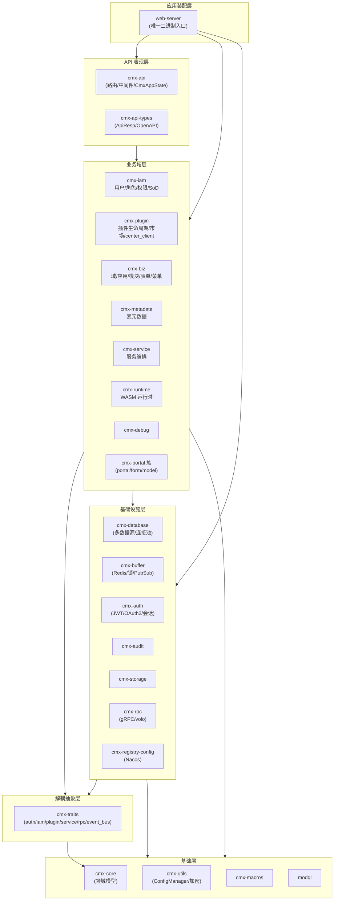
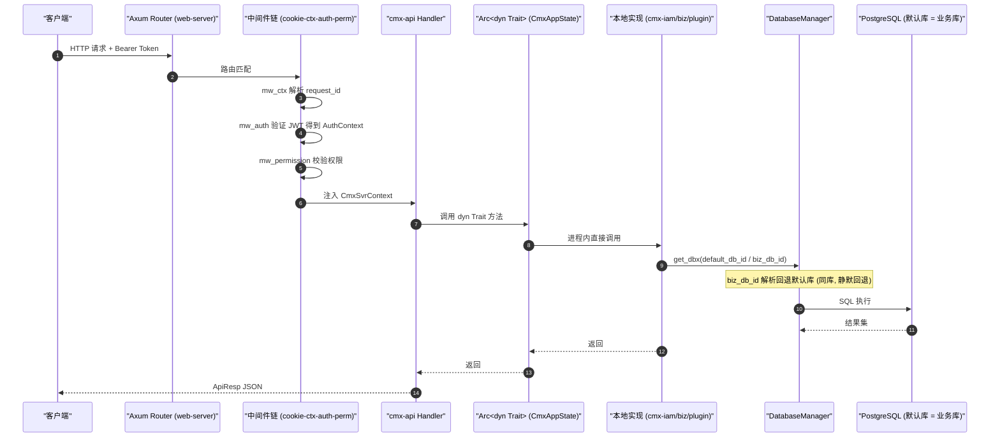
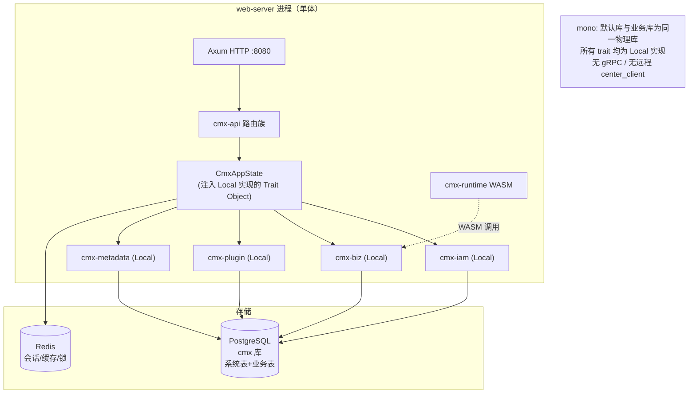
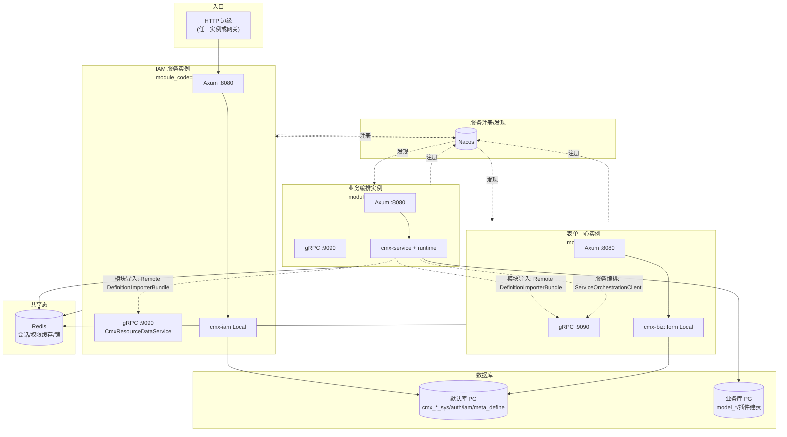
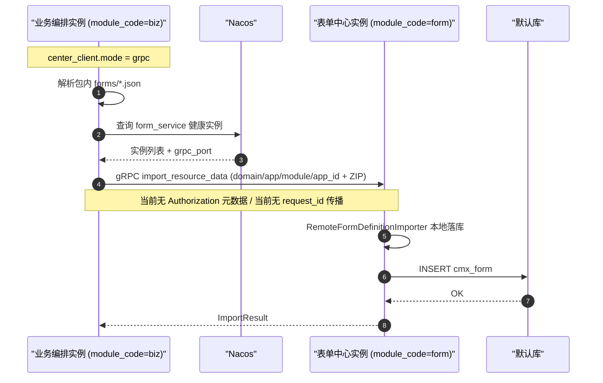
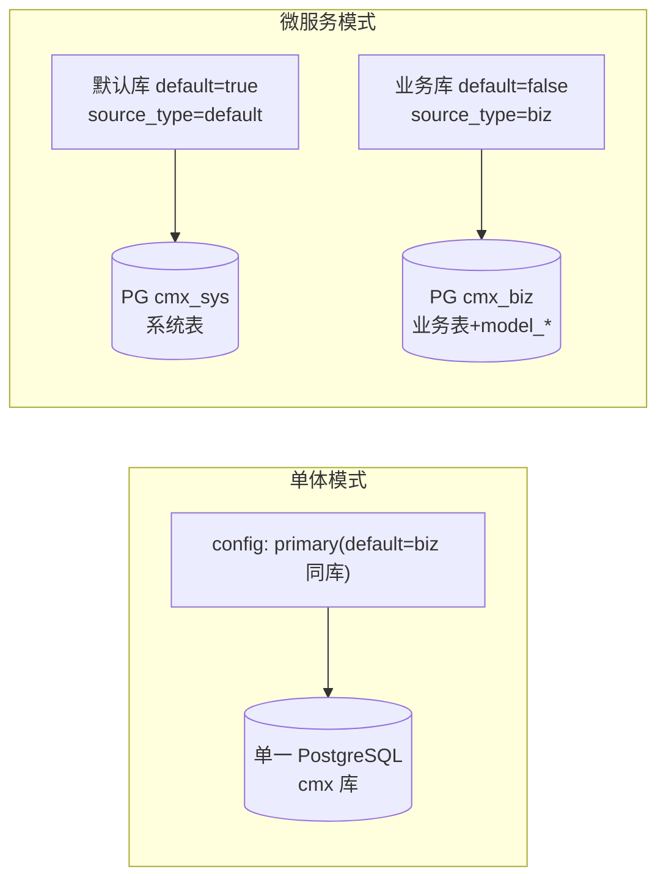
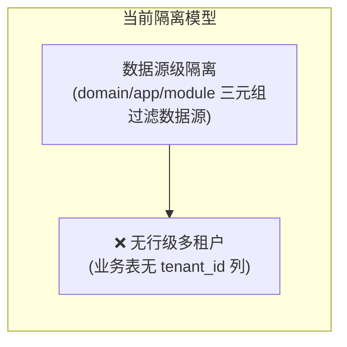

# CMX-Container 架构分析文档

> **主题**：单体应用 / 微服务双模运行能力分析
> **审查日期**：2026-07-03
> **审查范围**：cmx-container workspace 全量 crate，聚焦部署模式、数据库路由、服务间通信
> **配套文档**：`docs/deployment-mode-review.md`（评审与优化建议）

---

## 一、工程总览

CMX-Container 是一套「企业业务容器平台」（由 Node.js 迁移至 Rust），本质上是 **一个模块化单体（Modular Monolith）+ 可选 RPC 逃生舱** 的架构。整套系统由 **单一 `web-server` 二进制** 装配而成，通过运行时配置切换是否启用跨进程调用。

### 1.1 Crate 分层

### 1.2 解耦枢纽：`cmx-traits`

业务 crate 之间 **不直接依赖**，而是通过 `cmx-traits` 定义的 trait 以 `Arc<dyn Trait>` 形式交互。这是整个工程最关键的设计决策，也是双模切换的基石。

| Trait | 本地实现 | 远程实现 | 配置切换点 |
|-------|---------|---------|-----------|
| `ResourceDataImporter` | `cmx-biz::ResourceDataImporterImpl` | gRPC `CmxResourceDataService` | `center_client.mode` |
| `DefinitionImporterBundle` (Form/Menu/Table/Perm) | `Local*DefinitionImporter` | `remote_importers` (grpc/http) | `web-server/config/iam.rs:128-174` |
| `ServiceInvoker` | `cmx-service` | `ServiceOrchestrationClient` (gRPC) | `[rpc] enabled` |
| `FunctionInvoker` | `cmx-biz::BizFunctionInvoker` | 同上 gRPC | 同上 |
| `AuthService` | `cmx-auth::AuthServiceImpl` | ❌ **无** | — |
| `UserAuthQuery` | `cmx-iam::UserAuthQueryImpl` | ❌ **无** | — |

### 1.3 功能域归属

| 功能域 | 路由模块 | 承载 crate |
|--------|---------|-----------|
| 认证 (Auth) | `handlers::auth` | `cmx-auth` |
| 权限/用户/角色 (IAM) | `handlers::iam` | `cmx-iam` |
| 域/应用/模块 | `handlers::domain/application/module` | `cmx-biz` |
| 数据源 | `handlers::sys_datasource` | `cmx-biz` + `cmx-database` |
| 表单/菜单 | `handlers::form/menu` | `cmx-biz` |
| 插件生命周期/市场 | `handlers::plugin/marketplace` | `cmx-plugin` |
| 表元数据 (meta_table) | `handlers::table_metadata` | `cmx-metadata` |
| 服务编排 | `handlers::service` | `cmx-service` |
| 调试/WASM 调用 | `handlers::debug` | `cmx-debug` |
| Portal/设计器 | `handlers::portal` | `cmx-portal` 族 |

---

## 二、单体运行模式（Monolithic）

### 2.1 运行特征

- **单进程**：仅 `web-server` 一个二进制，所有功能域编译进同一进程。
- **配置标志**：`[center_client] mode = "local"`（默认）+ `[rpc] enabled = false`。
- **调用方式**：所有跨域调用走 **进程内 `Arc<dyn Trait>` 直接派发**，零网络开销。
- **数据库**：默认库与业务库指向 **同一物理数据库**（`primary` 与 `biz` 的 `db_url` 相同）。

### 2.2 单体运行时序图

### 2.3 单体架构图

> **要点**：单体模式下，没有任何流量离开进程。`app_id ≡ module_code` 的约束、`domain/application/module` 三元组仅用于给数据源行打标，在单实例部署里三者恒为 `"default"`。

---

## 三、微服务运行模式（Microservice）

### 3.1 运行特征

- **多进程**：每个服务域（如 IAM 中心、表单中心、流程中心、业务编排中心）可独立部署为 `web-server` 实例，通过 `[app] module_code` 标识自身所属。
- **配置标志**：`[center_client] mode = "grpc"|"http_url"|"http_discovery"` + `[rpc] enabled = true`。
- **调用方式**：跨域调用经 Nacos 服务发现后走 gRPC（volo）或 HTTP multipart。
- **数据库**：每个服务实例仅装载属于自己的数据源（`load_active_datasources` 按 `domain/application/module` 过滤），默认库（系统表）与业务库分离。

### 3.2 微服务架构图

### 3.3 微服务跨实例调用时序（以模块资源导入为例）

> **关键风险标注**：当前微服务路径上，gRPC 服务端**无认证拦截器**，客户端**不携带身份/请求上下文**（详见评审文档 🔴 项）。这意味着在真正拆分为独立网络服务前，这些缺口必须补齐，否则 gRPC 端口（9090）将成为未授权访问入口。

---

## 四、数据库双模对照

### 4.1 配置层

`[[databases]]` 数组中每个数据源由以下字段区分语义：

| 字段 | 含义 |
|------|------|
| `db_id` | 逻辑标识（`primary`/`biz`/...） |
| `default: bool` | 是否主数据源（全局唯一） |
| `source_type` | `"default"` \| `"biz"` \| `"other"`（未设置时由 `default` 派生） |
| `domain_code/application_code/module_code` | 所属身份三元组（启动时注入） |

### 4.2 双模映射

| 维度 | 单体 | 微服务 |
|------|------|--------|
| 默认库与业务库 | **同一物理库** | **物理分离** |
| `get_biz_db_id()` | 回退到默认库（同库） | 返回 biz 库 db_id |
| 系统表（plugin/iam/auth/meta_define/...） | 默认库 | 默认库（各服务共享或集中） |
| 业务表（model_*/插件建表） | 默认库（同库） | 业务库 |
| 表路由决策点 | 集中于 `deploy.rs` / `module_install.rs` / importer | 同左（无集中抽象） |

### 4.3 表归类

**系统/平台表（驻留默认库）**：`cmx_domain/application/module`、`cmx_sys_datasource`、`cmx_plugin(_versions)`、`cmx_audit_log`、`cmx_plugin_audit_log`、`cmx_auth_*`（6 张）、`cmx_user/role/role_group/permission/...`（9 张）、`cmx_meta_table_define(_version)`、`cmx_service_define(_version)`、`cmx_marketplace_*`、`cmx_file_*`、`cmx_form/menu`、`cmx_module_current_version/version_history`。

**业务表（驻留业务库）**：`cmx_model_meta/module/deploy_history/source`、`cmx_model_registry`（仅默认库）、插件运行时动态创建的表（由 `cmx_meta_table_define.db_id` 列记录其物理归属）。

> 注意 `cmx_model_*` 表会在**默认库与每个业务库**同时创建（由 `PgTableDefineExecutor` 程序化建表 + 主库迁移保底）。

### 4.4 表路由现状（关键观察）

工程**没有集中的 `DbRouter` 抽象**，「哪张表写入哪个库」的决策分散在 20+ 调用点：

- `PluginPersistence` → 写默认库（事务守卫）
- `DeployService::deploy` → `request.db_id ?: get_biz_db_id()`
- `ModuleInstallService` → 校验/版本台账写默认库；资源/表定义写业务库
- `LocalTableDefinitionImporter` → 业务表建在业务库，元数据注册在默认库（最清晰的跨库指针设计）
- `cmx-iam` → `auth_db_id ?: default_db_id`
- `cmx-audit` → 构造期固定 db_id

这种「策略散落」使路由规则容易被无声破坏（详见评审文档 🟡 项）。

---

## 五、身份与数据隔离

### 5.1 身份三元组的双重角色

`domain_code / application_code / module_code`（及其等价的 `app_id`）在系统中承担**两种不同职责**，当前实现存在概念混淆：

| 职责 | 当前实现 | 说明 |
|------|---------|------|
| **数据路由键** | ✅ 已落地 | 标记数据源归属，`load_active_datasources` 按此过滤；导入请求体携带此字段路由到对应中心 |
| **请求上下文（调用者身份）** | ❌ 未落地 | 跨服务调用**不**作为 header/metadata 传播；下游无法得知调用者是谁 |

依据 `AGENTS.md §6`：当前 `app_id ≡ module_code`，二者恒等，行级多租户尚未实现，隔离粒度为**数据源/连接池级**而非行级。

### 5.2 隔离模型

这意味着：微服务模式下，一个模块实例只能「看到」自己的数据源池；但若多个模块共享同一业务库，**库内表数据并不天然隔离**，需依赖业务层的 `module_code/app_id` WHERE 条件（如 `cmx_plugin`、`cmx_meta_table_define` 等表）。

---

## 六、小结：双模能力评估

| 能力维度 | 单体 | 微服务 | 说明 |
|---------|:----:|:------:|------|
| 进程内 trait 直调 | ✅ | — | 默认行为 |
| 跨进程 gRPC 调用 | — | ⚠️ 部分 | 仅 orchestrator/resource_data 两个域有 RPC 面 |
| 服务注册发现 | — | ✅ | Nacos 完备，含 watch + 负载均衡 |
| Local↔Remote 配置切换 | ✅ | ✅ | OCP 合规，`center_client.mode` 驱动 |
| 数据库双模 | ✅ | ⚠️ | 路由分散，回退静默，漂移不可检测 |
| **跨服务认证** | — | 🔴 **缺失** | gRPC 无拦截器 |
| **身份/请求上下文传播** | — | 🔴 **缺失** | 客户端无 auth header |
| **IAM/Auth 远程化** | — | 🔴 **缺失** | 无 client trait 实现 |
| 会话水平扩展 | ✅ | ✅ | Redis 已支持 |

**结论**：工程的「形」（trait 抽象、服务发现、传输无关）已具备微服务雏形，但「神」（信任边界、身份传播、IAM 远程化）尚未补齐。**当前可以安全地以单体运行；在补齐三大 🔴 缺口前，不建议将服务真正拆分到独立网络部署。** 具体问题与优化路线见 `docs/deployment-mode-review.md`。
