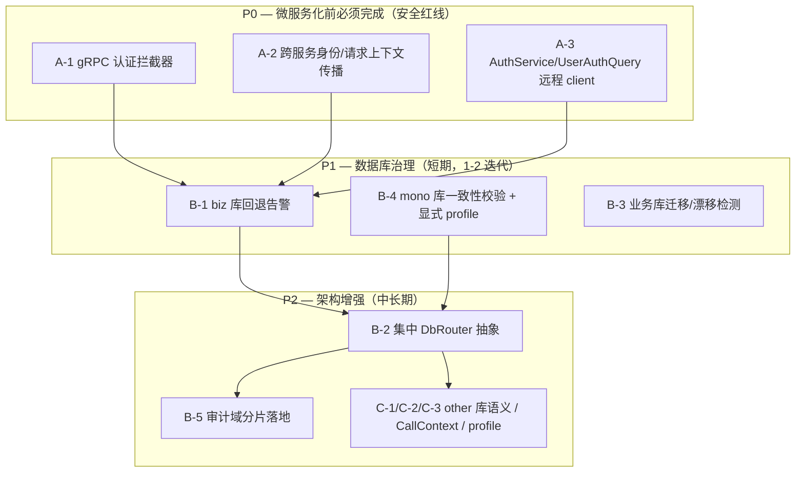
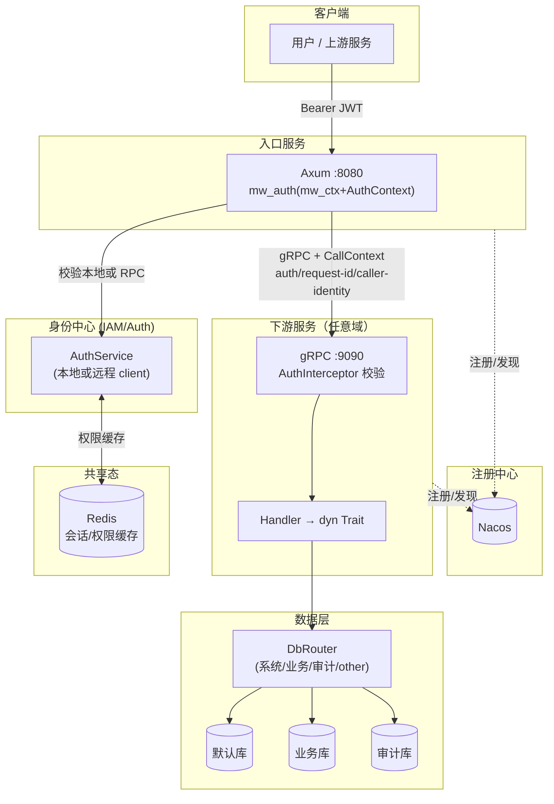

# CMX-Container 部署模式评审报告

> **评审主题**：单体 / 微服务双模运行的合理性与优化
> **评审日期**：2026-07-03
> **评审依据**：workspace 全量 crate 源码 + 关键文件行级复核
> **配套文档**：`docs/architecture-analysis.md`（架构分析）

---

## 一、评审总览

### 1.1 总体评分

| 维度 | 评分 | 状态 | 说明 |
|------|:----:|:----:|------|
| 部署模式适配度 | 7/10 | 🟡 | trait 抽象 + 配置切换设计优秀，但无 mono/micro 校验，缺编译期 profile |
| 数据库路由 | 5/10 | 🟡 | 双模数据源模型清晰，但路由策略散落、回退静默、漂移不可检测 |
| 服务间通信 | 6/10 | 🟡 | Local↔Remote 切换 OCP 合规，但 RPC 域覆盖窄（仅 2 个） |
| 安全 / 身份传播 | 3/10 | 🔴 | gRPC 无认证、无身份传播、IAM 不可远程化——拆分前必须补齐 |
| 可演进性 | 8/10 | ✅ | 分层清晰、解耦良好，演进路径明确 |

### 1.2 问题统计

| 严重级别 | 数量 |
|---------|:----:|
| 🔴 严重 | 3 |
| 🟡 警告 | 5 |
| 🔵 建议 | 3 |

---

## 二、问题清单

### 维度 A：安全与身份传播（微服务化前提）

#### 🔴 A-1 gRPC 服务端无认证拦截器

- **文件位置**：`crates/libs/cmx-infra/cmx-rpc/src/server_runner.rs:46-80`，及 `src/server/{orchestrator,resource_data}.rs`
- **问题描述**：`start_grpc_server` 用 `volo_grpc::server::Server::new()` 直接 `run`，未注册任何 `interceptor`/`filter`。任何能触达 9090 端口的客户端均可无鉴权调用 `call_service`、`call_function`、`import_resource_data`、`list_resource_data`。
- **当前代码**：
```rust
let server = bundles
    .into_iter()
    .fold(volo_grpc::server::Server::new(), |server, bundle| {
        bundle.build_server(&deps).apply(server)
    });
// ...
server.run(incoming).await  // 无 auth 层
```
- **建议修改**：引入基于 service-to-service token（mTLS 或预共享 JWT）的拦截器；内部调用与终端用户调用分层校验。
```rust
let server = bundles
    .into_iter()
    .fold(
        volo_grpc::server::Server::new()
            .add_front_service(AuthInterceptor::new(verifier)), // 新增
        |server, bundle| bundle.build_server(&deps).apply(server),
    );
```
- **修改理由**：分布式部署下，gRPC 端口默认应视为不可信网络的入口，必须强制鉴权。
- **破坏性变更**：否（向后兼容：本地 mono 模式可配置 `skip_auth` 或仅 loopback 暴露）。

---

#### 🔴 A-2 跨服务调用不携带调用者身份与请求上下文

- **文件位置**：
  - gRPC 客户端：`crates/libs/cmx-infra/cmx-rpc/src/client/{orchestrator,resource_data}.rs`
  - HTTP 远程导入：`crates/libs/cmx-plugin/src/service/remote_importers/mod.rs:281-287`
- **问题描述**：客户端发起远程调用时，既不设置 `Authorization`/`Bearer` 元数据，也不透传 `AuthContext`（user_id/roles/permissions）与 `request_id`。下游服务无法做用户级权限校验和审计链路追踪。
- **当前代码**（HTTP 远程导入）：
```rust
// remote_importers/mod.rs — multipart 构造
let form = reqwest::multipart::Form::new()
    .text("domain_code", domain_code)
    // ... 仅有数据路由字段，无 Authorization / X-Request-Id
```
- **建议修改**：定义统一的跨服务上下文协议。
  - gRPC：通过 metadata 透传 `authorization`、`x-request-id`、`x-user-id`、`x-domain/app/module`
  - HTTP：在 multipart 之外加 `Authorization`、`X-Request-Id` 头
  - 在 trait 方法签名中引入 `ctx: &CallContext`（或在 client 内部以 task-local / 显式参数注入），由 `RemoteImporter` 自动序列化到 header
- **修改理由**：拆分后，每个服务需独立鉴权与审计；缺失身份传播将导致下游要么「全放行」要么「全部失败」。
- **破坏性变更**：trait 签名扩展（**是**，但可通过新增带 `ctx` 的默认方法做到源码兼容）。

---

#### 🔴 A-3 AuthService / UserAuthQuery 无远程客户端实现

- **文件位置**：`crates/libs/cmx-traits/src/auth/{service,user_query}.rs`
- **问题描述**：当前仅存在 `cmx-auth::AuthServiceImpl` 与 `cmx-iam::UserAuthQueryImpl` 两个**本地**实现。对照 `ResourceDataImporter`/`ServiceInvoker` 均有 gRPC client impl（`ResourceDataClient`/`ServiceOrchestrationClient`），IAM/Auth 这两个最该被中心化的能力却没有远程路径。
- **影响**：一旦把 IAM 拆为独立服务，其他服务（业务编排、插件中心）将**无法调用认证/用户查询**——`mw_auth`/`mw_permission` 中间件在非 IAM 实例上会因拿不到本地 `AuthService` 而失效。
- **建议**：
  1. 在 `cmx-rpc` 新增 `auth` / `iam` Bundle（参照 `orchestrator` Bundle 模式）
  2. 提供 `AuthServiceClient`、`UserAuthQueryClient`（gRPC）
  3. 在 `web-server` 装配时：IAM 实例注入本地实现；非 IAM 实例注入远程 client
  4. 长期：权限决策结果缓存到本地 Redis（已具备），避免每次请求跨网络回查
- **破坏性变更**：否（新增能力，不改现有接口）。

---

### 维度 B：数据库路由

#### 🟡 B-1 业务库缺失时静默回退默认库，且无告警

- **文件位置**：`crates/libs/cmx-infra/cmx-database/src/manager/mod.rs:87-96`
- **问题描述**：`get_biz_db_id()` 在未找到 `source_type="biz"` 的数据源时，**直接返回默认库 db_id，无 `warn!` 日志、无启动校验**。微服务部署若漏配业务库，系统会「看起来正常」却把业务数据写进系统库，污染系统表空间且难以察觉。
- **当前代码**：
```rust
pub async fn get_biz_db_id(&self) -> String {
    for config in &configs {
        if config.source_type.as_deref() == Some("biz") {
            return config.db_id.clone();
        }
    }
    // 未找到业务库，回退到默认库
    self.default_db_id.read().await.clone()  // 静默
}
```
- **建议修改**：
```rust
pub async fn get_biz_db_id(&self) -> String {
    for config in &configs {
        if config.source_type.as_deref() == Some("biz") {
            return config.db_id.clone();
        }
    }
    tracing::warn!(
        target: "cmx_database",
        default = %self.default_db_id.read().await,
        "未配置 source_type=\"biz\" 的业务库，业务数据将写入默认库（单体模式正常；微服务模式请检查配置）"
    );
    self.default_db_id.read().await.clone()
}
```
- **修改理由**：可观测性优先；让运维在日志中立即发现配置缺失。
- **破坏性变更**：否。

---

#### 🟡 B-2 表到数据库的路由策略散落，无集中抽象

- **文件位置**：`cmx-plugin/src/service/{deploy.rs:139-140, persistence.rs:298,586,762, module_install.rs:145,337, table_definition_importer.rs}`、`cmx-iam/src/permission/service/mod.rs:70-74`、`cmx-audit/src/store/database.rs:69` 等 20+ 处
- **问题描述**：不存在 `DbRouter`/`table_to_db()` 这类集中策略对象。「系统表→默认库、业务表→业务库、审计→固定库」的规则分散在各 service 构造期或调用点，规则修改需逐处排查，易无声破坏。
- **建议**：引入路由策略层：
```rust
pub trait DbRouter: Send + Sync {
    fn db_for_system(&self) -> &str;          // 默认库
    fn db_for_business(&self) -> &str;        // 业务库（含回退告警）
    fn db_for_audit(&self, domain: AuditDomain) -> &str;
    fn db_for_table(&self, table: &str) -> &str; // 查 cmx_meta_table_define.db_id
}
```
各 service 接收 `Arc<dyn DbRouter>` 而非裸 `db_id: String`，路由规则单点维护。
- **修改理由**：单一职责 + 可测试（可 Mock 路由）。
- **破坏性变更**：是（service 构造签名变更），建议分阶段迁移。

---

#### 🟡 B-3 数据库迁移仅在默认库执行，业务库 schema 漂移不可检测

- **文件位置**：`crates/web/web-server/src/config/migration.rs:24,31`
- **问题描述**：迁移 runner 只对 `default_db_id` 跑 DDL。业务库的 `cmx_model_*` 表靠 `PgTableDefineExecutor` 程序化创建，插件运行时建的表完全无迁移治理。业务库 schema 是否与元数据定义一致，框架无法感知。
- **建议**：
  1. 扩展迁移框架支持「按 source_type 分组」执行迁移清单
  2. 启动时对业务库做 `information_schema` 抽样校验，与 `cmx_meta_table_define` 比对，漂移时 `warn!`
  3. 插件建表纳入版本化迁移（与 `cmx_meta_table_define_version` 联动）
- **破坏性变更**：否。

---

#### 🟡 B-4 mono 模式不校验默认库与业务库一致性

- **文件位置**：`crates/web/web-server/src/config/datasource.rs:29-103`
- **问题描述**：单体意图是「默认库与业务库同库」，但代码不校验二者 `db_url` 是否相同。运维若误配为不同库，行为变化无声（如跨库事务失败、`cmx_model_*` 主从两份不一致）。
- **建议**：启动期一致性检查：
```rust
if mode == Mono && default_url != biz_url {
    tracing::warn!("单体模式下默认库与业务库 db_url 不一致，请确认意图");
}
```
并提供显式 `[deploy] mode = "mono"|"micro"` 配置项作为强约束来源（当前只能从 `center_client.mode` 间接推断）。
- **修改理由**：让部署意图显式化、可校验。
- **破坏性变更**：否（新增校验与配置项）。

---

#### 🟡 B-5 审计域分片设计未落地

- **文件位置**：`crates/libs/cmx-infra/cmx-audit/src/store/database.rs:69,166`
- **问题描述**：`AuditDomain` 枚举含 `Biz` 变体并逐行记录，但 `DatabaseAuditStore` 的物理目标库在构造期固定为单一 db_id——业务域审计行仍落入默认库。四个域的分片意图（按域路由到不同库）未实现。
- **建议**：让 `db_for_audit(domain)` 成为路由策略的一部分（与 B-2 协同），实现按域分库；或显式删除未落地的分片设计以免误导。
- **破坏性变更**：否（默认行为不变，新增可选路由）。

---

### 维度 C：服务边界与可演进性

#### 🔵 C-1 `source_type="other"` 已持久化但路由层未利用

- **文件位置**：`get_biz_db_id()` 仅查 `source_type=="biz"`；`"other"` 只能由插件显式 `db_id` 引用
- **建议**：若短期无「其他库」自动路由需求，建议在配置文档中明确 `"other"` 为「插件按需引用」语义；若计划支持，则在 `DbRouter` 中补 `db_for_other(name)` 发现接口。
- **破坏性变更**：否。

---

#### 🔵 C-2 身份三元组应作为「请求上下文」而非仅「数据路由键」

- **文件位置**：`cmx-traits/src/plugin/data_importer.rs:60-96`、`remote_importers/mod.rs:281-287`
- **问题描述**：`domain_code/application_code/module_code` 当前仅作为导入请求体字段（标识「数据属于谁」），未作为通用调用上下文（标识「调用来自哪个域/应用/模块」）在所有跨服务调用中传播。
- **建议**：定义 `CallContext { request_id, caller_identity: ServiceIdentity(domain/app/module), user_auth: Option<AuthContext> }`，在 gRPC metadata / HTTP header 统一透传；服务端中间件解析后注入 `CmxSvrContext`。这与 A-2 协同。
- **破坏性变更**：trait 签名演进，建议渐进。

---

#### 🔵 C-3 引入编译期 / 显式部署 profile，取代隐式推断

- **问题描述**：当前 mono/micro 由 `center_client.mode` + `[rpc] enabled` 间接推断，无单一可信来源。建议新增 `[deploy] mode = "mono" | "micro"`，据此：
  - mono：强制默认库≡业务库校验；gRPC 可禁用或仅 loopback；所有 importer 走 Local
  - micro：强制 gRPC 鉴权拦截器存在；要求 IAM 远程 client 已配置；要求 Nacos 注册
- **建议**：profile 化能将「部署意图」从「运行时副作用」提升为「启动期契约」，大幅降低误配风险。
- **破坏性变更**：否（新增可选配置，缺省保持现状）。

---

## 三、优化路线图



### P0 — 立即修复（🔴 微服务化前必做）

| 编号 | 项 | 影响范围 | 涉及文件 |
|------|----|---------|---------|
| A-1 | gRPC 认证拦截器 | 所有暴露 gRPC 的实例 | `cmx-rpc/src/server_runner.rs`、`server/*.rs` |
| A-2 | 身份/请求上下文传播 | 所有跨服务调用 | `cmx-rpc/src/client/*.rs`、`remote_importers/mod.rs`、`cmx-traits` trait 签名 |
| A-3 | IAM/Auth 远程 client | 拆分 IAM 服务的前提 | 新增 `cmx-rpc` auth/iam Bundle + client |

### P1 — 短期优化（🟡 1-2 迭代）

| 编号 | 项 | 涉及文件 |
|------|----|---------|
| B-1 | biz 库回退 `warn!` | `cmx-database/src/manager/mod.rs:87-96` |
| B-4 | mono 一致性校验 + `[deploy] mode` | `web-server/src/config/datasource.rs`、config 文档 |
| B-3 | 业务库迁移与漂移检测 | `web-server/src/config/migration.rs`、`cmx-plugin table_definition_importer.rs` |

### P2 — 长期改进（🔵）

| 编号 | 项 | 涉及文件 |
|------|----|---------|
| B-2 | 集中 `DbRouter` trait | 跨 20+ 调用点迁移 |
| B-5 | 审计域分片落地 | `cmx-audit/src/store/database.rs` |
| C-3 | 编译期/显式 profile | `web-server` 装配层 |
| C-2 | `CallContext` 统一传播 | `cmx-traits` + 全 RPC 面 |

---

## 四、目标态架构（含安全边界）



**目标态要点**：
1. 每个服务实例（无论何种域）都能独立完成 `mw_auth` → `mw_permission`，因为 `AuthService`/`UserAuthQuery` 既可本地也可远程（A-3）。
2. 跨服务调用携带 `CallContext`（A-2），下游 gRPC 服务端 `AuthInterceptor` 校验调用方 token（A-1）。
3. 数据库访问统一经 `DbRouter`（B-2），按表/域路由到对应库。
4. 部署意图由 `[deploy] mode` 显式声明并启动校验（C-3）。

---

## 五、修改任务清单

### P0（微服务化前必须完成）

- [ ] **A-1**：在 `cmx-rpc/src/server_runner.rs` 引入 `AuthInterceptor`（service-to-service token / mTLS）；本地 mono 模式可配置跳过或仅 loopback → `server_runner.rs:46-80`
- [ ] **A-1**：为每个 `server/*.rs` 的 service 方法补充鉴权 → `server/orchestrator.rs`、`server/resource_data.rs`
- [ ] **A-2**：定义 `CallContext`（`cmx-traits`）并在 gRPC client / HTTP remote importer 透传 `authorization`、`x-request-id`、`x-caller-domain/app/module` → `cmx-rpc/src/client/*.rs`、`cmx-plugin/src/service/remote_importers/mod.rs:281-287`
- [ ] **A-2**：服务端解析 metadata 注入 `CmxSvrContext`（与 HTTP `mw_ctx` 对齐）
- [ ] **A-3**：新增 `cmx-rpc` 的 `auth` / `iam` Bundle + `AuthServiceClient` / `UserAuthQueryClient` → 参照 `cmx-rpc/src/bundle.rs:68` `default_bundles()`
- [ ] **A-3**：`web-server` 装配：IAM 实例注入本地 impl，非 IAM 实例注入远程 client → `web-server/src/config/{iam,auth}.rs`

### P1（1-2 迭代）

- [ ] **B-1**：`get_biz_db_id()` 回退路径加 `warn!` → `cmx-database/src/manager/mod.rs:87-96`
- [ ] **B-4**：新增 `[deploy] mode` 配置项；启动期校验 mono 模式默认库≡业务库 → `web-server/src/config/datasource.rs:29-103` + config 文档（触发 `config-sync`）
- [ ] **B-3**：扩展迁移 runner 支持 `source_type` 分组；业务库启动校验 `information_schema` 与 `cmx_meta_table_define` 比对 → `web-server/src/config/migration.rs`、`cmx-plugin/src/service/table_definition_importer.rs`

### P2（中长期）

- [ ] **B-2**：定义 `DbRouter` trait，逐个迁移 20+ 调用点 → 跨 crate
- [ ] **B-5**：`DatabaseAuditStore` 按 `AuditDomain` 路由 → `cmx-audit/src/store/database.rs:69`
- [ ] **C-1**：明确 `source_type="other"` 文档语义或补 `db_for_other` 发现接口
- [ ] **C-2**：`CallContext` 推广到全部 RPC 域（不仅是 orchestrator/resource_data）
- [ ] **C-3**：`[deploy] mode` 作为强约束来源（mono 强制同库 + 关 RPC 鉴权可跳过；micro 强制鉴权 + Nacos + IAM client）

---

## 六、结论

CMX-Container 的架构**底子良好**：分层清晰、trait 解耦到位、Local↔Remote 配置切换设计成熟、服务发现与水平扩展（Redis 会话）已就绪。**单体模式当前可安全、合理地运行**。

然而**「微服务模式」目前是一个未完工的逃生通道**。三大 🔴 缺口（gRPC 无认证、身份不传播、IAM 不可远程化）意味着：**在补齐 P0 之前，不应将服务真正拆分到独立网络部署**。否则 gRPC 端口将成为未授权入口，下游服务也无法独立鉴权与审计。

数据库双模的**意图正确**（mono 同库、micro 分库），但**实现粗糙**：路由策略散落、回退静默、漂移不可检测、mono 不校验一致性。建议以 P1 的低成本改动（告警 + 显式 profile）先行收敛，再以 P2 的集中 `DbRouter` 抽象根治。

**推荐路径**：先以单体稳定运行 → 补齐 P0 安全红线 → 再视业务规模决定是否拆分；拆分前务必完成 P1 数据库治理。
