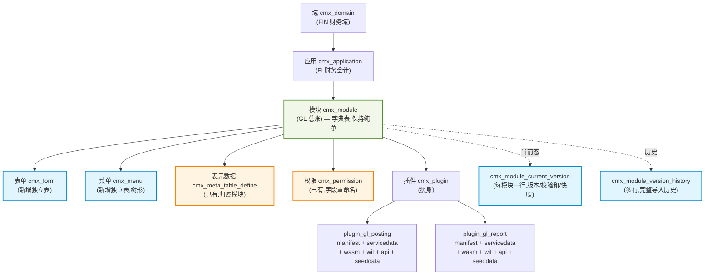
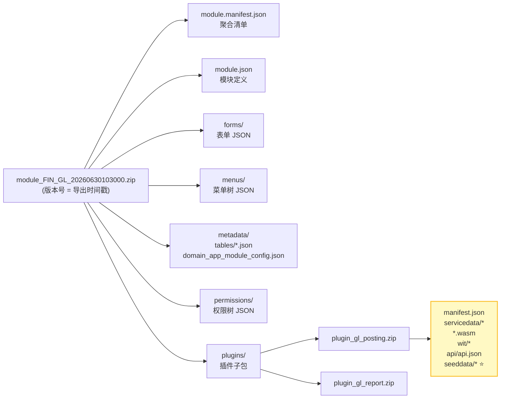
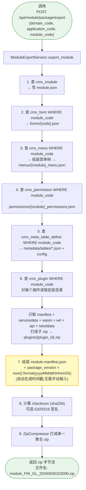
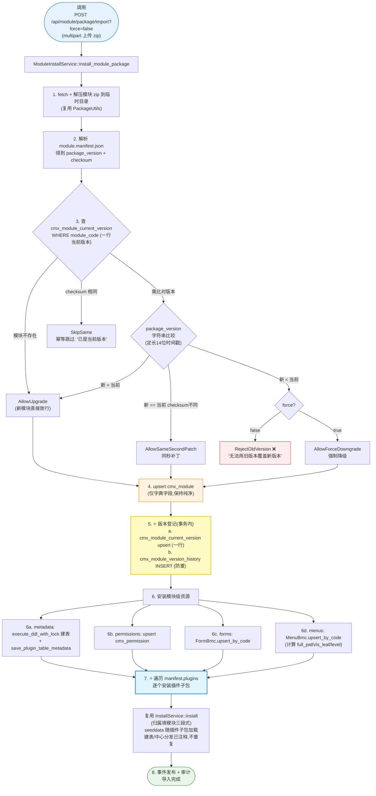
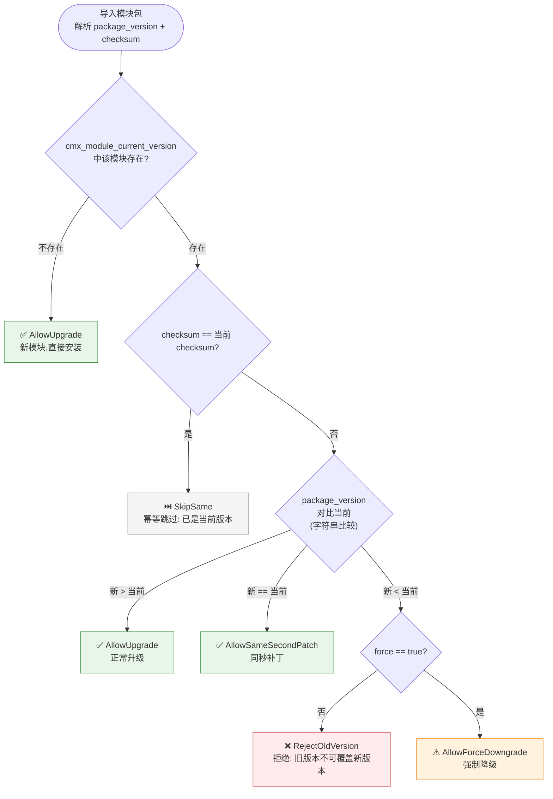
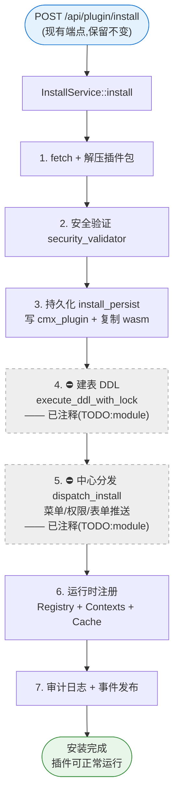
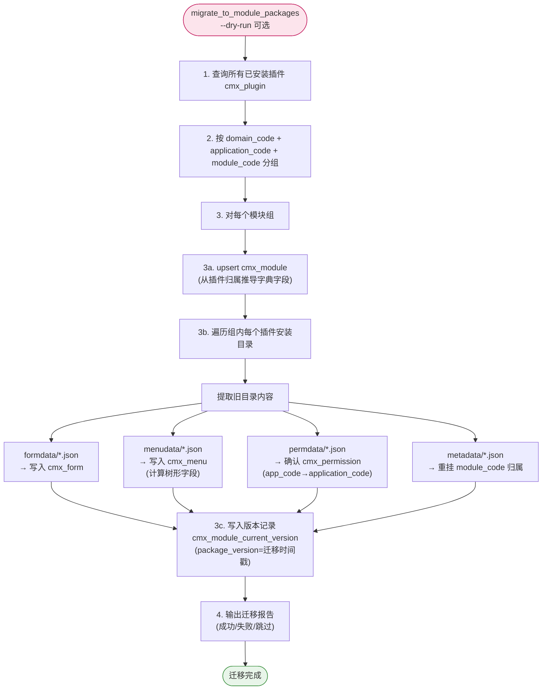
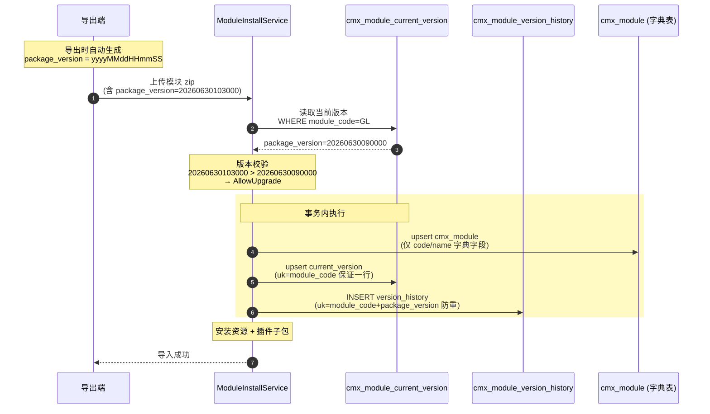
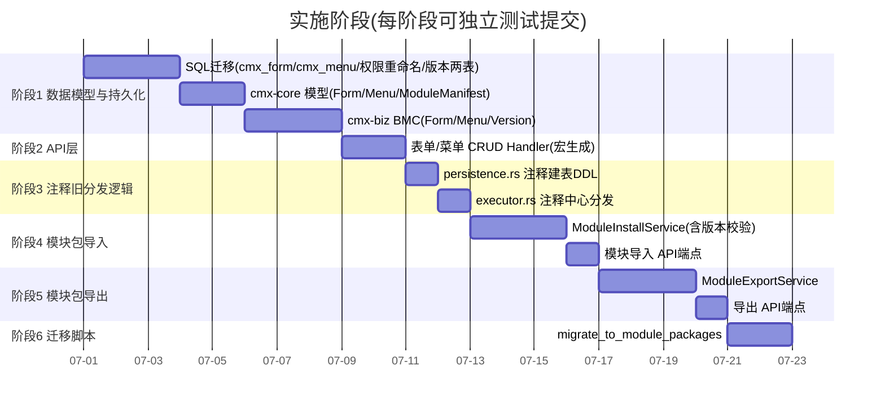
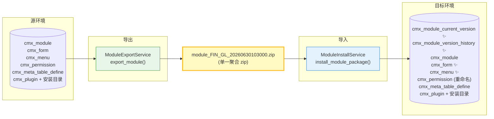

# 模块为中心的插件解耦与迁移包方案 — 流程图

> 配套文档:`docs/superpowers/plans/20260630_cmx-plugin_模块为中心的插件解耦与迁移包方案.md`
>
> 本文用 Mermaid 流程图可视化方案的各核心操作流程,便于快速理解全貌与实施。

---

## 一、整体架构:模块下的资源归属关系

---

## 二、模块迁移包结构

> **关键约定:** 所有 `seeddata`(字典种子 + 业务表种子)统一保留在**插件子包内**,模块包不存储、不导出 seeddata。

---

## 三、模块导出流程(生成迁移包)

---

## 四、模块导入流程(含版本校验)

---

## 五、版本校验决策树

---

## 六、插件单独安装流程(保留,注释旧逻辑)

> **说明:** 插件单独安装链路**完整保留**。仅注释掉两块(虚线):① 建表 DDL(已迁到模块流程);② 菜单/权限/表单中心分发(已迁到模块流程)。服务编排解析、运行时注册、审计、事件均保留。`seeddata` 加载也保留。

---

## 七、旧格式迁移脚本流程

> **幂等保证:** 基于 `code` 唯一索引 upsert,可重复运行;`--dry-run` 仅预检不写库。

---

## 八、模块版本管理:三表协作

---

## 九、实施阶段总览(6 阶段)

---

## 十、端到端数据流总览

> ✨ = 新增表;迁移包以模块为原子单位,版本号自动生成时间戳,旧版本默认不可覆盖新版本。

---

## 图例说明

| 标记 | 含义 |
|------|------|
| ✨ / 蓝色 | 新增(表/模块/代码) |
| 🟡 / 黄色 | 版本管理关键点 / 需特别注意 |
| ⛔ / 灰色虚线 | 已注释保留的代码块 |
| ❌ / 红色 | 拒绝/错误路径 |
| ⭐ | 核心复用点 / 关键约定 |
